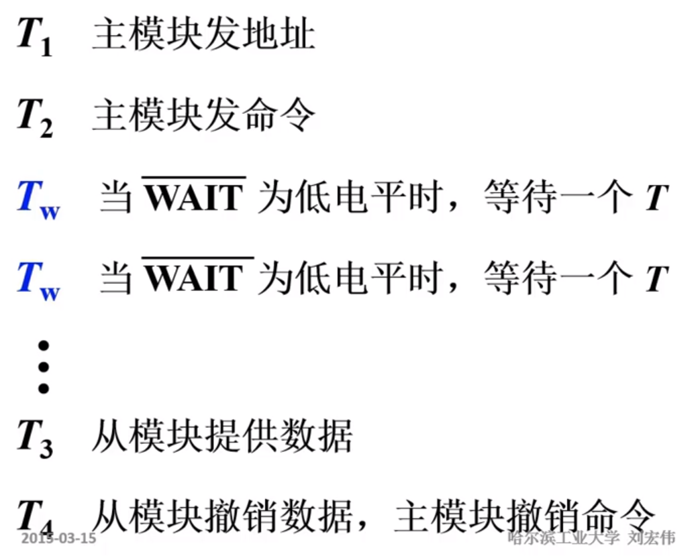
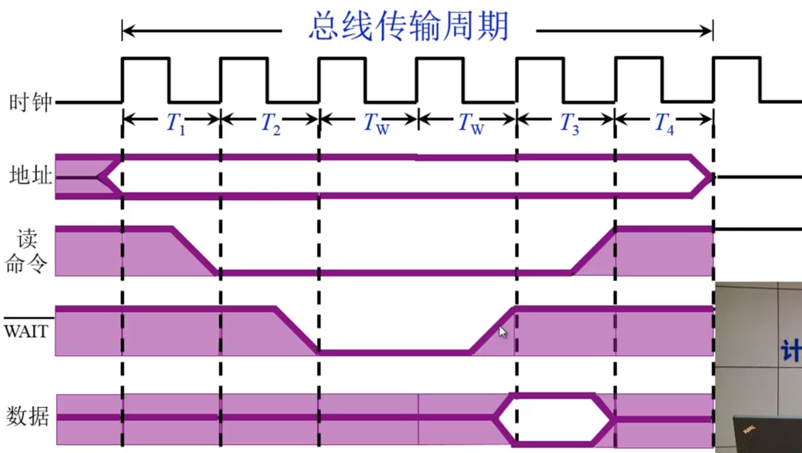
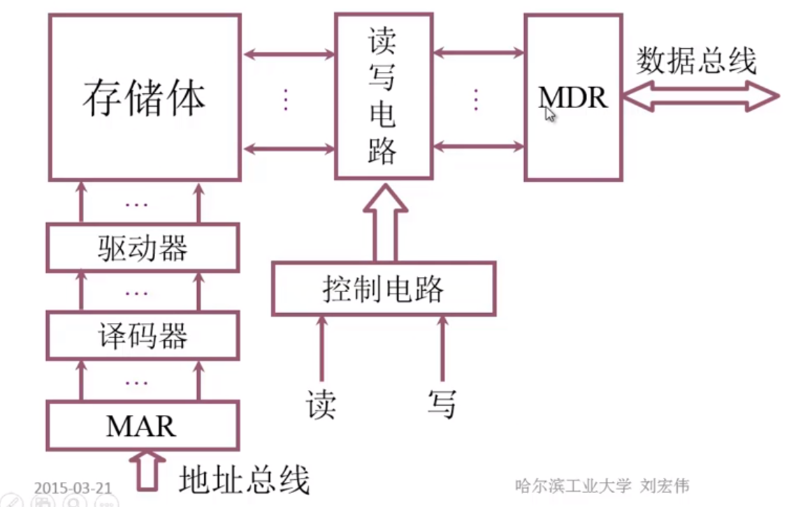
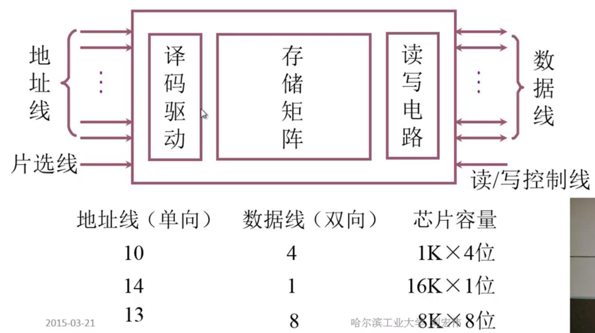
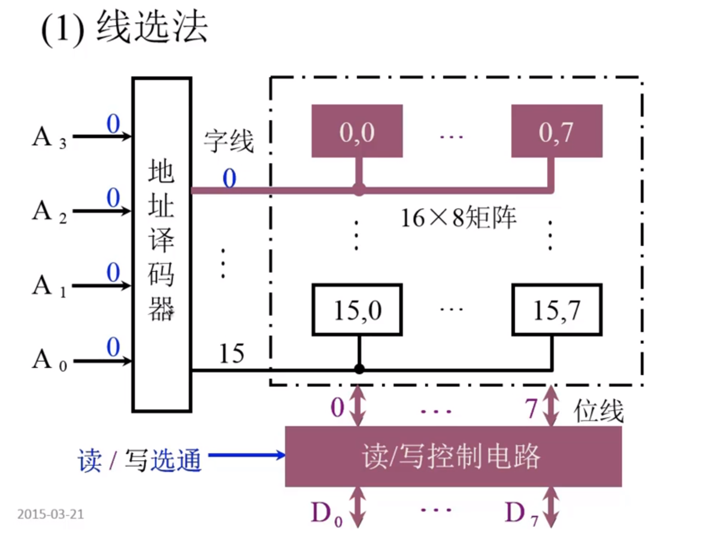
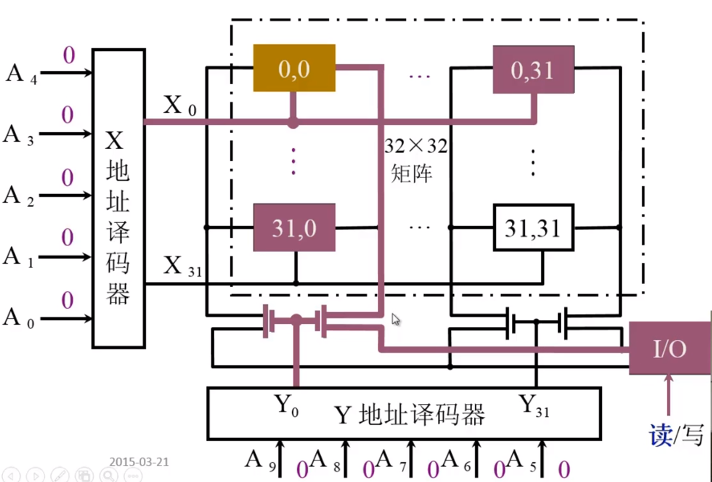
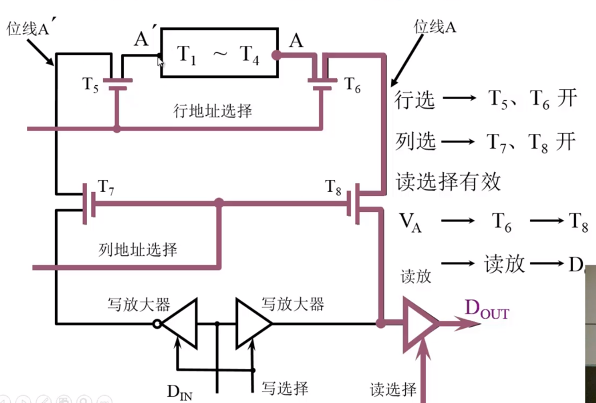
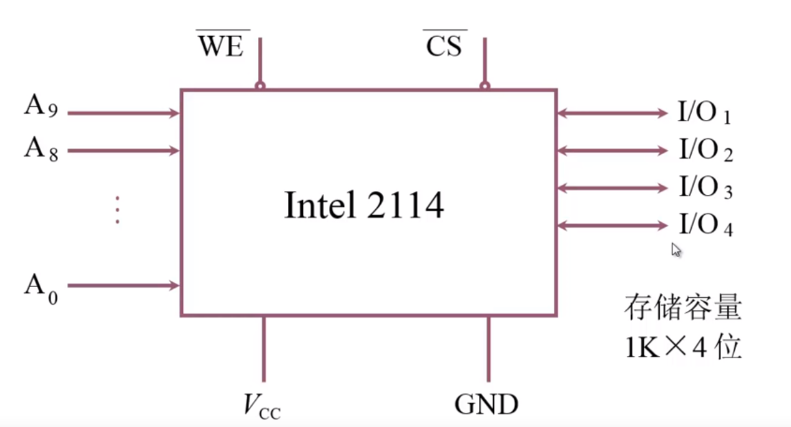
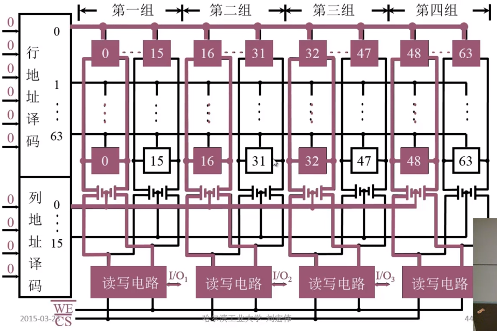
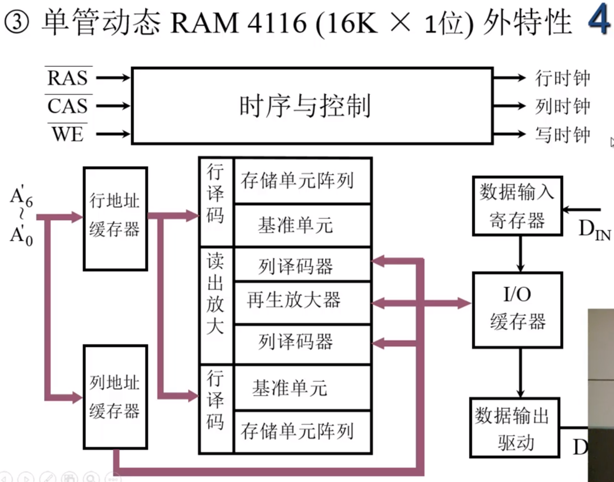

计算机组成原理

**哈尔滨工业大学——刘宏伟**

---

#### 课程介绍

+ 主要讲什么？

+ 讲授内容

  + 基本部件的结构和组织方式
  + 基本运算的操作原理
  + 基本部件和单元的设计思想

+ 特色

  + **只讲一般原理**，不以具体机型为依托
  + 采用自顶向下的方式、层层细化

+ 教材

  + 《计算机组成原理》——唐硕飞

+ 计算机课程体系

  

+ 课程组织

  1. 概论

  2. 计算机系统的硬件结构

  3. CPU

  4. CU

     

---

#### 第一章 计算机系统概要

###### 计算机系统简介

+ 现代计算机的多样性

+ 计算机系统的两大组成部分：硬件，软件

  + 硬件：计算机实体，如主机、外设等

  + 软件：由具有各类特殊功能的程序组成

    + 系统软件：管理整个计算机系统。  

      语言处理程序、操作系统、服务性程序、网络通信程序、数据库管理系统

    + 应用软件：按任务编制的程序

+ 语言层次结构

  + 微指令系统，微程序机器M0，由硬件直接执行微指令
  + 机器语言，实际机器M1，用微指令解释机器指令

  **硬件**

  ————————————————————————————

  **软件**

  + 操作系统，虚拟机器M2，用机器语言解释操作系统
  + 汇编语言，虚拟机器M3，用汇编程序翻译成机器语言程序
  + 高级语言，虚拟机器M4，用编译程序翻译成汇编语言程序

+ 计算机体系结构和计算机组成

  

###### 计算机的基本组成框图

+ 冯·诺依曼计算机的特点

  + 组成部件：运算器、控制器、存储器、输入设备、输出设备

  + 指令和数据以同等地位存于存储器中，按地址寻访

  + 指令和数据用二进制表示

  + **指令由操作码和地址码组成**

  + **存储程序**

  + 以运算器为中心

  + 冯·诺依曼计算机硬件框图

    

+ 计算机框图改进

  + 以存储器为核心

  + 硬件框图

    

+ 现代计算机硬件框图

  

+ 系统复杂性管理的方法
  + 抽象化
  + 层次化：将被设计系统分为多个模块或子模块
  + 模块化：有明确定义的功能和接口
  + 规则性：模块化更容易被重用

###### 计算机的各个部件

+ 上机前准备

  + 建立数学模型
  + 确定计算方法
  + 编制解决程序
    + 程序——运算的**所有步骤**
    + 指令——每**一个步骤**

+ 存储器的基本结构

  

  + 存储体(办公大楼) &rArr; 存储单元(房间) &rArr; 存储单元(床位，0/1)
  + **存储单元**存放一串二进制代码
  
  + **存储字**存储单元中二进制代码的组合
  
  + **存储字长**存储单元中二进制代码位数
  
  + 每个存储单元都有一个地址
  
  + **按地址寻址**
  
+ **MAR**：存储器地址寄存器，反映存储单元的个数。
  
+ **MDR**：存储器数据寄存器，反映存储字长。
  
  如 MAR = 4位，MDR = 8位，则存储单元个数为16个，存储字长为8
  
+ 运算器的基本机构

  

  + 加法操作过程
  
    
  
  + 减法操作过程
  
    
  
  + 乘法操作过程
  
    
  
  + 除法操作过程
  
    
  
+ 控制器的基本结构

  + 功能
    + 解释指令
    + 保证指令的按序执行
  + 完成一条指令
    1. 取指令	PC
    2. 分析指令	IR
    3. 执行指令	CU
  + **PC**：存放当前欲执行指令的地址，具体计数功能**(PC)+1 &rArr; PC**。
  + **IR**：存放当前欲执行的指令。
  + **CU**：控制单元，用于执行计算机指令

+ 主机完成一条指令的过程

  + 以取数指令为例

    

    + 取指令：PC &rArr; MAR &rArr; M(存储体) &rArr; MDR &rArr; IR
    + 调整PC：( PC )+1 &rArr; PC
    + 分析指令：OP( IR ) &rArr; CU
    + 执行指令：Ad( IR ) &rArr; MAR &rArr; M &rArr; MDR &rArr; ACC

  + 以存数指令为例

    

+ 计算机硬件的主要技术指标

  + **机器字长**，与CPU中的寄存器位数有关

  + **运算速度**

    + 主频

    + 核数，每个核支持的线程数

    + 吉普森法
      $$
      T_M = \sum^{n}_{i = 1}{f_i}{t_i}
      $$

    + **CPI** 执行一条指令所需时钟周期数，使用加权平均法

    + **MIPS**每秒执行的百万级机器指令数

    + **FLOPS**每秒浮点运算次数

  + **存储容量**

    + 主存容量
      + 存储单元个数 × 存储字长，如MAR = 10，MDR = 8，容量为 1K × 8位
      + 字节数，如 2^13 b = 1KB
    + 辅存容量

---

#### 第二章 计算机的发展及应用

###### 计算机的发展史

+ 第一台电子计算机的出现时间

  1946年，美国ENIAC，30吨，1955年退役

+ 现代计算机产生的驱动力

  + 需求
  + 技术发展
    + 电子技术的发展
    + 计算机体系结构的发展

+ IBM System / 360

+ 微处理器芯片	1971年	Intel

+ 软件技术的兴起和发展

  + 机器语言	面向机器
  + 汇编语言	面向机器
  + 高级语言	面向问题

+ 系统软件

  

+ 软件发展特点

  + 开发周期长
  + 制作成本昂贵
  + 检测软件产品质量的特殊性
  + 软件是程序以及开发、使用和维护程序所需要的所有文档

###### 计算机应用与展望

**应用**

1. 科学计算和数据处理
2. 工业控制和实时控制
3. 网络技术
   + 电子商务
   + 网络教育
   + 敏捷制造
   + 虚拟现实
   + 办公自动化和管理信息系统
   + CAD/CAM/CIMS
   + 多媒体技术
   + 人工智能

**展望**

1. 计算机具有类似人脑的一些超级智能功能
2. 芯片集成度的提高受以下三方面的限制
   + 芯片集成度受物理极限的制约
   + 按几何级数递增的制作成本
   + 芯片的功耗、散热、线延迟
3. 替代传统硅芯片？
   + 光计算机
   + DNA生物计算机
   + 量子计算机

---

#### 第三章 系统总线

###### 总线的基本概念

+ 总线是连接各个部件的信息传输线，是**各个部件共享的传输介质**

+ 总线上信息的传输

  + 串行，传送数据少，但传送距离长
  + 并行，传送数据多，但传送距离短

+ 总线结构

  + 单总线结构

    

    缺点：电脑效率特别低

  + CPU双总线结构

    

    缺点：主存 和 I/O设备没有直接的信息通路

  + 存储器为中心双总线结构

    

###### 总线的分类

+ 片内总线：**芯片内部** 的总线

+ 系统总线：**计算机各部件之间** 的信息传输线

  + 数据总线	**双向** 与机器字长、存储字长有关，小于等于机器字长、存储字长。
  + 地址总线	**单向** 与存储地址、I/O地址有关。
  + 控制总线	**有出  有入**

+ 通信总线：用于 **计算机系统之间** 或 **计算机系统与其他系统** 之间的通信

  传输方式

  + 串行通信总线
  + 并行通信总线

###### 总线特性即性能指标

+ 总线的物理实现

+ 总线的特性

  + 机械特性：**尺寸、形状、管脚数** 及 **排列顺序**
  + 电气特性：**传输方向** 和有效的 **电平** 范围
  + 功能特性：每根总线的 **功能**
  + 时间特性：信号的 **时序** 关系

+ 总线的性能指标

  + 总线宽度：数据线的根数
  + 标准传输率：每秒传输的最大字节数（MBps）
  + 时钟同步/异步：同步、不同步
  + 总线复用：**地址线** 与 **数据线** 复用
  + 信号线数：地址线、数据线 和 控制线 的总和
  + 总线控制方式：突发、自动、仲裁、逻辑、技术
  + 其他指标：负载能力

+ 总线的标准

  

###### 总线的结构

+ 单总线结构

+ 多总线结构

  + 双总线结构

    

  + 三总线结构

    

    

  + 四总线结构

    

+ 传统微机总线结构

+ VL-BUS局部总线结构

+ PCI总线结构

+ 多层PCI总线结构

###### 总线控制

+ 总线判优控制

  + 基本概念
    + 主设备（模块）	对总线有**控制权**
    + 从设备（模块）	只能 **响应** 从主设备发来的总线命令

  + 总线判优控制实现
    + 集中式

      + 链式查询

        

        **结构简单，增删设备方便，但是对电路故障十分敏感，且速度慢，优先级设置简单，用于简单的嵌入式系统。**

      + 计数器定时查询

        

        **优先级设置非常灵活，需要多条设备地址线，数量为 log2(n) 的向上取整。**

      + 独立请求方式

        

        **较前两种方法速度更快，优先级由总线内部控制部件确定，优先级设置比较灵活，缺点是需要线路较多。**

    + 分布式

+ 总线通信控制

  + 目的：解决通信双方 **协调配合** 问题

  + 总线传输周期

    + 申请分配阶段	**主模块申请**，总线仲裁决定
    + 寻址阶段			主模块向从模块 **给出地址** 和 **命令**
    + 传数阶段			主模块和从模块 **交换数据**
    + 结束阶段			主、从模块 **撤销有关消息**

  + 通信四种方式

    + 同步通信			由 **统一时标** 控制数据传输
    + 异步通信			采用 **应答式**，没有公共时钟标准
    + 半同步通信		**同步、异步结合**
    + 分离式通信		充分 **挖掘** 系统 **总线的每个瞬间** 的潜力

    1. 同步式数据输入/输出

       **同步式数据输入**

       

       **同步数据输出**，和上图略有差别

       

    2. 异步通信

       较同步通信多了两条线，**请求线**和**应答线**

       + 不互锁（可靠性有待提高）
       + 半互锁（可能会导致一直处于请求状态）
       + 全互锁（类似于3次握手）

    3. 半同步通信（同步、异步相结合）

       + 同步：发送方 用系统 时钟前沿 发信号  

         ​			接收方 用系统 时钟后沿 判断、识别

       + 异步：允许同步速度的模块和谐工作  

         ​			增加一条”等待“响应信号 **WAIT**

       

       **对应的时序图**

       

    4. 以上三种通信的**共同点**（以一个总线传输周期为例）

       + 主模块发地址、命令		占用总线
       + 从模块准备数据				不占用总线	**总线空闲** &rArr; 分离式通信，**充分利用总线**
       + 从模块向主模块发数据	占用总线

    5. 分离式通信

       **充分 挖掘 系统 总线的每个瞬间 的潜力**

       一个总线传输周期

       + 子周期1	主模块 申请 占用总线，使用完后即 放弃总线 使用权；
       + 子周期2	从模块（此时应该是**主模块**） 申请 占用总线，将各种信息送至总线上。

       特点

       + 各模块有权申请占用总线
       + 采用同步通信方式，不等对方回答
       + 各模块准备数据时，不占用总线
       + 总线被占用时，无空闲

---

#### 第四章 存储器

###### 概述

+ 存储器分类

  + 按存储介质分类(半导体，磁，光)
    1. 半导体存储器 **易失**		TTL（集成低，功耗多，速度快）、MOS（集成高，功耗小，速度慢）
    2. 磁表面存储器				磁头、载磁体
    3. 磁芯存储器					硬磁材料、环状元件（古老的存储方式）
    4. 光盘存储器					激光、磁光材料
  + 按存取方式分类
    1. 存取时间与物理地址无关（随机访问）
       + 只读存储器	可读可写
       + 只读存储器	只可读
    2. 存取实践与物理地址有关（串行访问）
       + 顺序存取存储器	磁带
       + 直接存取存储器	磁盘
    3. 按计算机中的作用分类
       + 主存储器
         + RAM
           + 静态RAM
           + 动态RAM
         + ROM
           + MROM
           + PROM
           + EPROM
           + EEPROM
       + Flash Memory
       + 高速缓冲存储器（Cache）
       + 辅助存储器：磁盘、磁带、光盘

+ 存储器的层次结构

  1. 存储器三个主要特征的关系

     

  2. 寄存器：体系结构寄存器、非体系结构寄存器
  
  3. 缓存-主存层序 和 主存-辅存层序
  
     

###### 主存储器

+ 概述
  
  + 主存的基本组成
  
    
  
  + 主存和CPU之间的联系
  
    
  
  + 主存中存储单元地址的分配
  
    + **数据的前面是高位，地址的后面是高位**
  
      
  
    +  以下3个寻址的地址线均为24根。
  
      1. 字节一般为8个字长，符号为B，所以224 = 16MB
      2. **字长为16位等于2个字节**，按**字**寻址，224  = 8MW，W是word字的意思
      3. **字长为32位等于4个字节**，按**字**寻址，224  = 4MW，W是word字的意思
  
      
  
  + 主存的技术指标
  
    + 存储容量：**主存 存放二进制代码的总位数**
    + 存储速度
      + 存取时间	存储器的 **访问时间**：读出时间，写入时间
      + 存取周期	**连续两次独立的存储器操作**（读或写）所需的**最小时间间隔**，分为**读周期**和**写周期**
      + 存取周期 **大于** 存取时间，因为 **存取周期 = 存取时间 + 恢复时间**
      + 存储器带宽：位 / 秒
  
+ 半导体存储芯片简介

  + 半导体存储芯片的基本结构

    

    + 片选线：CS，CE，可以进行芯片组合

      

    + 读 / 写 控制线：WE（低电平写，高电平读）  

      ​							OE（允许读）WE（允许写）

  + 半导体存储芯片的译码驱动方式

    + 线选法：所需的线太多了，例如20根地址线就会延伸出 **220** 根线

      

    + 重合法：对比线选法，20根地址线只会延伸出**211**根线

      

+ 随机存取存储器（RAM）

  + 静态RAM（SRAM）
    
    + 存储原理：利用 **数电** 中的**双稳态触发器**结构进行 0 / 1 存储
      
    + 基本电路
    
      
    
      1. 基本电路读操作
    
         
    
      2. 基本电路写操作
    
         
    
      3. 重合法组合芯片
    
         
    
         **组合成64 × 64 的芯片矩阵，每次进行4位的读和写**
    
         
    
         **以上是写操作，读操作雷同，WE 是低写高读，每次控制4位的读和写**
    
  + 动态RAM（DRAM）
  
    + 存储原理：利用的是**电容**
  
    + 基本单元电路
  
      + 分为 **三管DRAM** 和 **单管DRAM**
  
      
  
    + 基本芯片
  
      + 三管动态RAM芯片(1K  × 1 位 芯片)
  
        行地址线对每一行都有**读选择线**和**写选择线**，并且还有**刷新放大器**对存储电容进行充电
  
        
  
      + 单管动态RAM芯片
  
        
  
        具体读写 看[视频](https://www.bilibili.com/video/av15123338/?p=29)
  
    + 电容刷新
  
      + 电容会慢慢漏电，**每次刷新都只和行地址有关**
      + 刷新方法
        + 集中是刷新，存在**死区**
        + 分散刷新，没有死区，但会过度刷新
        + 异步刷新，可能存在**死区**，但**死区较小**
  
  + **动态RAM** 和 **静态RAM** 的比较
  
    |          | DRAM (用作主存) | SRAM (用作缓存) |
    | -------- | --------------- | --------------- |
    | 存储原理 | 电容            | 触发器          |
    | 集成度   | 高              | 低              |
    | 芯片引脚 | 少              | 多              |
    | 功耗     | 小              | 大              |
    | 价格     | 低              | 高              |
    | 速度     | 慢              | 快              |
    | 刷新     | 有              | 无              |
  
+ 只读存储器（ROM）

  + 发展历程
    + 早期只读存储器出厂时，厂家就写好了内容
    + 改进1——用户可以自己写——一次性
    + 改进2——可以多次写——能够对信息进行擦除
    + 改进3——电可擦写——特定设备
    + 改进3——电可擦写——连接到计算机即可擦写
  + 掩模ROM（MROM）

