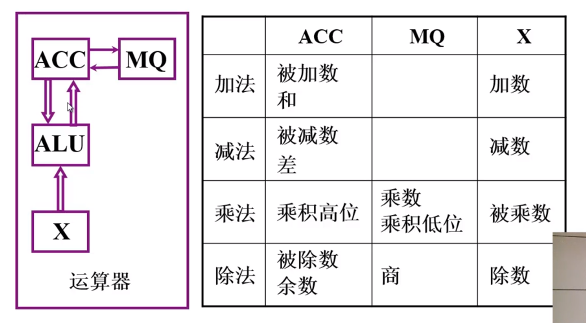

### 计算机组成原理

**哈尔滨工业大学——刘宏伟**

---

#### 课程介绍

+ 主要讲什么？

+ 讲授内容

  + 基本部件的结构和组织方式
  + 基本运算的操作原理
  + 基本部件和单元的设计思想

+ 特色

  + **只讲一般原理**，不以具体机型为依托
  + 采用自顶向下的方式、层层细化

+ 教材

  + 《计算机组成原理》——唐硕飞

+ 计算机课程体系

  

+ 课程组织

  1. 概论

  2. 计算机系统的硬件结构

  3. CPU

  4. CU

     

---

#### 第一章 计算机系统概要

###### 计算机系统简介

+ 现代计算机的多样性

+ 计算机系统的两大组成部分：硬件，软件

  + 硬件：计算机实体，如主机、外设等

  + 软件：由具有各类特殊功能的程序组成

    + 系统软件：管理整个计算机系统。  

      语言处理程序、操作系统、服务性程序、网络通信程序、数据库管理系统

    + 应用软件：按任务编制的程序

+ 语言层次结构

  + 微指令系统，微程序机器M0，由硬件直接执行微指令
  + 机器语言，实际机器M1，用微指令解释机器指令

  **硬件**

  ————————————————————————————

  **软件**

  + 操作系统，虚拟机器M2，用机器语言解释操作系统
  + 汇编语言，虚拟机器M3，用汇编程序翻译成机器语言程序
  + 高级语言，虚拟机器M4，用编译程序翻译成汇编语言程序

+ 计算机体系结构和计算机组成

  

###### 计算机的基本组成框图

+ 冯·诺依曼计算机的特点

  + 组成部件：运算器、控制器、存储器、输入设备、输出设备

  + 指令和数据以同等地位存于存储器中，按地址寻访

  + 指令和数据用二进制表示

  + **指令由操作码和地址码组成**

  + **存储程序**

  + 以运算器为中心

  + 冯·诺依曼计算机硬件框图

    

+ 计算机框图改进

  + 以存储器为核心

  + 硬件框图

    

+ 现代计算机硬件框图

  

+ 系统复杂性管理的方法
  + 抽象化
  + 层次化：将被设计系统分为多个模块或子模块
  + 模块化：有明确定义的功能和接口
  + 规则性：模块化更容易被重用

###### 计算机的各个部件

+ 上机前准备

  + 建立数学模型
  + 确定计算方法
  + 编制解决程序
    + 程序——运算的**所有步骤**
    + 指令——每**一个步骤**

+ 存储器的基本结构

  

  + 存储体(办公大楼) &rArr; 存储单元(房间) &rArr; 存储单元(床位，0/1)
  + **存储单元**存放一串二进制代码
  
  + **存储字**存储单元中二进制代码的组合
  
  + **存储字长**存储单元中二进制代码位数
  
  + 每个存储单元都有一个地址
  
  + **按地址寻址**
  
+ **MAR**：存储器地址寄存器，反映存储单元的个数。
  
+ **MDR**：存储器数据寄存器，反映存储字长。
  
  如 MAR = 4位，MDR = 8位，则存储单元个数为16个，存储字长为8
  
+ 运算器的基本机构

  

  + 加法操作过程
  
    
  
  + 减法操作过程
  
    
  
  + 乘法操作过程
  
    
  
  + 除法操作过程
  
    
  
+ 控制器的基本结构

  + 功能
    + 解释指令
    + 保证指令的按序执行
  + 完成一条指令
    1. 取指令	PC
    2. 分析指令	IR
    3. 执行指令	CU
  + **PC**：存放当前欲执行指令的地址，具体计数功能**(PC)+1 &rArr; PC**。
  + **IR**：存放当前欲执行的指令。
  + **CU**：控制单元，用于执行计算机指令

+ 主机完成一条指令的过程

  + 以取数指令为例

    

    + 取指令：PC &rArr; MAR &rArr; M(存储体) &rArr; MDR &rArr; IR
    + 调整PC：( PC )+1 &rArr; PC
    + 分析指令：OP( IR ) &rArr; CU
    + 执行指令：Ad( IR ) &rArr; MAR &rArr; M &rArr; MDR &rArr; ACC

  + 以存数指令为例

    

+ 计算机硬件的主要技术指标

  + **机器字长**，与CPU中的寄存器位数有关

  + **运算速度**

    + 主频

    + 核数，每个核支持的线程数

    + 吉普森法
      $$
      T_M = \sum^{n}_{i = 1}{f_i}{t_i}
      $$

    + **CPI** 执行一条指令所需时钟周期数，使用加权平均法

    + **MIPS**每秒执行的百万级机器指令数

    + **FLOPS**每秒浮点运算次数

  + **存储容量**

    + 主存容量
      + 存储单元个数 × 存储字长，如MAR = 10，MDR = 8，容量为 1K × 8位
      + 字节数，如 2^13 b = 1KB
    + 辅存容量

---

#### 第二章 计算机的发展及应用

###### 计算机的发展史

+ 第一台电子计算机的出现时间

  1946年，美国ENIAC，30吨，1955年退役

+ 现代计算机产生的驱动力

  + 需求
  + 技术发展
    + 电子技术的发展
    + 计算机体系结构的发展

+ IBM System / 360

+ 微处理器芯片	1971年	Intel

+ 软件技术的兴起和发展

  + 机器语言	面向机器
  + 汇编语言	面向机器
  + 高级语言	面向问题

+ 系统软件

  

+ 软件发展特点

  + 开发周期长
  + 制作成本昂贵
  + 检测软件产品质量的特殊性
  + 软件是程序以及开发、使用和维护程序所需要的所有文档

###### 计算机应用与展望

**应用**

1. 科学计算和数据处理
2. 工业控制和实时控制
3. 网络技术
   + 电子商务
   + 网络教育
   + 敏捷制造
   + 虚拟现实
   + 办公自动化和管理信息系统
   + CAD/CAM/CIMS
   + 多媒体技术
   + 人工智能

**展望**

1. 计算机具有类似人脑的一些超级智能功能
2. 芯片集成度的提高受以下三方面的限制
   + 芯片集成度受物理极限的制约
   + 按几何级数递增的制作成本
   + 芯片的功耗、散热、线延迟
3. 替代传统硅芯片？
   + 光计算机
   + DNA生物计算机
   + 量子计算机

---

#### 第三章 系统总线

###### 总线的基本概念

+ 总线是连接各个部件的信息传输线，是**各个部件共享的传输介质**

+ 总线上信息的传输

  + 串行，传送数据少，但传送距离长
  + 并行，传送数据多，但传送距离短

+ 总线结构

  + 单总线结构

    

    缺点：电脑效率特别低

  + CPU双总线结构

    

    缺点：主存 和 I/O设备没有直接的信息通路

  + 存储器为中心双总线结构

    

###### 总线的分类

+ 片内总线：**芯片内部** 的总线

+ 系统总线：**计算机各部件之间** 的信息传输线

  + 数据总线	**双向** 与机器字长、存储字长有关，小于等于机器字长、存储字长。
  + 地址总线	**单向** 与存储地址、I/O地址有关。
  + 控制总线	**有出  有入**

+ 通信总线：用于 **计算机系统之间** 或 **计算机系统与其他系统** 之间的通信

  传输方式

  + 串行通信总线
  + 并行通信总线

###### 总线特性即性能指标

+ 总线的物理实现

+ 总线的特性

  + 机械特性：**尺寸、形状、管脚数** 及 **排列顺序**
  + 电气特性：**传输方向** 和有效的 **电平** 范围
  + 功能特性：每根总线的 **功能**
  + 时间特性：信号的 **时序** 关系

+ 总线的性能指标

  + 总线宽度：数据线的根数
  + 标准传输率：每秒传输的最大字节数（MBps）
  + 时钟同步/异步：同步、不同步
  + 总线复用：**地址线** 与 **数据线** 复用
  + 信号线数：地址线、数据线 和 控制线 的总和
  + 总线控制方式：突发、自动、仲裁、逻辑、技术
  + 其他指标：负载能力

+ 总线的标准

  

###### 总线的结构

+ 单总线结构

+ 多总线结构

  + 双总线结构

    

  + 三总线结构

    

    

  + 四总线结构

    

+ 传统微机总线结构

+ VL-BUS局部总线结构

+ PCI总线结构

+ 多层PCI总线结构

