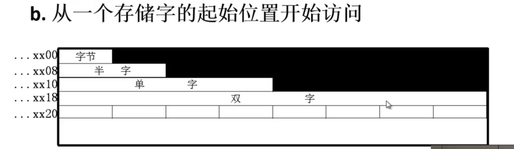

## 计算机组成原理 -- CPU

**哈尔滨工业大学——刘宏伟**

---

#### 主要内容

1. 机器指令
2. 控制器中的中断
3. CPU中控制器的工作原理和设计方式

---

#### 第七章 指令系统

##### 机器指令

+ 指令的格式是什么？

  操作码、地址码、寻址方式

  + 操作码：反映机器做什么操作

    + 长度固定：用于指令字长较长的情况

    + 长度可变：操作码分散在指令字的不同字段中

    + 扩展操作码技术

      + 操作码的位数随地址码的减少而增加

        

        **三地址指令操作码每减少一种最多可构成 24 种二地址指令**

        **二地址指令操作码每减少一种最多可构成 24 种一地址指令**

        **tip**：经常出现的指令用短操作码，很少使用的指令用长操作码。

  + 地址码

    + 四地址

      

    + 三地址

      

    + 二地址

      

    + 一地址

      

    + 零地址：无地址码，对**ACC**里的数据进行操作

+ 指令的字长

  + 指令字长决定于
    1. 操作码的长度
    2. 操作码地址的长度
    3. 操作数地址的个数

  + 固定指令字长：指令字长 &le; 存储字长

  + 可变指令字长：按字节的倍数变化

+ 小结：

  1. 用一些硬件资源代替指令字中的地址码字段后
     + 可扩大指令的寻址范围
     + 可缩短指令字长
     + 可减少访存次数
  2. 当指令的地址字段为寄存器时
     + 由于寄存器的个数十分有限，所以地址码的位数较少，缩短指令长度。
     + 指令执行阶段可以不访存

##### 操作数类型和操作种类

+ 操作数类型
  + 地址		无符号整数
  + 数字		定点数、浮点数、十进制数
  + 字符		ASCII
  + 逻辑数	逻辑运算
  
+ 数据在存储器中的存放方式
  + 大端：字地址 为 高字节 地址
  + 小端：字地址 为 低字节 地址
  + 字节编址，数据在存储器中的存放方式（存放字长64位，机器字长32位）
    + 
      + 优点：不浪费任何存储空间
      + 缺点：除了访问一个字节之外，访问其它任何类型的数据都需要花费两个存储周期的时间。读写			控制比较复杂
      
    + 
      + 优点：无论访问何种类型的数据，在一个存储周期内均可完成，读写控制简单
      + 缺点：浪费了宝贵的存储资源
      
    + 
    
      数据存放的起始地址是数据长度（按照编制单位进行计算）的整数倍
    
      是前两种方法的折中，可以在一个周期内完成存储的访问，空间浪费也不太严重
  
+ 操作类型

  1. 数据传送

     + 源			寄存器			寄存器			存储器			存储器

     + 目的		寄存器			存储器			寄存器			存储器

     + 例如		MOVE			STORE			LOAD			MOVE

       ​										MOVE			MOVE

       ​										PUSH			POP

     + 置“1”，清“0”

  2. 算术逻辑操作

  3. 移位操作

     + 算术移位
     + 逻辑移位
     + 循环移位（带进位和不带进位）

  4. 转移

     

     

     

  5. 输入输出

     + 入：端口中的内容 &rArr; CPU寄存器
     + 出：CPU寄存器 &rArr; 端口中的内容

##### 寻址方式

+ 寻址方式：确定 **本条指令** 的 **操作数地址** **下一条** 要执行 **指令** 的 **指令地址**

  + 指令寻址

    + 顺序：  (PC) + 1 &rArr; PC
    + 跳跃寻址：由转移指令指出

  + 数据寻址

    

    + 立即寻址：形式地址A就是操作数，需要的数据已被取入CPU中，指令阶段不访存

    + 直接寻址：有效地址就由形式地址直接给出

      + 执行阶段访问一次存储器
      + A的位数决定了该指令操作数的寻址范围
      + 操作数的地址不易修改

    + 隐含寻址：操作数地址隐含在操作码中，一个操作数从主存中取出，另一个操作数隐含在CPU对应操作的寄  				  存器中。

    + 间接寻址：有效地址由形式地址间接提供

      + 一次间接寻址：执行指令阶段2次访存，可扩大寻址范围，便于编程
      + 多次间接寻址

    + 寄存器寻址：又名**寄存器直接寻址**，有效地址即为寄存器编号

      + 执行阶段不访存，只访问寄存器，执行速度快
      + 寄存器个数有限，可缩短指令字长

    + 寄存器间接寻址：有效地址保存在寄存器中

      + 有效地址保存在寄存器中，操作数在存储器中，执行阶段一次访存
      + 便于编制循环程序

    + 基址寻址：

      1. 采用专用寄存器作为基址寄存器

         

      2. 采用通用寄存器作为基址寄存器

         

    + 变址寻址：通过**变址寄存器**（即可使用通用寄存器，也可使用专用变址寄存器）与**形式地址**形成有效地址

      + 可扩大寻址范围
      + IX（变址寄存器）的内容由用户给定
      + 在程序的执行过程中 IX **内容可变**，形式地址**不可变**
      + 便于处理数组问题
      + 

    + 相对寻址：形式地址相当于当前指令的位移量（可正可负，补码），实际地址为 (PC) + A

      + A的位数决定了操作数的存储范围
      + 程序浮动
      + 广泛用于转移指令

    + 堆栈寻址

      + 硬堆栈：多个寄存器
      + 软堆栈：指定的存储空间
      + 栈顶地址由 **SP** 寄存器指出
        + 进栈 (SP) - 1 &rArr; SP
        + 出栈 (SP) + 1 &rArr; SP
        + SP 的修改与主存编址方式有关（参考 (PC) ）

##### 指令格式的举例

+ 指令设计考虑因素
  1. 指令系统的 **兼容性**
  2. 其他因素
     + 操作类型：指令个数与及操作难易程度
     + 数据类型：确定哪些数据类型
     + 指令格式：
       + 指令字长是否固定
       + 操作码位数、是否采用可扩展操作码技术
       + 地址码位数、地址个数、寻址方式
     + 寄存器个数
     + ……
+ IBM 360
+ Intel 8086

##### RISC 技术

+ 简介

  + RISC（Reduced Instruction Set Computer）精简指令集
  + CISC（Complex Instruction Set Computer）复杂指令集
  + 80--20规律：典型程序中，有80%的语句仅仅由20%的指令所组成
  + 执行频度高的的简单指令，会因复杂指令的存在，使得执行速度无法提高

+ RISC主要特征

  + 复杂指令的功能有一些使用频度高的 **简单指令** 组合成
  + 指令 **长度固定、指令格式少、寻址方式少**
  + 只有 **LOAD / STORE** 指令访存
  + CPU中有多个通用寄存器
  + 采用 **流水技术**，**一个时钟周期** 内完成一条指令
  + 采用 **组合逻辑（硬件）** 实现控制器

+ CISC主要特征

  + 系统指令 **复杂庞大**，各种指令使用频度相差较大
  + 指令 **长度不固定、指令格式种类多、寻址方式多**
  + 访存指令 **不受控制**
  + CPU中设有 **专用寄存器**
  + 大多数指令需要 **多个时钟周期** 执行完成
  + 采用 **微程序** 控制器

+ RISC和CISC 比较

  

#### CPU的结构和功能

