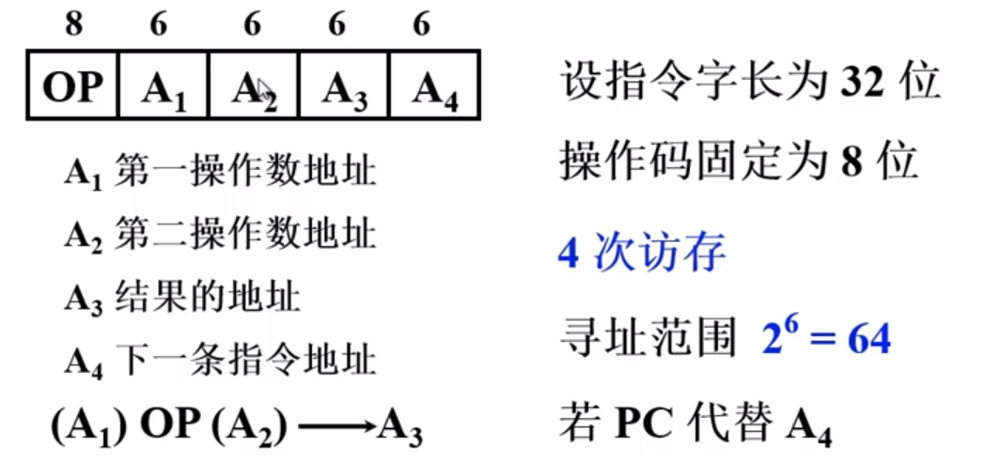
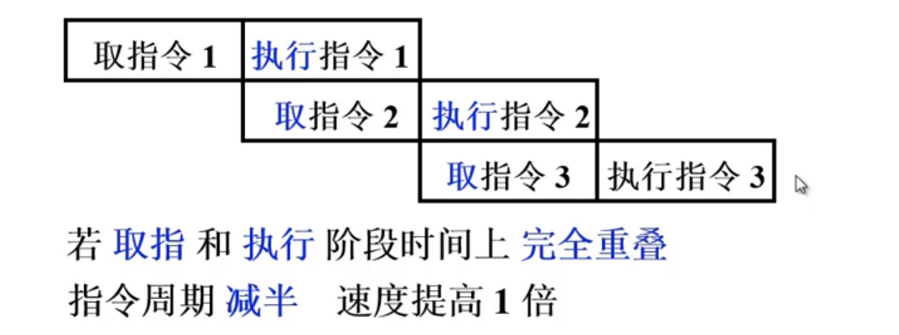

## 计算机组成原理 -- CPU

**哈尔滨工业大学——刘宏伟**

---

#### 主要内容

1. 机器指令
2. 控制器中的中断
3. CPU中控制器的工作原理和设计方式

---

#### 第七章 指令系统

##### 机器指令

+ 指令的格式是什么？

  操作码、地址码、寻址方式

  + 操作码：反映机器做什么操作

    + 长度固定：用于指令字长较长的情况

    + 长度可变：操作码分散在指令字的不同字段中

    + 扩展操作码技术

      + 操作码的位数随地址码的减少而增加

        

        **三地址指令操作码每减少一种最多可构成 24 种二地址指令**

        **二地址指令操作码每减少一种最多可构成 24 种一地址指令**

        **tip**：经常出现的指令用短操作码，很少使用的指令用长操作码。

  + 地址码

    + 四地址

      

    + 三地址

      

    + 二地址

      

    + 一地址

      

    + 零地址：无地址码，对**ACC**里的数据进行操作

+ 指令的字长

  + 指令字长决定于
    1. 操作码的长度
    2. 操作码地址的长度
    3. 操作数地址的个数

  + 固定指令字长：指令字长 &le; 存储字长

  + 可变指令字长：按字节的倍数变化

+ 小结：

  1. 用一些硬件资源代替指令字中的地址码字段后
     + 可扩大指令的寻址范围
     + 可缩短指令字长
     + 可减少访存次数
  2. 当指令的地址字段为寄存器时
     + 由于寄存器的个数十分有限，所以地址码的位数较少，缩短指令长度。
     + 指令执行阶段可以不访存

##### 操作数类型和操作种类

+ 操作数类型
  + 地址		无符号整数
  + 数字		定点数、浮点数、十进制数
  + 字符		ASCII
  + 逻辑数	逻辑运算
  
+ 数据在存储器中的存放方式
  + 大端：字地址 为 高字节 地址
  + 小端：字地址 为 低字节 地址
  + 字节编址，数据在存储器中的存放方式（存放字长64位，机器字长32位）
    + 
      + 优点：不浪费任何存储空间
      + 缺点：除了访问一个字节之外，访问其它任何类型的数据都需要花费两个存储周期的时间。读写			控制比较复杂
      
    + 
      + 优点：无论访问何种类型的数据，在一个存储周期内均可完成，读写控制简单
      + 缺点：浪费了宝贵的存储资源
      
    + 
    
      数据存放的起始地址是数据长度（按照编制单位进行计算）的整数倍
    
      是前两种方法的折中，可以在一个周期内完成存储的访问，空间浪费也不太严重
  
+ 操作类型

  1. 数据传送

     + 源			寄存器			寄存器			存储器			存储器

     + 目的		寄存器			存储器			寄存器			存储器

     + 例如		MOVE			STORE			LOAD			MOVE

       ​										MOVE			MOVE

       ​										PUSH			POP

     + 置“1”，清“0”

  2. 算术逻辑操作

  3. 移位操作

     + 算术移位
     + 逻辑移位
     + 循环移位（带进位和不带进位）

  4. 转移

     

     

     

  5. 输入输出

     + 入：端口中的内容 &rArr; CPU寄存器
     + 出：CPU寄存器 &rArr; 端口中的内容

##### 寻址方式

+ 寻址方式：确定 **本条指令** 的 **操作数地址** **下一条** 要执行 **指令** 的 **指令地址**

  + 指令寻址

    + 顺序：  (PC) + 1 &rArr; PC
    + 跳跃寻址：由转移指令指出

  + 数据寻址

    

    + 立即寻址：形式地址A就是操作数，需要的数据已被取入CPU中，指令阶段不访存

    + 直接寻址：有效地址就由形式地址直接给出

      + 执行阶段访问一次存储器
      + A的位数决定了该指令操作数的寻址范围
      + 操作数的地址不易修改

    + 隐含寻址：操作数地址隐含在操作码中，一个操作数从主存中取出，另一个操作数隐含在CPU对应操作的寄  				  存器中。

    + 间接寻址：有效地址由形式地址间接提供

      + 一次间接寻址：执行指令阶段2次访存，可扩大寻址范围，便于编程
      + 多次间接寻址

    + 寄存器寻址：又名**寄存器直接寻址**，有效地址即为寄存器编号

      + 执行阶段不访存，只访问寄存器，执行速度快
      + 寄存器个数有限，可缩短指令字长

    + 寄存器间接寻址：有效地址保存在寄存器中

      + 有效地址保存在寄存器中，操作数在存储器中，执行阶段一次访存
      + 便于编制循环程序

    + 基址寻址：

      1. 采用专用寄存器作为基址寄存器

         

      2. 采用通用寄存器作为基址寄存器

         

    + 变址寻址：通过**变址寄存器**（即可使用通用寄存器，也可使用专用变址寄存器）与**形式地址**形成有效地址

      + 可扩大寻址范围
      + IX（变址寄存器）的内容由用户给定
      + 在程序的执行过程中 IX **内容可变**，形式地址**不可变**
      + 便于处理数组问题
      + 

    + 相对寻址：形式地址相当于当前指令的位移量（可正可负，补码），实际地址为 (PC) + A

      + A的位数决定了操作数的存储范围
      + 程序浮动
      + 广泛用于转移指令

    + 堆栈寻址

      + 硬堆栈：多个寄存器
      + 软堆栈：指定的存储空间
      + 栈顶地址由 **SP** 寄存器指出
        + 进栈 (SP) - 1 &rArr; SP
        + 出栈 (SP) + 1 &rArr; SP
        + SP 的修改与主存编址方式有关（参考 (PC) ）

##### 指令格式的举例

+ 指令设计考虑因素
  1. 指令系统的 **兼容性**
  2. 其他因素
     + 操作类型：指令个数与及操作难易程度
     + 数据类型：确定哪些数据类型
     + 指令格式：
       + 指令字长是否固定
       + 操作码位数、是否采用可扩展操作码技术
       + 地址码位数、地址个数、寻址方式
     + 寄存器个数
     + ……
+ IBM 360
+ Intel 8086

##### RISC 技术

+ 简介

  + RISC（Reduced Instruction Set Computer）精简指令集
  + CISC（Complex Instruction Set Computer）复杂指令集
  + 80--20规律：典型程序中，有80%的语句仅仅由20%的指令所组成
  + 执行频度高的的简单指令，会因复杂指令的存在，使得执行速度无法提高

+ RISC主要特征

  + 复杂指令的功能有一些使用频度高的 **简单指令** 组合成
  + 指令 **长度固定、指令格式少、寻址方式少**
  + 只有 **LOAD / STORE** 指令访存
  + CPU中有多个通用寄存器
  + 采用 **流水技术**，**一个时钟周期** 内完成一条指令
  + 采用 **组合逻辑（硬件）** 实现控制器

+ CISC主要特征

  + 系统指令 **复杂庞大**，各种指令使用频度相差较大
  + 指令 **长度不固定、指令格式种类多、寻址方式多**
  + 访存指令 **不受控制**
  + CPU中设有 **专用寄存器**
  + 大多数指令需要 **多个时钟周期** 执行完成
  + 采用 **微程序** 控制器

+ RISC和CISC 比较

  

#### 第八章 CPU的结构和功能

##### 8.1 CPU 结构

1. CPU的功能

    + 指令控制
    + 操作控制
    + 时间控制
    + 处理中断
    + 数据加工
    
2. CPU结构框图

    

3. CPU的寄存器（分类）

    + 用户可见和不可见寄存器
      + 通用寄存器
      + 数据寄存器
      + 地址寄存器
      + 条件码寄存器：存放条件码，可作程序分支的依据。
    + 控制和状态寄存器
      + 控制寄存器
        + 例如：PC，MAR，MDR，IR等等
      + 状态寄存器
        + PSW寄存器：存放程序状态字，保存中断前的信息

4. 控制单元CU和中断系统

    + CU：产生全部指令的微操作命令**序列**
      + 组合逻辑设计：硬连线逻辑（硬件实现）
      + 微程序设计：存储逻辑
    + 中断系统

5. ALU

##### 8.2 指令周期

###### 指令周期的基本概念

+ 指令周期：**取出**并**执行**一条指令所需的全部时间

+ 完成一条指令

  + 取指周期：取指、分析
  + 执行周期：执行

+ 每条指令的指令周期不同

+ 具有间接须知的指令周期

  + 取指周期
  + 间址周期
  + 执行周期

+ 具有中断周期的指令周期

+ 指令周期的流程

  

+ CPU工作周期的标志

  + CPU访存的四种性质
    + **取** 指令						取指周期
    + **取** 地址						间址周期
    + **存取** 操作数或结果	执行周期
    + **存** 程序断点				中断周期

###### 指令周期的数据流

+ 取指周期数据流
+ 间址周期数据流
+ 执行周期数据流
+ 中断周期数据流

##### 8.3 指令流水

+ 如何提高机器速度
  1. 提高访存速度
     + 高速芯片
     + Cache
     + 多体并行
  2. 提高I/O和主机之间的传送速度
     + 中断
     + DMA，减少CPU占用率
     + 通道
     + I/O处理机
     + 多总线
  3. 提高运算速度
     + 高速芯片
     + 改进算法
     + 快速进位链
  4. 提高整机处理能力
     + 使用高速器件
     + 改进系统结构，开发系统的并行性
  
+ 系统的并行性
  1. 并行的概念
     + 并发：两个或两个以上事件在 **同一时间段** 发生
     + 同时：两个或两个以上事件在 **同一时刻** 发生
  2. 并行性的等级
     + 过程级（软件实现）：程序、进程
     + 指令级（硬件实现）
       + 多条指令之间并行
       + 指令内部的命令并行
  
+ 指令流水原理

  1. 指令的串行执行

     

  2. 指令的二级流水

     

  3. 影响指令流水效率加倍的因素

     + 执行时间 > 取指时间

       解决：添加指令部件缓冲区

     + 条件转移指令：必须等 **上条** 指令执行结束，才能确定 **下条** 指令的地址，会造成时间损失。

  4. 指令的六级流水

     

+ 影响指令流水线性能的因素

  1. 结构相关：资源冲突，不同指令争用同一功能部件产生资源冲突

     + 解决方法：
       + 停顿
       + 指令存储器和数据存储器分开
       + 指令预取技术

  2. [数据相关](https://blog.csdn.net/qq_33094993/article/details/53455466)：不同指令因重叠操作，可能改变操作数的 读/写 访问顺序

     + 先写后读相关：先把数据写入才能再读入

       

     + 先读后写相关：先把数据读取才能再写入

       

     + 写后写相关:

       

     + 解决方法：

       + 后推法：后一条必须暂停前一条指令执行完才能开始取指执行
       + 采用 **旁路技术**

  3. 控制相关：由转移指令引起

     

+ 流水线高性能指标

  + 吞吐率：单位时间内 **流水线所完成指令** 或 **输出结果** 的 **数量**
    + 最大吞吐率（理想情况）
    + 实际吞吐率
  + 加速比 Sp : 执行同样数量的指令，不使用流水线执行的时间（分子）和使用流水线执行的时间（分母）比
  + 效率：流水线中各个功能段的 **利用率**

+ 流水线的多发技术

  1. 超标量技术

     + 每个时钟周期内可以 **并发多条独立指令**
     + **不能调整** 指令的 **执行顺序**
     + 

  2. 超流水线技术

     + 在 **一个时钟周期** 内 **在分段**，一个功能部件在**一个周期内使用多次**
     + 也 **不能调整** 指令的 **执行顺序**，只能靠编译程序时解决优化问题
     + 

  3. 超长指令字技术：**实质就是一次取出多条不相关的指令，然后同时执行**

     

+ 流水线的结构

  1. 指令流水线

     

  2. 运算流水线：用于解决复杂的运算速度较慢的问题，例如 **浮点数运算**

##### 8.4 中断系统

1. 概述

   + 引起中断的原因
     + 人为设置的中断
     + 程序性事故
     + 硬件故障
     + I/O设备
     + 外部设备
   + 中断系统需要解决的问题
     + 如何提出中断请求
     + 多个请求同时发生怎么办
     + CPU怎么响应中断
     + 如何保护现场
     + 如何寻找中断入口地址
     + 如何恢复现场
     + 处理中断过程中出现新的中断又怎么办

2. 中断的请求标记和中断判优逻辑

   + 中断请求标记	INTR

     

   + 中断判优逻辑

     + 硬件实现（排队器）
       + 链式排队器
       + 集中在CPU内部
     + 软件实现（程序查询）

3. 中断服务程序入口地址的寻址

   + 硬件向量法：有硬件直接形成，灵活性低
   + 软件查询法：根据优先级逐个查询

4. 中断响应

   + 响应中断的 **条件**：EINT = 1
   + 响应中断的时间
   + 中断隐指令：指令由计算机自动完成，并没有对应的指令
     + 保护程序断点
     + 寻找服务程序入口地址
     + 硬件 **关中断**

5. 保护现场和恢复现场

   + 保护现场
     + 断点：由 **中断隐指令** 完成
     + **寄存器** 内容： 由 **中断服务程序** 完成
   + 恢复现场：由 **中断服务程序** 完成

6. 多重中断

   + 多重中断的概念

   + 实现条件

     + 提前设置 **开中断** 指令
     + **优先级别高** 的中断源 **有权中断优先级别低** 的中断源

   + 中断屏蔽技术

     + 使用 **屏蔽触发器 MASK**

     + 屏蔽字：使**低优先级**的中断无法中断**高优先级**的中断，也可以**改变处理优先级**，响应优先级**不可改变**

       + 解释：

         就好比方一群人喊你帮忙，你答应时有个顺序，这就叫响应。

         你去处理相关事件，就叫处理。

         优先级好理解。但实际上在你响应后，你 **中断处理** 完顺序不一定是响应的顺序，

         就好像 **操作系统** 中有“中断级屏蔽字”可以去改变你的 **中断处理** 顺序一样

     + 屏蔽技术可改变**处理优先级**

       

       

     + 其他作用：人为地屏蔽 某个中断源的请求

   + 多重中断的断点保护

     1. 断点进栈
     2. 断点存入“0”地址，此处的“0”地址是逻辑地址

#### 第九章 控制单元的功能

##### 9.1 微操作命令分析

1. 取指周期

   

2. 间址周期

   

3. 执行周期

   + 非访存指令：只包含 **取指周期**和 **执行周期**
     + CLA	清0
     + COM	取反
     + SHR	算术右移
     + CSL	循环右移
     + STP	停机指令
     + 等等……
   + 访存指令：直接访存 只包含 **取指周期**和 **执行周期**， 间接访存 还要包含 **间址周期**
     + 加法指令	ADD X
     + 存数指令	STA X
     + 取数指令	LDA X
   + 转移指令：**直接转移** 只包含 **取指周期**和 **执行周期**，间接转移 还要包含 **间址周期**
     + 无条件转移	JMP X
     + 条件转移
       + BAN X
       + 等等……

4. 中断周期

   + 保存断点
     + 存入“0”地址
     + 进栈存储

##### 9.2 控制单元的功能