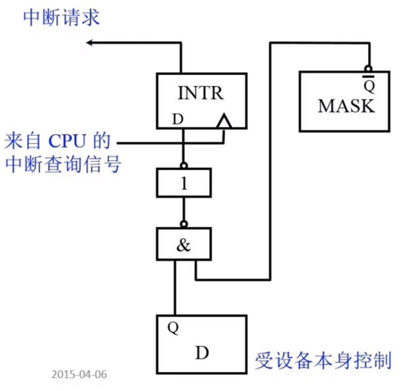

## 计算机组成原理 -- 硬件

**哈尔滨工业大学——刘宏伟**

---

#### 课程介绍

+ 主要讲什么？

+ 讲授内容

  + 基本部件的结构和组织方式
  + 基本运算的操作原理
  + 基本部件和单元的设计思想

+ 特色

  + **只讲一般原理**，不以具体机型为依托
  + 采用自顶向下的方式、层层细化

+ 教材

  + 《计算机组成原理》——唐硕飞

+ 计算机课程体系

  

+ 课程组织

  1. 概论

  2. 计算机系统的硬件结构

  3. CPU

  4. CU

     

---

#### 第一章 计算机系统概要

##### 计算机系统简介

+ 现代计算机的多样性

+ 计算机系统的两大组成部分：硬件，软件

  + 硬件：计算机实体，如主机、外设等

  + 软件：由具有各类特殊功能的程序组成

    + 系统软件：管理整个计算机系统。  

      语言处理程序、操作系统、服务性程序、网络通信程序、数据库管理系统

    + 应用软件：按任务编制的程序

+ 语言层次结构

  + 微指令系统，微程序机器M0，由硬件直接执行微指令
  + 机器语言，实际机器M1，用微指令解释机器指令

  **硬件**

  ————————————————————————————

  **软件**

  + 操作系统，虚拟机器M2，用机器语言解释操作系统
  + 汇编语言，虚拟机器M3，用汇编程序翻译成机器语言程序
  + 高级语言，虚拟机器M4，用编译程序翻译成汇编语言程序

+ 计算机体系结构和计算机组成

  

##### 计算机的基本组成框图

+ 冯·诺依曼计算机的特点

  + 组成部件：运算器、控制器、存储器、输入设备、输出设备

  + 指令和数据以同等地位存于存储器中，按地址寻访

  + 指令和数据用二进制表示

  + **指令由操作码和地址码组成**

  + **存储程序**

  + 以运算器为中心

  + 冯·诺依曼计算机硬件框图

    

+ 计算机框图改进

  + 以存储器为核心

  + 硬件框图

    

+ 现代计算机硬件框图

  

+ 系统复杂性管理的方法
  + 抽象化
  + 层次化：将被设计系统分为多个模块或子模块
  + 模块化：有明确定义的功能和接口
  + 规则性：模块化更容易被重用

##### 计算机的各个部件

+ 上机前准备

  + 建立数学模型
  + 确定计算方法
  + 编制解决程序
    + 程序——运算的**所有步骤**
    + 指令——每**一个步骤**

+ 存储器的基本结构

  

  + 存储体(办公大楼) &rArr; 存储单元(房间) &rArr; 存储单元(床位，0/1)
  + **存储单元**存放一串二进制代码
  
  + **存储字**存储单元中二进制代码的组合
  
  + **存储字长**存储单元中二进制代码位数
  
  + 每个存储单元都有一个地址
  
  + **按地址寻址**
  
+ **MAR**：存储器地址寄存器，反映存储单元的个数。
  
+ **MDR**：存储器数据寄存器，反映存储字长。
  
  如 MAR = 4位，MDR = 8位，则存储单元个数为16个，存储字长为8
  
+ 运算器的基本机构

  

  + 加法操作过程
  
    
  
  + 减法操作过程
  
    
  
  + 乘法操作过程
  
    
  
  + 除法操作过程
  
    
  
+ 控制器的基本结构

  + 功能
    + 解释指令
    + 保证指令的按序执行
  + 完成一条指令
    1. 取指令	PC
    2. 分析指令	IR
    3. 执行指令	CU
  + **PC**：存放当前欲执行指令的地址，具体计数功能**(PC)+1 &rArr; PC**。
  + **IR**：存放当前欲执行的指令。
  + **CU**：控制单元，用于执行计算机指令

+ 主机完成一条指令的过程

  + 以取数指令为例

    

    + 取指令：PC &rArr; MAR &rArr; M(存储体) &rArr; MDR &rArr; IR
    + 调整PC：( PC )+1 &rArr; PC
    + 分析指令：OP( IR ) &rArr; CU
    + 执行指令：Ad( IR ) &rArr; MAR &rArr; M &rArr; MDR &rArr; ACC

  + 以存数指令为例

    

+ 计算机硬件的主要技术指标

  + **机器字长**，与CPU中的寄存器位数有关

  + **运算速度**

    + 主频

    + 核数，每个核支持的线程数

    + 吉普森法
      $$
      T_M = \sum^{n}_{i = 1}{f_i}{t_i}
      $$

    + **CPI** 执行一条指令所需时钟周期数，使用加权平均法

    + **MIPS**每秒执行的百万级机器指令数

    + **FLOPS**每秒浮点运算次数

  + **存储容量**

    + 主存容量
      + 存储单元个数 × 存储字长，如MAR = 10，MDR = 8，容量为 1K × 8位
      + 字节数，如 2^13 b = 1KB
    + 辅存容量

---

#### 第二章 计算机的发展及应用

##### 计算机的发展史

+ 第一台电子计算机的出现时间

  1946年，美国ENIAC，30吨，1955年退役

+ 现代计算机产生的驱动力

  + 需求
  + 技术发展
    + 电子技术的发展
    + 计算机体系结构的发展

+ IBM System / 360

+ 微处理器芯片	1971年	Intel

+ 软件技术的兴起和发展

  + 机器语言	面向机器
  + 汇编语言	面向机器
  + 高级语言	面向问题

+ 系统软件

  

+ 软件发展特点

  + 开发周期长
  + 制作成本昂贵
  + 检测软件产品质量的特殊性
  + 软件是程序以及开发、使用和维护程序所需要的所有文档

##### 计算机应用与展望

**应用**

1. 科学计算和数据处理
2. 工业控制和实时控制
3. 网络技术
   + 电子商务
   + 网络教育
   + 敏捷制造
   + 虚拟现实
   + 办公自动化和管理信息系统
   + CAD/CAM/CIMS
   + 多媒体技术
   + 人工智能

**展望**

1. 计算机具有类似人脑的一些超级智能功能
2. 芯片集成度的提高受以下三方面的限制
   + 芯片集成度受物理极限的制约
   + 按几何级数递增的制作成本
   + 芯片的功耗、散热、线延迟
3. 替代传统硅芯片？
   + 光计算机
   + DNA生物计算机
   + 量子计算机

---

#### 第三章 系统总线

##### 总线的基本概念

+ 总线是连接各个部件的信息传输线，是**各个部件共享的传输介质**

+ 总线上信息的传输

  + 串行，传送数据少，但传送距离长
  + 并行，传送数据多，但传送距离短

+ 总线结构

  + 单总线结构

    

    缺点：电脑效率特别低

  + CPU双总线结构

    

    缺点：主存 和 I/O设备没有直接的信息通路

  + 存储器为中心双总线结构

    

##### 总线的分类

+ 片内总线：**芯片内部** 的总线

+ 系统总线：**计算机各部件之间** 的信息传输线

  + 数据总线	**双向** 与机器字长、存储字长有关，小于等于机器字长、存储字长。
  + 地址总线	**单向** 与存储地址、I/O地址有关。
  + 控制总线	**有出  有入**

+ 通信总线：用于 **计算机系统之间** 或 **计算机系统与其他系统** 之间的通信

  传输方式

  + 串行通信总线
  + 并行通信总线

##### 总线特性即性能指标

+ 总线的物理实现

+ 总线的特性

  + 机械特性：**尺寸、形状、管脚数** 及 **排列顺序**
  + 电气特性：**传输方向** 和有效的 **电平** 范围
  + 功能特性：每根总线的 **功能**
  + 时间特性：信号的 **时序** 关系

+ 总线的性能指标

  + 总线宽度：数据线的根数
  + 标准传输率：每秒传输的最大字节数（MBps）
  + 时钟同步/异步：同步、不同步
  + 总线复用：**地址线** 与 **数据线** 复用
  + 信号线数：地址线、数据线 和 控制线 的总和
  + 总线控制方式：突发、自动、仲裁、逻辑、技术
  + 其他指标：负载能力

+ 总线的标准

  

##### 总线的结构

+ 单总线结构

+ 多总线结构

  + 双总线结构

    

  + 三总线结构

    

    

  + 四总线结构

    

+ 传统微机总线结构

+ VL-BUS局部总线结构

+ PCI总线结构

+ 多层PCI总线结构

##### 总线控制

+ 总线判优控制

  + 基本概念
    + 主设备（模块）	对总线有**控制权**
    + 从设备（模块）	只能 **响应** 从主设备发来的总线命令

  + 总线判优控制实现
    + 集中式

      + 链式查询

        

        **结构简单，增删设备方便，但是对电路故障十分敏感，且速度慢，优先级设置简单，用于简单的嵌入式系统。**

      + 计数器定时查询

        

        **优先级设置非常灵活，需要多条设备地址线，数量为 log2(n) 的向上取整。**

      + 独立请求方式

        

        **较前两种方法速度更快，优先级由总线内部控制部件确定，优先级设置比较灵活，缺点是需要线路较多。**

    + 分布式

+ 总线通信控制

  + 目的：解决通信双方 **协调配合** 问题

  + 总线传输周期

    + 申请分配阶段	**主模块申请**，总线仲裁决定
    + 寻址阶段			主模块向从模块 **给出地址** 和 **命令**
    + 传数阶段			主模块和从模块 **交换数据**
    + 结束阶段			主、从模块 **撤销有关消息**

  + 通信四种方式

    + 同步通信			由 **统一时标** 控制数据传输
    + 异步通信			采用 **应答式**，没有公共时钟标准
    + 半同步通信		**同步、异步结合**
    + 分离式通信		充分 **挖掘** 系统 **总线的每个瞬间** 的潜力

    1. 同步式数据输入/输出

       **同步式数据输入**

       

       **同步数据输出**，和上图略有差别

       

    2. 异步通信

       较同步通信多了两条线，**请求线**和**应答线**

       + 不互锁（可靠性有待提高）
       + 半互锁（可能会导致一直处于请求状态）
       + 全互锁（类似于3次握手）

    3. 半同步通信（同步、异步相结合）

       + 同步：发送方 用系统 时钟前沿 发信号  

         ​			接收方 用系统 时钟后沿 判断、识别

       + 异步：允许同步速度的模块和谐工作  

         ​			增加一条”等待“响应信号 **WAIT**

       

       **对应的时序图**

       

    4. 以上三种通信的**共同点**（以一个总线传输周期为例）

       + 主模块发地址、命令		占用总线
       + 从模块准备数据				不占用总线	**总线空闲** &rArr; 分离式通信，**充分利用总线**
       + 从模块向主模块发数据	占用总线

    5. 分离式通信

       **充分 挖掘 系统 总线的每个瞬间 的潜力**

       一个总线传输周期

       + 子周期1	主模块 申请 占用总线，使用完后即 放弃总线 使用权；
       + 子周期2	从模块（此时应该是**主模块**） 申请 占用总线，将各种信息送至总线上。

       特点

       + 各模块有权申请占用总线
       + 采用同步通信方式，不等对方回答
       + 各模块准备数据时，不占用总线
       + 总线被占用时，无空闲

---

#### 第四章 存储器

##### 概述

+ 存储器分类

  + 按存储介质分类(半导体，磁，光)
    1. 半导体存储器 **易失**		TTL（集成低，功耗多，速度快）、MOS（集成高，功耗小，速度慢）
    2. 磁表面存储器				磁头、载磁体
    3. 磁芯存储器					硬磁材料、环状元件（古老的存储方式）
    4. 光盘存储器					激光、磁光材料
  + 按存取方式分类
    1. 存取时间与物理地址无关（随机访问）
       + 只读存储器	可读可写
       + 只读存储器	只可读
    2. 存取实践与物理地址有关（串行访问）
       + 顺序存取存储器	磁带
       + 直接存取存储器	磁盘
    3. 按计算机中的作用分类
       + 主存储器
         + RAM
           + 静态RAM
           + 动态RAM
         + ROM
           + MROM
           + PROM
           + EPROM
           + EEPROM
       + Flash Memory
       + 高速缓冲存储器（Cache）
       + 辅助存储器：磁盘、磁带、光盘

+ 存储器的层次结构

  1. 存储器三个主要特征的关系

     

  2. 寄存器：体系结构寄存器、非体系结构寄存器
  
  3. 缓存-主存层序 和 主存-辅存层序
  
     

##### 主存储器

###### 概述

+ 主存的基本组成

  

+ 主存和CPU之间的联系

  

+ 主存中存储单元地址的分配

  + **数据的前面是高位，地址的后面是高位**

    

  +  以下3个寻址的地址线均为24根。

    1. 字节一般为8个字长，符号为B，所以224 = 16MB
    2. **字长为16位等于2个字节**，按**字**寻址，224  = 8MW，W是word字的意思
    3. **字长为32位等于4个字节**，按**字**寻址，224  = 4MW，W是word字的意思

    

+ 主存的技术指标

  + 存储容量：**主存 存放二进制代码的总位数**
  + 存储速度
    + 存取时间	存储器的 **访问时间**：读出时间，写入时间
    + 存取周期	**连续两次独立的存储器操作**（读或写）所需的**最小时间间隔**，分为**读周期**和**写周期**
    + 存取周期 **大于** 存取时间，因为 **存取周期 = 存取时间 + 恢复时间**
    + 存储器带宽：位 / 秒

###### 半导体存储芯片简介

+ 半导体存储芯片的基本结构

  

  + 片选线：CS，CE，可以进行芯片组合

    

  + 读 / 写 控制线：WE（低电平写，高电平读）  

    ​							OE（允许读）WE（允许写）

+ 半导体存储芯片的译码驱动方式

  + 线选法：所需的线太多了，例如20根地址线就会延伸出 **220** 根线

    

  + 重合法：对比线选法，20根地址线只会延伸出**211**根线

    

###### 随机存取存储器（RAM）

+ 静态RAM（SRAM）
  
  + 存储原理：利用 **数电** 中的**双稳态触发器**结构进行 0 / 1 存储
    
  + 基本电路
  
    
  
    1. 基本电路读操作
  
       
  
    2. 基本电路写操作
  
       
  
    3. 重合法组合芯片
  
       
  
       **组合成64 × 64 的芯片矩阵，每次进行4位的读和写**
  
       
  
       **以上是写操作，读操作雷同，WE 是低写高读，每次控制4位的读和写**
  
+ 动态RAM（DRAM）

  + 存储原理：利用的是**电容**

  + 基本单元电路

    + 分为 **三管DRAM** 和 **单管DRAM**

    

  + 基本芯片

    + 三管动态RAM芯片(1K  × 1 位 芯片)

      行地址线对每一行都有**读选择线**和**写选择线**，并且还有**刷新放大器**对存储电容进行充电

      

    + 单管动态RAM芯片

      

      具体读写 看[视频](https://www.bilibili.com/video/av15123338/?p=29)

  + 电容刷新

    + 电容会慢慢漏电，**每次刷新都只和行地址有关**
    + 刷新方法
      + 集中是刷新，存在**死区**
      + 分散刷新，没有死区，但会过度刷新
      + 异步刷新，可能存在**死区**，但**死区较小**

+ **动态RAM** 和 **静态RAM** 的比较

  |          | DRAM (用作主存) | SRAM (用作缓存) |
  | -------- | --------------- | --------------- |
  | 存储原理 | 电容            | 触发器          |
  | 集成度   | 高              | 低              |
  | 芯片引脚 | 少              | 多              |
  | 功耗     | 小              | 大              |
  | 价格     | 低              | 高              |
  | 速度     | 慢              | 快              |
  | 刷新     | 有              | 无              |

###### 只读存储器（ROM）

+ 发展历程
  + 早期只读存储器出厂时，厂家就写好了内容
  + 改进1——用户可以自己写——一次性
  + 改进2——可以多次写——能够对信息进行擦除
  + 改进3——电可擦写——特定设备
  + 改进3——电可擦写——连接到计算机即可擦写
  
+ 掩膜ROM（MROM）

  + 行列选择线交叉处有MOS管为“1”
  + 行列选择线交叉处无MOS管为“0”

+ PROM（一次性编程）

  

+ EPROM（多次性编程）

  N型沟道浮动栅MOS电路，**用紫外线全部擦洗**，但信息擦除麻烦。

  

+ EEPROM（多次性编程）

  + 电可擦写
  + 局部擦写
  + 全部擦写

+ Flash Memory（闪速型存储器）

###### CPU和存储器的连接

+ 存储器容量的扩展

  + 位扩展（增加存储字长）

    + 用 2片 1K × 4 位存储芯片组成 1K × 8 位 的存储器

      有10根地址线和8根数据线

      

  + 字扩展（增加存储字的数量）

    用 2片 1K × 8位 存储芯片组成 2K × 8 位 的存储器

    由 2K × 8 可知共有 11 根地址线，和8根数据线

    

  + 字、位扩展

    用 8片 1K × 4位 存储芯片组成 4K × 8位 的存储器

    由 4K × 8 可知共有 12 根地址线，和8根数据线

    

+ 存储器与CPU的连接

  + 地址线的连接

  + 数据线的连接

  + 读 / 写命令线的连接

  + 片选线的连接

  + 合理选择存储芯片

  + 其他：时序（存储器和CPU的时序）、负载（CPU能带动多少个芯片）

  + **例1：**王道2019记组 P106 综合应用题 6

    系统程序区用 ROM，用户程序区用 RAM，ROM只读不写

  + **例2：**用例1的CPU，要求最小 4K 为系统程序区，相邻 8K 位用户程序区。

    **解题步骤：**

    1. 写出对应的二进制地址码
    2. 确定芯片的数量及类型
    3. 分配地址线
    4. 确定片选线
    5. 确定片选逻辑

###### 存储器的校验

+ 编码最小距离：任意两组合法代码之间的 **二进制位数** 的 **最少差异编码的纠错**、  

  **检错能力与编码的最小距离有关**

  **L - 1 = D + C （D >= C）**

  **L —— 编码的最小距离**

  **D ——检测错误的位数**

  **C ——纠正错误的位数**

+ 汉明码（具有**一位**纠错能力的编码）

  + 汉明码采用奇偶校验

  + 汉明码采用分组校验

  + 汉明码的分组是一种非划分方式

     

  + 汉明码添加校验位数 K ：2k >= n + k + 1，n是传输数据位数

  + 校验位的放置：放置在 20 = 1，22 = 2，22 = 4，23 = 8，…… 2n 的位置上，且校验位不需要再被校验

  + 具体过程：P 代表校验位，D 代表数据位

    | 位置 | 7    | 6    | 5    | 4    | 3    | 2    | 1    |
    | ---- | ---- | ---- | ---- | ---- | ---- | ---- | ---- |
    |      | D4   | D3   | D2   | P3   | D1   | P2   | P1   |

    + D1放在位置3上，由P2和P1校验；

      D2放在位置5上，由P3和P1校验；

      D3放在位置6上，由P3和P3校验；

      D4放在位置7上，由P3、P2和P1校验；

    + 校验位Pi的取值（偶校验）

    $$
    P_{1} = D_{1} xor D_{2} xor D_{4}\\
    P_{2} = D_{1} xor D_{3} xor D_{4}\\
    P_{3} = D_{2} xor D_{3} xor D_{4}
    $$

    ​		奇校验的校验位 Pi 还要异或一个 “1”

    + 校验原理（偶校验）：

      校验得出Si
      $$
      S_{1} = P_{1} xor D_{1} xor D_{2} xor D_{4}\\
      S_{2} = P_{2} xor D_{1} xor D_{3} xor D_{4}\\
      S_{3} = P_{3} xor D_{2} xor D_{3} xor D_{4}
      $$
      若 Si 都为0则说明无错；否则Sn …… S1 组成的二进制数的位号是出错的位（错的可能是校验位），校验位错了可不纠正。奇校验则是 Si 还要异或一个“1”。

###### 提高访存速度的措施

+ 采用高速器件

+ 采用层次结构 **Cache——主存**

+ 调整主存结构

  + 单体多字系统（16位的CPU，64位的数据存储，1次访问获得4倍数据）

    + 增加存储器的带宽；
    + 造成写入麻烦，只需要写入16位，但可能最后要多写入48位；
    + 对不相邻的数据会造成读取浪费，由于不相邻多出的数据可能并不需要。

  + 多提并行系统

    + 高位交叉	顺序编址 （**用于存储器容量的扩展**）

      

      缺点：**根据程序的局部性原理，可能会造成某个存储体十分繁忙**

      适合存储容量的扩展，并不适合提高存储器访存速度

    + 低位交叉	各个存储体轮流编址 （**用于访问带宽和存取时间的提升**）

      

      对高位交叉的一种改进

      特点：不改变存取周期的前提下，增加存储器的带宽

      **流水线方式读取存储体时间**

      

###### 高性能存储芯片

+ SDRAM（同步DRAM）  

  在系统时钟控制下进行读 / 写，**CPU无需等待**

+ RDRAM，主要解决 **存储器带宽** 问题

+ 带 Cache 的 DRAM，特别适合 **猝发式读取**

  猝发式读取：也称猝发式传送，只需给出块的起始地址，然后对固定块长度的数据一个接一个地读出或写入。对于CPU（主方）存储器（从方）而言的块传送，常称为猝发式传送，其块长一般固定为数据线宽度（存储器字长）的4倍。例如一个64位数据线的总线，一次猝发式传送可达256位。这在超标量流水中十分有用

##### 高速缓冲存储器

###### 概述

+ 高速缓冲存储器用于提高CPU访存数据，避免CPU **空等** 现象

  

  *利用了程序访问的局部性原理*

  + 时间局部性：当前使用的指令和数据在不久的将来还会使用。
  + 空间局部性：当前使用的指令数据的**相邻**的指令数据在不久的将来可能会使用。

+ Cache的工作原理

  + 主存和缓存的编址

    主存和Cache按块存储，主存中**块**的大小和Cache中**块**的大小一致

    

  + 命中和不命中

    

  + Cache 的命中率

    CPU欲访问的信息在Cache中的 **比率**

    命中率与Cache的 **容量** 与 **块长** 有关

    一般块可取 4~8 个字

    块长：**一个存取周期内从主存迪调出的信息长度**

  + Cache —— 主存系统的效率

    + 下图是Cache与主存并行访问的时间计算公式

      

    + 先访问Cache，Cache中没有在访问主存的时间计算公式：
      $$
      e = \frac{t_{c}}{h × t_{c} + (1 - h) × (t_c + tm)} × 100\%
      $$

  + Cache 的基本结构

    

  + Cache 的读写操作

    + **读操作**

      

    + **写操作**：解决 Cache 和主存一致性

      + 写直达法：主存和Cache都写入（**速度慢，实现简单**）
      + 写回法：只写入Cache，当Cache数据被替换出去时才写回主存（**速度快，实现复杂**）

  + Cache 的改进

    + 增加Cache 的级数

      片内 Cache

      片外 Cache

    + 统一缓存和分立缓存

      指令Cache	数据Cache

      与指令执行的控制方式有关

###### Cache--主存的地址映射

+ 直接映射：结构简单，速度快，但Cache冲突概率较大，Cache利用率低，速度可能会较慢

  

+ 全相联映射：结构复杂，查找麻烦，速度慢

  

+ 组相联映射（**全相连映射** 和 **直接映射** 的 **折中**）

  

###### 替换算法

+ 先进先出（FIFO）算法
+ 近期最少使用（LRU）算法
+ 小结
  + 直接：**某一** 主存块 **只能固定** 映射到 **某一** 缓存块
  + 全相连：**某一** 主存块 **能** 映射到 **任一** 缓存块
  + 组相连：**某一** 主存块 只**能** 映射到 **某一** 缓存 **组** 中的位置

##### 辅助存储器（非重点）

###### 概述

+ 特点	不能直接与CPU交换信息

+ 磁表面存储器的技术指标

  1. 记录密度	道密度Dt	位密度Db

  2. 存储容量

  3. 平均寻址时间 = 寻道时间 + 等待时间

     辅存速度：寻址时间，磁头读写时间

  4. 数据传输率：Dr = Db × V

  5. 误码率

###### 磁记录原理和记录方式

+ 磁记录原理

  + 写入

    

  + 读出

    

###### 硬磁盘存储器

+ 硬磁盘存储器类型

  + 固定磁头（快）和移动磁头（慢）
  + 可换盘和固定盘

+ 硬磁盘存储器结构

  

###### 软磁盘存储器

+ 已经退出市场

+ |          | 硬盘                   | 软盘                     |
  | -------- | ---------------------- | ------------------------ |
  | 速度     | 高                     | 低                       |
  | 磁头     | 固定、活动，悬浮在盘片 | 活动，接触盘片（易损坏） |
  | 盘片     | 固定盘，不可换         | 可换盘片                 |
  | 价格     | 高                     | 低                       |
  | 环境要求 | 苛刻                   | 一般                     |

###### 光盘存储器

+ 概述
  + 采用光存储技术，利用激光写入和读出
  + 第一代光存储技术：采用非磁性介质，不可擦写
  + 第二代光存储技术：采用磁性介质，可擦写
+ 光盘存储原理
  + 只读型和只写以此型：热作用（烧写）
  + 可擦写光盘：				热磁效应

---

#### 第五章 输入输出系统

##### 概述

###### 发展状况

  + 早期
    + 分散连接
    + CPU 和 I/O设备 **串行** 工作，程序查询方式
  + 接口模块和DMA阶段
    + 总线连接
    + CPU 和 I/O设备 **并行** 工作
      + 中断方式
      + DMA方式
  + 具有通道结构的阶段
  + 具有I/O处理机的阶段

###### I/O系统的组成

  + I/O软件

    + I/O指令	CPU指令的一部分

      | 操作码                  | 命令码                | 设备码                             |
      | ----------------------- | --------------------- | ---------------------------------- |
      | 说明这条这指令对I/O操作 | 指出要对I/O进行的操作 | I/O设备的地址或I/O设备中寄存器地址 |

    + 通道（小型DMA处理器）指令：通道自身的指令  

      指出数组的首地址、传送字数、操作命令

  + I/O硬件

    + 设备
    + I/O接口
    + 连接方式：设备 &hArr; 设备控制器 &hArr; 通道

###### I/O设备与主机的联系方式

  + I/O设备编址方式

    + 统一编址：	可以使用取数、存数指令对 I/O设备 进行操作
    + 不统一编址：有专门的I/O指令

  + 设备选址

    用设备选择电路识别是否被选中

  + 传送方式

    + 串行
    + 并行

  + 联络方式

    + 立即响应

    + 异步工作，采用应答信号

      

    + 同步工作，采用同步时标

  + I/O设备与主机的连接方式

    + 辐射式连接（分散式连接）：早期的连接方式，不便于增删设备和设备移植
    + 总线连接：便于增删设备

###### I/O设备与主机信息传送的控制方式

  + 程序查询方式

    

    这种方式的**CPU使用效率较低**

  + 程序中断方式

    + I/O工作

      + 自身准备，此时CPU不查询
      + 与主机交换信息，此时CPU暂停现行程序
      + CPU与I/O部分的并行工作

    + 中断方式流程

      

    + 缺点：I/O设备和主存间的数据交换仍需要CPU来完成，降低CPU利用率

  + DMA方式

    + 主存和I/O之间有一条直接数据通道，I/O设备和主存间的数据交换不需要中断现行程序

    + 周期窃取（周期挪用）：用CPU空出总线，以实现I/O设备和主存间的数据交换

      
    
+ 三种方式工作效率比较

  

  

  

###### 总结

I/O设备随着时代的发展会越来越**自主化**

##### 外部设备

*简要介绍*

+ 概述：分为 **设备控制器** 和 **机、电、磁、光部分**，通过**I/O接口** 与主机相连
  + 分类
    + 人机交互设备				键盘、鼠标、打印机等
    + 计算机信息存储设备	磁盘、光盘、磁带
    + 机——机通信设备		调制解调器等
+ 输入设备
  + 键盘
    1. 按键
    2. 判断哪个键按下
    3. 将此键翻译成ASCII码（编码键盘法）
  + 鼠标
    + 机械式
    + 光电式
  + 触摸屏
+ 输出设备
  + 显示器：
    1. 字符显示		字符发生器
    2. 图形显示		主观图像
    3. 图像显示		客观图像
  + 打印机
    + 击打式		点阵式
    + 非打击式	激光、喷墨
+ 其他设备
  + A/D、D/A	模拟 / 数字（数字 / 模拟）转换器
  + 终端
  + 文字处理	文字处理、文字存储、文字输出
+ 多媒体技术
  + 数据压缩
  + 图像、语音识别
  + 虚拟现实技术
  + 等等……

##### I/O接口

+ 概述与功能

  + **I/O接口是CPU与外部设备之间的"翻译官"**
  + 功能
    + 实现设备的选择
    + 实现数据缓冲达到速度匹配
    + 实现数据串——并格式的转换
    + 实现主机和I/O设备的电平转换
    + 传送控制命令
    + 反映设备的状态

+ 接口的组成

  + 总线连接方式的I/O接口电路

    

  + | 功能               | 组成                   |
    | ------------------ | ---------------------- |
    | 选址功能           | 设备选择电路           |
    | 传送命令的功能     | 命令寄存器、命令译码器 |
    | 传送数据的功能     | 数据缓冲寄存器         |
    | 反映设备状态的功能 | 设备状态标记           |

    + 设备状态标记
      + 完成触发器D
      + 工作触发器B
      + 中断请求触发器INTR
      + 屏蔽触发器MASK，通过中断优先级判断是否要屏蔽中断

  + 基本组成

    

+ 接口类型

  + 按数据 **传送方式** 分类
    + 并行接口
    + 串行接口
  + 按功能 **选择的灵活性** 分类
    + 可编程接口
    + 不可编程接口
  + 按 **通用性** 分类
    + 通用接口
    + 专用接口：只能做某种特定外部设备的接口
  + 按数据传送的 **控制方式** 分类
    + 中断接口
    + DMA接口

#####  程序查询方式

+ 程序查询流程

  + 查询流程

    

  + 程序流程

    

+ 程序查询流程

  

##### 程序中断方式

###### 中断的概念

###### I/O中断的产生

+ 中断就是中断源产生，中断源是指一切能够引起CPU中断的事物，例如：打印机、鼠标、键盘等等……

###### 程序中断方式的接口电路

+ 设置中断请求触发器和中断屏蔽触发器  

  INTR（为1，有请求） 和 MASK（为1，被屏蔽）

  

+ 排队器：选出优先级最高的设备优先处理

  + **硬件**实现：在CPU内或在接口电路中（链式排队器）

    

  + **软件**实现：通过查询的方法，查询出高优先级的中断

+ 中断向量地址形成部件：让CPU知道中断服务程序的**入口地址**

  + 由软件产生
  + 硬件向量法：由 **硬件** 产生 **向量地址**， 再由 **向量地址** 找到 **入口地址**。  

  中断向量：即可以理解成 **中断服务程序的入口地址**，包括一些执行中断的具体状态信息。

+ 程序中断电路的基本组成。

  

###### I/O中断处理过程

+ CPU响应中断的条件和时间
  + 条件
    + 允许你中断触发器 EINT = 1
  + 时间
    + 当 D = 1 且 MASK = 0 时
    + 在每条指令执行阶段的结束前，CPU发出中断查询信号
+ I/O中断处理过程（具体对照 93.png，即上图，真是妙啊！！！）

###### 中断服务程序的流程

+ 中断服务程序的流程

  1. 保护现场
     + 程序断点的保护			中断隐指令完成
     + 寄存器内容的保护		进栈指令，进栈保存
  2. 中断服务：对不同I/O设备具有不同内容的设备服务
  3. 恢复现场
  4. 中断返回		中断返回指令

+ 单重中断和多重中断

  + 单重中断：**不允许别的中断** **中断** 正在执行的 **中断服务程序**
  + 多重中断：**允许级别更高** 的中断源 **中断** 现行的 **中断服务程序**

+ 单重中断和多重中断服务流程

  

  单重中断和多重中断差别在于 **中断服务程序中 *开中断* 的位置**

+ 主程序和服务程序抢占CPU示意图

  

##### DMA方式

###### DMA方式的特点

+ DMA和程序中断两种方式的数据通路

  

  DMA方式数据传送不需要CPU的参与，提高CPU利用率

+ DMA与主存交换数据的三种方式

  + 停止CPU访问主存

    + 控制简单
    + CPU处于不工作状态或保持状态
    + 缺点：DMA工作时，CPU不能对主存进行访问，未能充分发挥CPU对主存的利用率

  + 周期挪用（周期窃取）

    + DMA访问主存有三种可能

      + CPU此时不访问主存，DMA进行主存访问
      + CPU正在访问住处，DMA只能进行等待
      + CPU与DMA同时请求访问主存，**CPU将放弃对主存的访问**，总线控制权交给DMA

      

  + DMA与CPU交替访问

    将CPU周期分为C1与C2，C1供DMA访问，C2供CPU访问

###### DMA接口的功能和组成

+ DMA接口功能

  + 向CPU **申请** DMA传送
  + 处理总线 **控制权的转交**
  + **管理** 系统总线、**控制** 数据传送
  + **确定** 数据传送的 **首地址和长度**，**修正** 传送过程中的数据 **地址** 和 **长度**
  + DMA传送结束时，**给出操作完成信号**

+ DMA接口组成（示例：单总线结构）

  

###### DMA的工作过程

+ DMA传送过程
  + 预处理：处理的信息如：输入/输出、传输的方向、设备地址、主存地址、传送字数等等……
  + 数据传输
  + 后处理
    + 数据的校验
    + 是否继续使用DMA
    + 传送过程是否正确，错则转诊断程序
    + **由中断服务程序完成**
  
  
  
+ DMA接口与系统的连接方式

  + 具有公共请求线的DMA请求：所有DMA接口**共享一条** DMA请求线 与CPU相连
  + 独立的DMA请求：每个DMA接口都有**独立的**DMA请求线与CPU相连

+ DMA方式与程序中断方式的比较

  |              | 中断方式         | DMA方式      |
  | ------------ | ---------------- | ------------ |
  | 数据传送     | 程序             | 硬件         |
  | 响应时间     | 指令执行结束     | 存取周期结束 |
  | 处理异常情况 | 通过中断处理，能 | 不能         |
  | 中断请求     | 传送数据         | 后处理       |
  | 优先级       | 低               | 高           |

+ DMA接口类型

  + 选择型：**物理上** 连接 **多个** 设备，**逻辑上** 只允许连接 **一个** 设备

  + 多路型：**物理上** 连接 **多个** 设备，**逻辑上** 允许连接 **多个** 设备同时工作，即 **设备准备阶段** 可有 **多个** 设备同时准				备，但是 **数据传送阶段** 也只能 **一个** 设备进行数据传送。

    + 多路型DMA接口，利用了 **通道** 的技术。

    + 工作原理：速度快的设备优先级高

      
