## 计算机组成原理 -- 数字

**哈尔滨工业大学——刘宏伟**

---

#### 主要内容

1. 计算机中数的表示
2. 计算机的运算方法
3. 运算器的设计

---

#### 第六章 计算机的运算方法

##### 无符号数和有符号数

###### 一、无符号数（无正负号）

+ 寄存器的位数 反映了无符号数的表示范围

  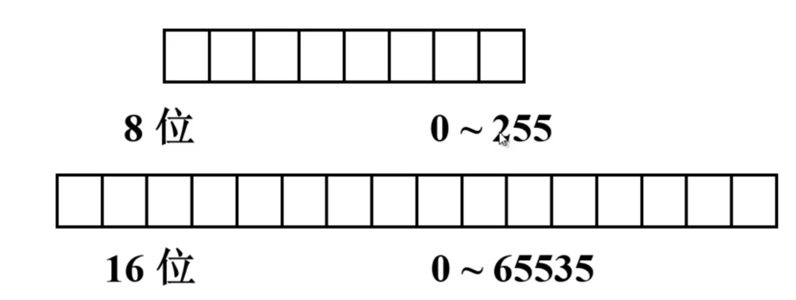

###### 二、有符号数

1. 机器数与真值

   + 真值：带符号的数

   + 机器数：符号数字化的数

   + 计算机中没有专门的硬件用于表示小数点，一般小数点的表示使用约定的方法

     + 小数点在数值位之前 &rarr; 小数定点机
     + 小数点在数值位之后 &rarr; 整数定点机

     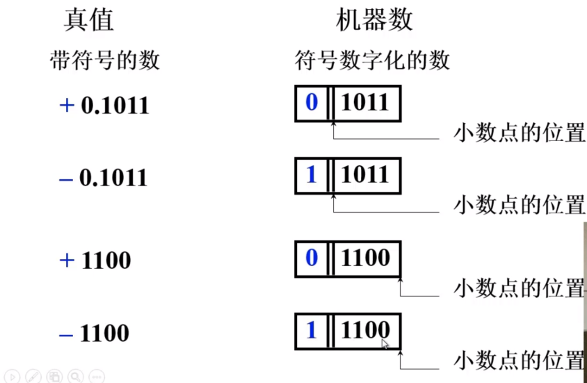

2. 原码表示法

   + 定义

     + 整数
       $$
       [x]_{原} = 
       \left\{
         \begin{array}{lr}
           0 \ \ ， \ x &  2^n > x \geq 0\\
           2^n，-x &  0 \geq x > -2^n
         \end{array}
       \right. \\
       x为真值 \ \ n为整数的位数
       $$
       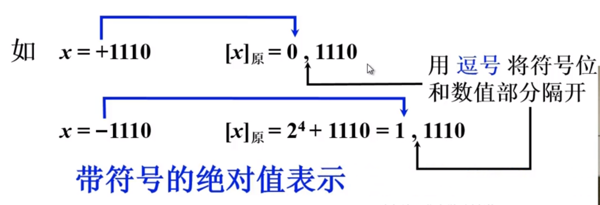

     + 小数
       $$
       [x]_{原} = 
       \left\{
         \begin{array}{lr}
           x   &  1 > x \geq 0\\
           1-x & \ 0 \geq x > -1
         \end{array}
       \right. \\ 
       x为真值
       $$
       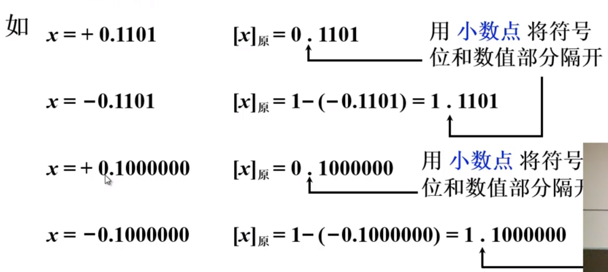

   + [正0]原  &ne;  [负0]原
   
   + 原码的特点：**简单、直观，但不适用计算机的运算**
   
     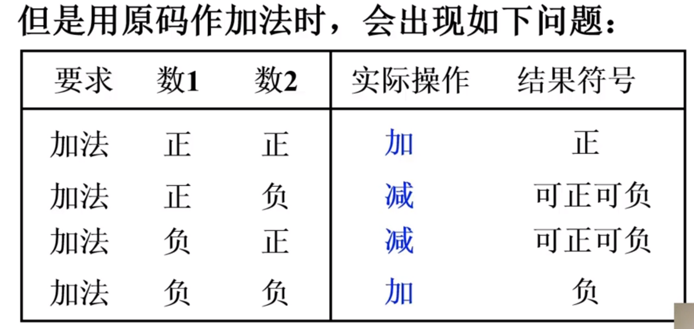
   
3. 补码表示法

   + **“补”** 的概念

     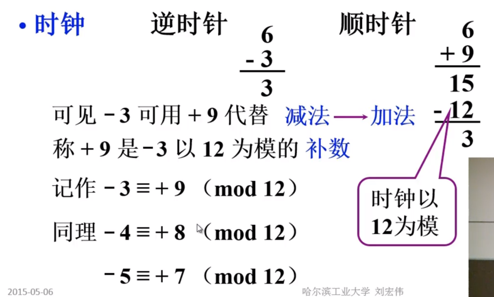

     + 结论
       + **一个负数加上 “模” 即得到该负数的补数**
       + **一个正数和一个负数互为补数时，它们的绝对值之和即为 “模” 数**

   + 正数的补数即为其本身

     + 两个互为补数的数，分别加上模数，结果仍为补数。

       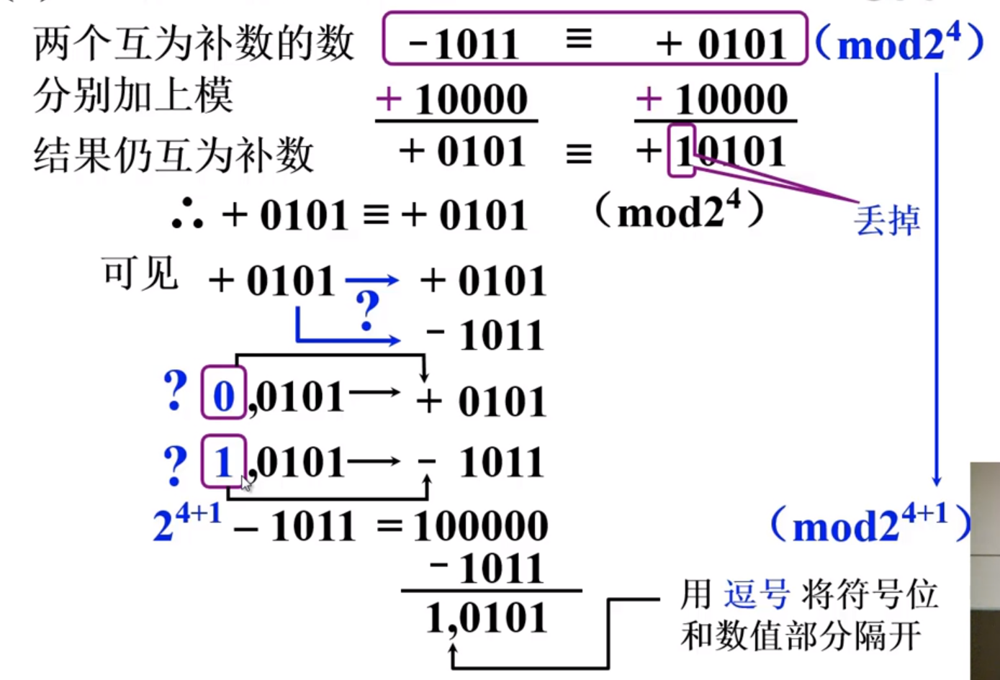

   + 补码的定义

     + 整数
       $$
       [x]_{补} = 
       \begin{cases}
       0, \ \ \ \ \ \ \ \ \ x & 2^n > x \ge 0 \\
       2^{n+1} + x & 0 > x \ge -2^n (mod \ 2^{n+1})
       \end{cases} \\
       x 为 真值 \ \ \ \ n为整数的位数(不包括符号位)
       $$
       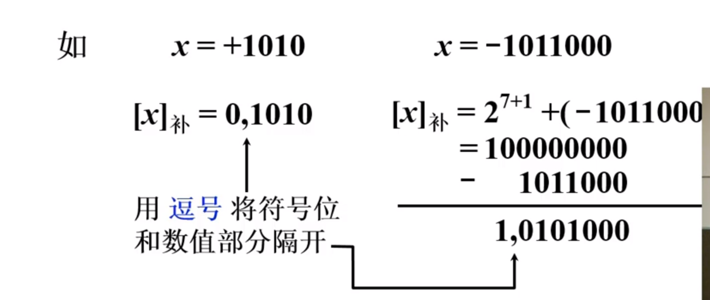
       
     + 小数
       $$
       [x]_{补} = 
       \begin{cases}
       x & 1 > x \ge 0 \\
       2 + x & 0 > x \ge -1 \ (mod \ 2)
       \end{cases} \\
       x为真值
       $$
       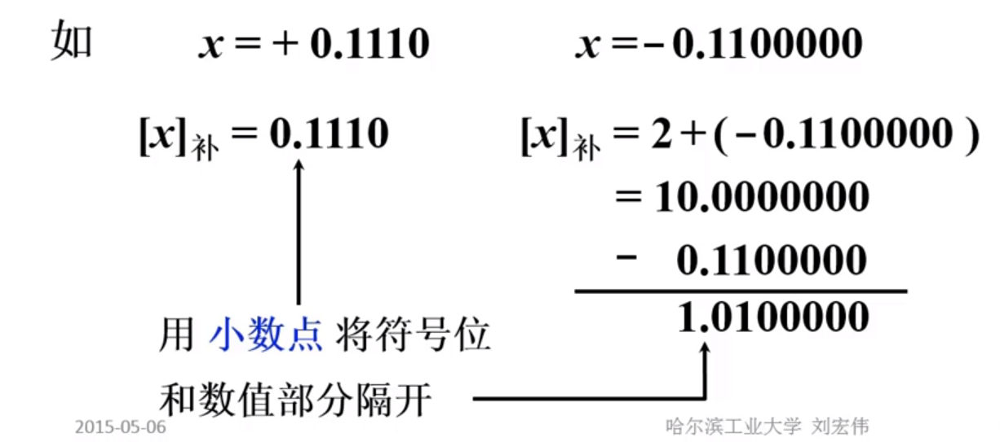
     
   + 原码求补码的快捷方式
   
     + **当真值为负时，除符号位外，每位取反，最后末位加1**
     + 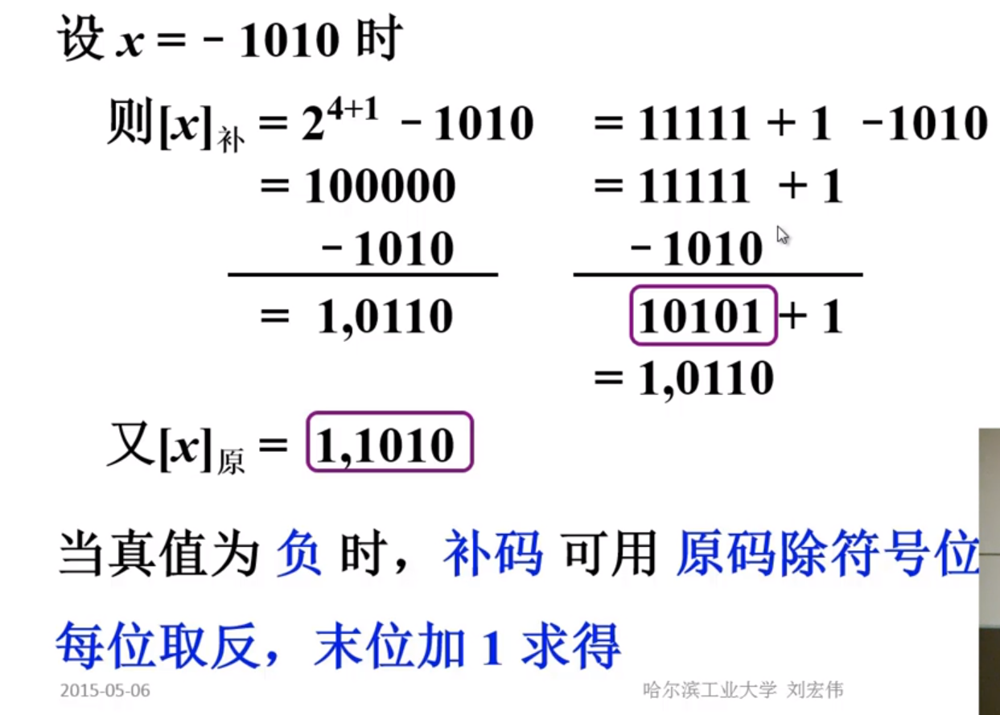
   
   + 补码求原码的快捷方式
   
     + **与原码求补码的快捷方式一样** &rArr; 当真值为负时，除符号位外，每位取反，最后末位加1
   
   + 补码的特点：
   
     + 补码的出现是为了**将**计算中的**减法**运算**变成加法**运算
     + **[正0]补  =  [负0]补**
     + **小数的 -1 是有补码的，但没有原码形式**
   
   + 补码的计算
   
     + 已知 **[y]补** ，求 **[-y]补**  
   
       **[y]补** 连同符号位在内，每位取反，末位加1即可得到**[-y]补** 
   
4. 反码表示法

   + 定义

     + 整数
       $$
       [x]_{反} = 
       \begin{cases}
       0, \ x & 2^n > x \ge 0 \\
       (2^{n+1}-1) + x & 0 \ge x > -2^n \ (mod \ 2^{n+1}-1)
       \end{cases} \\
       x为真值 \ \ \ \ n为整数的位数
       $$
       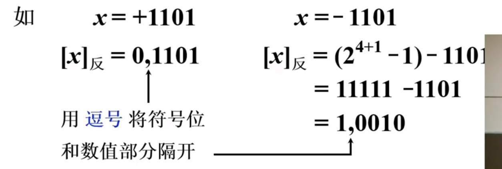

     + 小数
       $$
       [x]_{反} = 
       \begin{cases}
       x & 1 > x \ge 0 \\
       (2 - 2^{-n}) + x & 0 \ge x > -1 \ (mod \ 2 - 2^{-n})
       \end{cases} \\
       x为真值 \ \ \ \ n为小数的位数
       $$
       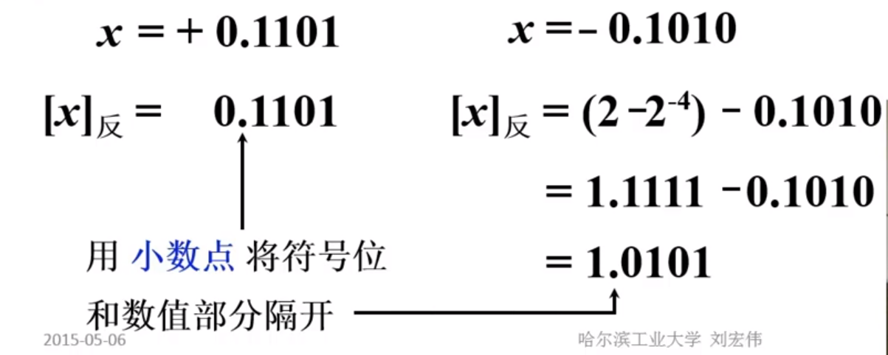

   + 反码的零

     + 正0：[+ 0.00000]反 = 0.00000，[+ 0,00000]反 = 0,00000
     + 负0：[- 0.00000]反 = 1.11111，[- 0,00000]反 = 1,11111

5. 三种机器数小结

   + 最高位为符号位，书写上用**”,“**或**”.“**(小数)将数值部分和符号位隔开
   + 对于正数，原码 = 补码 = 反码
   + 对于负数，符号位为1，其数值部分
     + 原码出符号位外每位取反，最后末位加1 &rarr; 补码
     + 原码出符号位外每位取反 &rarr; 反码
   + 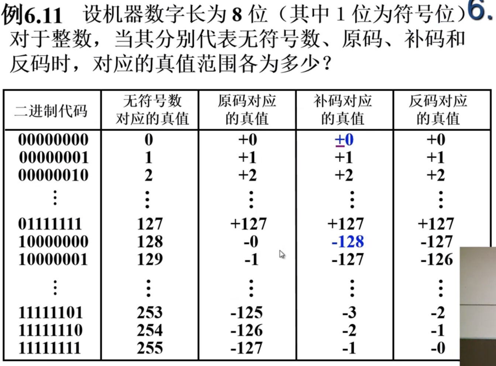

6. 移码表示法