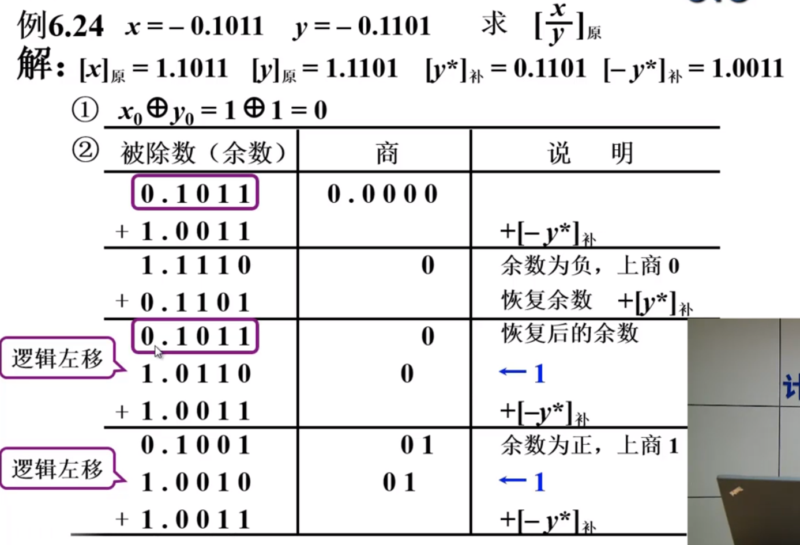
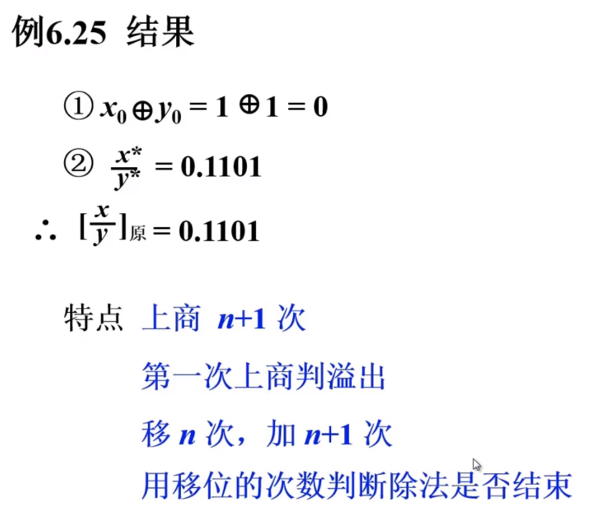

## 计算机组成原理 -- 数字

**哈尔滨工业大学——刘宏伟**

---

#### 主要内容

1. 计算机中数的表示
2. 计算机的运算方法
3. 运算器的设计

---

#### 第六章 计算机的运算方法

##### 无符号数和有符号数

###### 一、无符号数（无正负号）

+ 寄存器的位数 反映了无符号数的表示范围

  

###### 二、有符号数

1. 机器数与真值

   + 真值：带符号的数

   + 机器数：符号数字化的数

   + 计算机中没有专门的硬件用于表示小数点，一般小数点的表示使用约定的方法

     + 小数点在数值位之前 &rarr; 小数定点机
     + 小数点在数值位之后 &rarr; 整数定点机

     

2. 原码表示法

   + 定义

     + 整数
       $$
       [x]_{原} = 
       \left\{
         \begin{array}{lr}
           0 \ \ ， \ x &  2^n > x \geq 0\\
           2^n，-x &  0 \geq x > -2^n
         \end{array}
       \right. \\
       x为真值 \ \ n为整数的位数
       $$
       

     + 小数
       $$
       [x]_{原} = 
       \left\{
         \begin{array}{lr}
           x   &  1 > x \geq 0\\
           1-x & \ 0 \geq x > -1
         \end{array}
       \right. \\ 
       x为真值
       $$
       

   + [正0]原  &ne;  [负0]原
   
   + 原码的特点：**简单、直观，但不适用计算机的运算**
   
     
   
3. 补码表示法

   + **“补”** 的概念

     

     + 结论
       + **一个负数加上 “模” 即得到该负数的补数**
       + **一个正数和一个负数互为补数时，它们的绝对值之和即为 “模” 数**

   + 正数的补数即为其本身

     + 两个互为补数的数，分别加上模数，结果仍为补数。

       

   + 补码的定义

     + 整数
       $$
       [x]_{补} = 
       \begin{cases}
       0, \ \ \ \ \ \ \ \ \ x & 2^n > x \ge 0 \\
       2^{n+1} + x & 0 > x \ge -2^n (mod \ 2^{n+1})
       \end{cases} \\
       x 为 真值 \ \ \ \ n为整数的位数(不包括符号位)
       $$
       
       
     + 小数
       $$
       [x]_{补} = 
       \begin{cases}
       x & 1 > x \ge 0 \\
       2 + x & 0 > x \ge -1 \ (mod \ 2)
       \end{cases} \\
       x为真值
       $$
       
     
   + 原码求补码的快捷方式
   
     + **当真值为负时，除符号位外，每位取反，最后末位加1**
     + 
   
   + 补码求原码的快捷方式
   
     + **与原码求补码的快捷方式一样** &rArr; 当真值为负时，除符号位外，每位取反，最后末位加1
   
   + 补码的特点：
   
     + 补码的出现是为了**将**计算中的**减法**运算**变成加法**运算
     + **[正0]补  =  [负0]补**
     + **小数的 -1 是有补码的，但没有原码形式**
   
   + 补码的计算
   
     + 已知 **[y]补** ，求 **[-y]补**  
   
       **[y]补** 连同符号位在内，每位取反，末位加1即可得到**[-y]补** 
   
4. 反码表示法

   + 定义

     + 整数
       $$
       [x]_{反} = 
       \begin{cases}
       0, \ x & 2^n > x \ge 0 \\
       (2^{n+1}-1) + x & 0 \ge x > -2^n \ (mod \ 2^{n+1}-1)
       \end{cases} \\
       x为真值 \ \ \ \ n为整数的位数
       $$
       

     + 小数
       $$
       [x]_{反} = 
       \begin{cases}
       x & 1 > x \ge 0 \\
       (2 - 2^{-n}) + x & 0 \ge x > -1 \ (mod \ 2 - 2^{-n})
       \end{cases} \\
       x为真值 \ \ \ \ n为小数的位数
       $$
       

   + 反码的零

     + 正0：[+ 0.00000]反 = 0.00000，[+ 0,00000]反 = 0,00000
     + 负0：[- 0.00000]反 = 1.11111，[- 0,00000]反 = 1,11111

5. 三种机器数小结

   + 最高位为符号位，书写上用**”,“**或**”.“**(小数)将数值部分和符号位隔开
   + 对于正数，原码 = 补码 = 反码
   + 对于负数，符号位为1，其数值部分
     + 原码出符号位外每位取反，最后末位加1 &rarr; 补码
     + 原码出符号位外每位取反 &rarr; 反码
   + 

6. 移码表示法

   + 补码表示很难直接**判断**数的真值的**大小关系**，所以需要移码

   + 定义
     $$
     [x]_{移} = 2^n + x \ (2^n > x \ge -2^n) \\
     x为真值，n为整数的位数
     $$
     

   + 移码和补码的比较

     + x大于0时  
       $$
       假设 \ x = +1100100 \\
       	  [x]_{移} = 2^7+ 1100100 = 1,1100100 \\
       	  [x]_{补} = 0,1100100
       $$

     + x小于0时  
       $$
       假设 \ x = -1100100 \\
       	  [x]_{移} = 2^7 - 1100100 = 0,0011100 \\
       	  [x]_{补} = 1,0011100
       $$
   
	  + 移码和补码只相差一个符号位，数值位相同
	
	+ 真值、补码和移码的对照表
	
	  
	
	+ 移码的特点
	
	  + [+ 0]移 = [- 0]移
	  + 最小的真值的移码为全0
	  + 用移码表示浮点数的阶码，能方便地判断浮点数的阶码大小。

##### 数的定点表示和浮点表示

###### 一、定点表示

+ 定点表示：小数点按约定的方式标出

  + 小数点位置在**数符之后**，表示计算机存放处理定点数是**小数**

  + 小数点在**数值部分之后**，表示计算机存放处理定点数是**整数**

  + 定点机

    | 定点机 | 小数定点机                                | 整数定点机                              |
    | ------ | ----------------------------------------- | --------------------------------------- |
    | 原码   | -(1-2-n) ~ +(1-2-n) | -(2n-1) ~ +(2n-1) |
    | 补码   | -1~ +(1-2-n)                   | -2n ~ +(2n-1)     |
    | 反码   | -(1-2-n) ~ +(1-2-n) | -(2n-1) ~ +(2n-1) |

###### 二、浮点表示

+ 为什么要引入浮点表示

  + 编程困难，程序猿要调节小数点的位置
  + 数的表示范围小，为了表示两个大小相差很大的数据，需要很长的机器字长
  + 数据单元利用率较低

+ 浮点表示
  $$
  N = S × r^j \ \ \ 浮点的一般形式 \\
  S尾数 \ \ j阶码 \ \ r 尾数的基值
  $$
  

  1. 浮点数的表示形式

     

  2. 浮点数的表示范围

     

  3. 浮点数的规格化形式

     

  4. 浮点数的规格化

     + r = 2	左规	尾数左移1位，阶码减1

       ​			右规	尾数右移1位，阶码加1

     + r = 4	左规	尾数左移2位，阶码减1

       ​			右规	尾数右移2位，阶码加1

     + r = 8	左规	尾数左移3位，阶码减1

       ​			右规	尾数右移3位，阶码加1

     + **基数 r 越大，可表示的浮点数的范围越大**  

       **基数 r 越大，浮点数的精度越低 **

  5. **机器零**

     + 当浮点数 **尾数为0** 时，不论其阶码为何值，按机器零处理
     + 当浮点数 **阶码等于或小于它所表示的最小数** 时，不论尾数为何值，按机器零处理

###### 三、IEEE754 标准

+ 其中尾数由于最高位必定为 1，所以 IEEE754 中省去了小数点后的最高位的1  

  例如：当表示的尾数为7位，值为 1100110 时；实际的尾数值为8位，值为 11100110 。

##### 定点运算

###### 一、移位运算

+ 移位运算的意义：机器中的数据相对于小数点进行移位

  + 左移：绝对值扩大

  + 右移：绝对值缩小

  + 在计算机中，移位与加减法配合，能够实现乘除法的运算

+ 算术移位规则

  + 符号位不变

    

+ 算术移位的硬件实现

  

+ 算术移位和逻辑移位的区别

  + 算术移位：有符号数的移位，符号位不参与移位
  + 逻辑移位：无符号数的移位，所有的位都参与移位
    + 逻辑左移：低位添零，高位移丢
    + 逻辑右移：高位添零，低位移丢

###### 二、加减法运算

+ 加减法运算公式
  + 加法
    + 整数：[A]补 + [B]补 = [A + B]补  (mod 2n+1)
    + 小数：[A]补 + [B]补 = [A + B]补  (mod 2)
  + 减法
    + 整数：[A - B]补 = [A + (-B)]补 = [A]补 + [-B]补  (mod 2n+1)
    + 小数：[A - B]补 = [A + (-B)]补 = [A]补 + [-B]补  (mod 2)
  + 加减法运算中，**连同符号位一起加，符号位产生的进位自然丢掉**。

+ 溢出判断

  + 一位符号位判溢出 （以加法为例）

    + 参加操作的**两个数符号相同，其结果的符号与原操作数的符号不同**，即为溢出。

    + 硬件实现：最高有效位的进位 xor 符号位的进位 = 1		**溢出**  

      当两个符号相同的数进行相加时，**只有符号位为0才判断其符号位进位了，若符号位为1时因为符号位没变所以检查不出是否已经进位**。

  + 两位符号位判溢出
    $$
    [x]_{补} = 
    \begin{cases}
    x & 1 > x \ge 0 \\
    4 + x & 0 > x \ge -1 \ \ (mod \ 4)
    \end{cases} \\
    [x]_{补`} + [y]_{补`} = [x + y]_{补`}  \ (mod \ 4) \\
    [x - y]_{补`} = [x]_{补`} + [-y]_{补`} \ (mod \ 4)
    $$

    + 结果的双符号位 **相同**		**未溢出**
    + 结果的双符号位 **不同**		**溢出**
    + **最高符号位** 代表其 **真正的符号**

+ 补码加减法的硬件配置

###### 三、乘法运算

**计算机进行乘法运算**

+ 笔算乘法分析

  + √	符号位单独处理
  + √	乘数的某一位决定是否加被加数
  + ?	所有的位积一起相加
  + √	乘积的位数扩大一倍

+ 笔算乘法改进

  + 计算 0.1101 × 0.1011

  + 具体过程

    

    **最后结果还需右移1位**，得到数值为：0.10001111

+ 小结

  + **乘法** 运算可以通过 **多次的加法和移位实现**

  + 由乘数的末位决定被乘数是否与原部分积相加，然后右移1位形成新的部分积，  

    乘数同时右移1位（舍去），空出高位存放部分积的低位。

  + 被乘数只与部分积的高位相加

  + 所需硬件：3个寄存器和1个全加器，其中2个寄存器需要有移位功能

+ 原码乘法运算

  + 原码一位乘法运算规则  

    

    乘积的符号位单独处理
    $$
    x^0 \bigoplus y^0
    $$
    

    数值部分为绝对值相乘
    $$
    x^* \cdot y^*
    $$

  + 原码一位乘法递推公式

    

  + 原码乘法例子

    

    **注意是逻辑移位**，最后结果为：0.10110110

  + 特点总结

    + 绝对值运算
    + 用**移位的次数**判断乘法是否结束，而不是加法的次数
    + 记住，移位是**逻辑移位**
    + 硬件图 

+ 补码乘法运算

###### 四、除法运算

+ 分析笔算除法

  

+ 笔算除法与机器除法的比较

  | 笔算除法                                       | 机器除法                                       |
  | ---------------------------------------------- | ---------------------------------------------- |
  | 商符单独处理                                   | 符号位异或形成                                 |
  | 心算上商                                       | \|x\|-\|y\| > 0，上商1；\|x\|-\|y\| < 0，上商0 |
  | 余数 **不动** 低位补”0“，**减右移一位** 的除数 | 余数 **左移一位** 低位补”0“，减除数            |
  | 2倍字长加法器                                  | 1倍字长加法器                                  |
  | 上商位置 **不固定**                            | 在寄存器 最末位上商                            |

+ 原码除法

  

  + 约定

    1. 小数定点除法 |x| < |y|，这样确保了**商的结果也是小于1的小数**；
    2. 整数定点除法 |x| > |y|，这样确保了**商的结果大于1**；
    3. 被除数不等于0；
    4. 除数不能为0。

  + 恢复余数法（通过例子讲解）

    

  + 不恢复余数法

    + 恢复余数法运算规则

      + 余数 Ri > 0，上商“1”，2Ri - y*；

      + 余数 Ri < 0，上商“0”，Ri + y*，恢复余数，再 Ri <<= 1。

        可推出：
        $$
        2(R_i + y^*) - y^* = 2R_i + y^*
        $$
        

    + 不恢复余数法运算规则

      + 上商为“1”，2Ri - y*
      + 上商为“0”，2Ri + y*
      + 又称为加减交替法

    + 例子讲解

      

      

    + 原码加减交替法除法（不恢复余数法）硬件配置

      

##### 浮点运算

###### 一、浮点数的加减运算

+ 浮点数进行加减运算的过程

  1. 对阶

     + 求阶差

       

     + 对阶原则：小阶向大阶看齐

       + 小阶向大阶看齐，即小阶尾数向右移减小，阶数增大，这样只会导致尾数低位数据丢失造成的

         **精度损失**；

       + 大阶向小阶看齐，即大阶尾数向左移增大，阶数减小，这样会导致尾数高位数据丢失造成的

         **数据错误**；

  2. 规格化

     + 规格化数的定义
       $$
       r = 2^n, \ \frac {1} {2^n} \leq |S| < 1
       $$

     + 规格化数的判断

       | S > 0 | 规格化形式 | S < 0 | 规格化形式 |
       | ----- | ---------- | ----- | ---------- |
       | 真值  | 0.1××××××  | 真值  | -0.1×××××× |
       | 原码  | 0.1××××××  | 原码  | 1.1××××××  |
       | 补码  | 0.1××××××  | 补码  | 1.0××××××  |
       | 反码  | 0.1××××××  | 反码  | 1.0××××××  |

       + 原码，不论正负，第一位都为1
       + 补码，符号位和第一位不同
         + 特例1：S = -0.5，[S]补 = **1.1**00……0，所以 [-0.5]补 不是规格化的数。
         + 特例2：S = -1，没有原码表示，但有补码[S]补 = **1.0**00……0，所以 [-1]补 是规格化的数。

     + 规格化方法

       + 左规：尾数左移一位，阶码减1，直到数符和第一数位不同为止。

       + 右规：尾数右移一位，阶码加1，直到数符和第一数位不同为止。

         用于尾数溢出的情况

  3. 浮点数加减法例子

     + 例1

       

     + 例2

       

       
  
  4. 舍入：在 **对阶** 和 **右规** 过程中，可能出现 **尾数末位数据丢** 死引起误差，需考虑舍入
  
     + 0舍1入法
     + 末位恒置“1”法
  
  5. 溢出判断

###### 二、浮点数的乘除法运算

+ 自学，……

##### 算术逻辑单元

###### 一、ALU电路

+ 是组合逻辑电路，无记忆功能

###### 二、快速进位链

1. 并行加法器

   

2. 串行进位链

   进位链				传送进位的电路

   串行进位链		进位串行传送

   

   + **通过上图得出结论：进位链对加法器的速度影响十分巨大**

3. 并行进位链（先行进位，跳跃进位）

   + 核心思路：**n位加法器的进位同时进行**

   + 以4位加法器为例

     

   + 缺点：线路太多，过于复杂

4. 折中的方法

   + 单重分组跳跃进位链  
   
     **n位全加器分成若干小组，小组中的进位同时产生，小组与小组之间的进位采用串行进位。**
   
     
   
   + 双重分组跳跃进位链
   
     n位全加器分若干大组，大组中又包含若干小组。每个大组中小组的最高进位同时产生。大组与大组之间采用串行进位。
   
     
   
     
   
     **上图的 Di、Ti 和 Ci 再结合上上图来看**
   
     + 大组进位线路
   
       
   
     + 小组进位线路
   
       
   
     + 双重分组跳跃进位链（小组进位链 + 大组进位链）
   
       