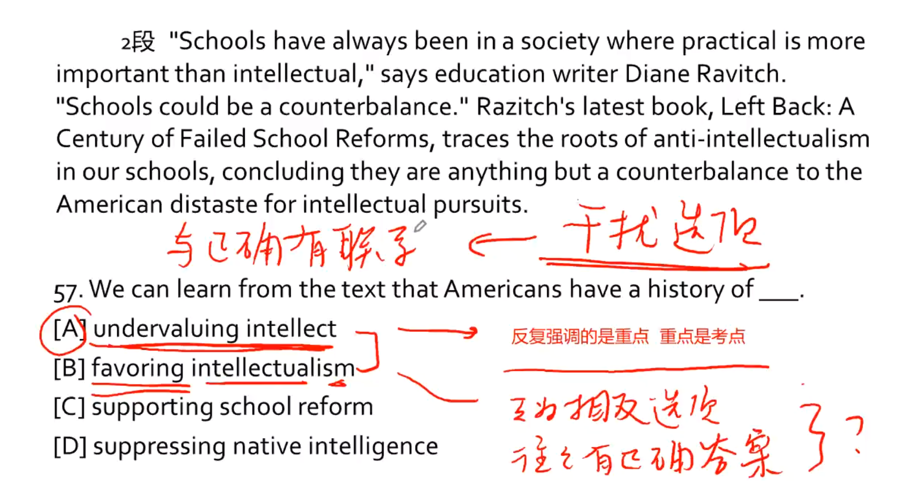
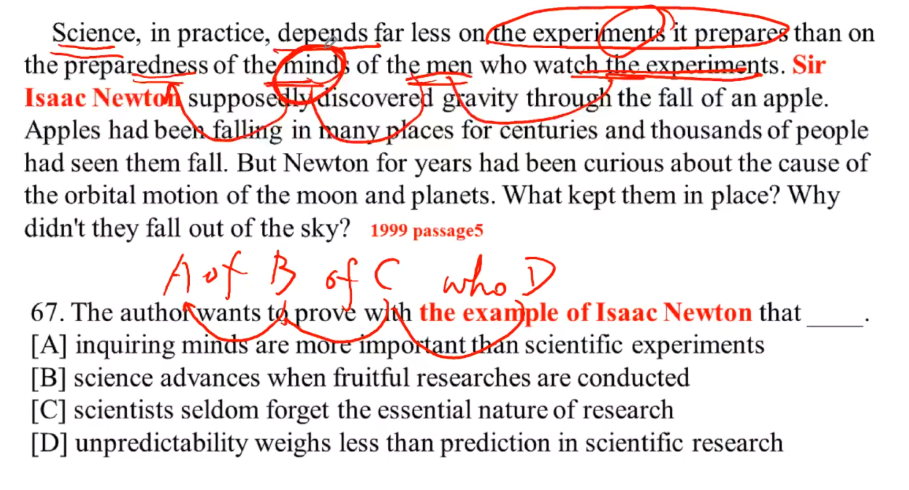
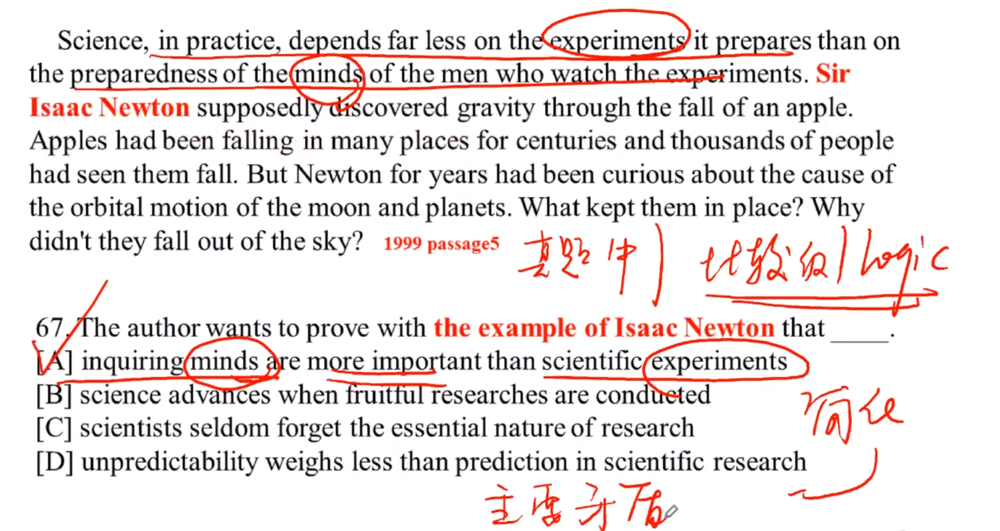

## 阅读规划

+ 课前预习，课前预习做题。
+ 在暑假的阅读练习的过程中不需要全真模拟，碰到不懂的单词即时查询，不用卡时间。
+ **不要急，慢慢来**

---

#### 2004-text4

1. 题干中反复提及的信息 &rArr; 中心

2. 最后一题：考察作者对某事的看法和态度 &rArr; 中心

3. 文章的 中心信息/词 **不止一个**

4. 作者的观点**往往**与大众相反，少数派

5. 阅读不仅仅要翻译，还要注重句间logic

6. **细节题**：定位好的句子，是最重要的解题依据。

7. 所有的方法都是辅助，一切以原文为主

   

8. **反复强调是重点，重点是考点**

9. 互为相反的选项往往存在正确选项，正确选项往往不想让人选，干扰项想让人选。

   

   

10. **对于比较级要抓住并简化主要矛盾**

11. 转折之后往往是重点！

+ **总结**：
  + 抓住单词的感情色彩

---

