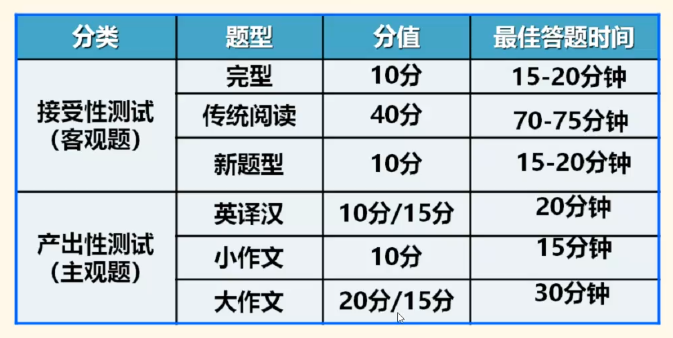
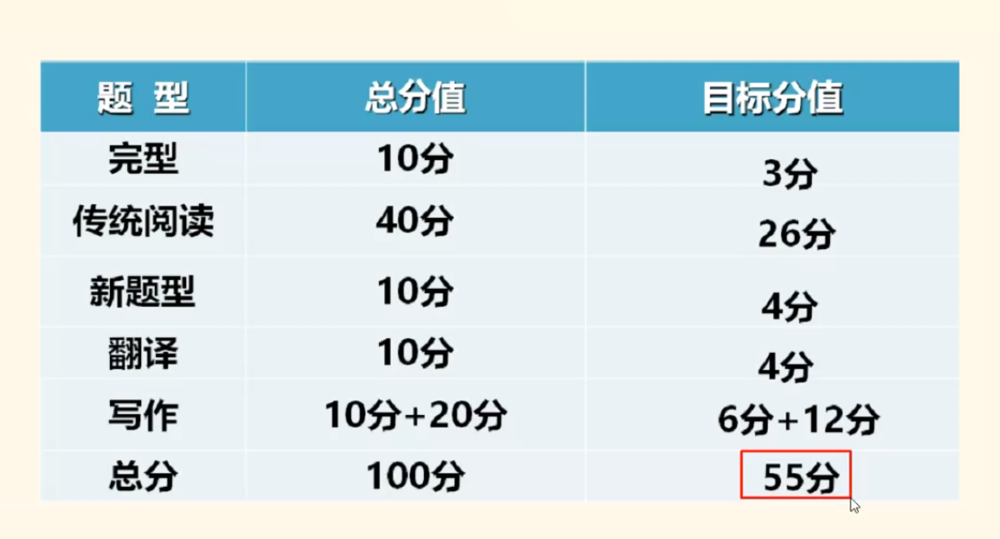
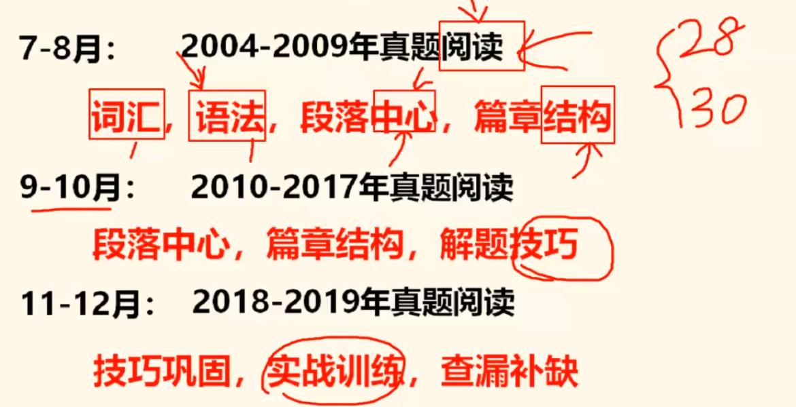

## 考研英语 —— 基础规划

#### 1、试卷结构

+ 
+ 
+ 英语考研是得阅读者得天下

#### 2、课程安排

#### 3、基础夯实
+ 3.1、**背单词**
  + 每天坚持背单词
  + 每次阅读课之前先把文章中的生词查出来，在阅读中背单词
+ 3.2、**长难句**
  + 语法
  + 语义
  + 语用
+ 3.3、**阅读理解**
  
  + 如何去做
  
  + 对于每篇阅读要做到
  
