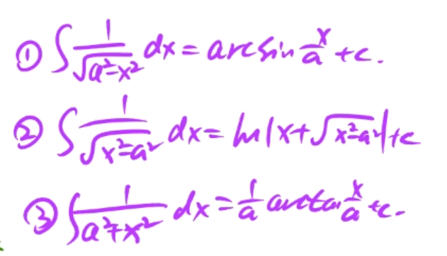

#### 一些数学需要多记的地方

1. 泰勒公式
2. 导数求导和积分凑微分
3. 曲率公式
4. 广义积分的收敛和发散
5. 二阶微分方程
6. 均值不等式
7. 6个重要圆和2个直线的极坐标方程

#### 一些数学要点截图

---

---

---

---

---

---

---

---

---

---

---

---

---

---

---

---

---

-----

---

-----

---

-----

---

-----
