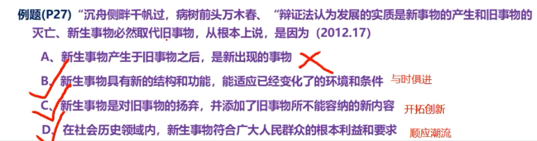
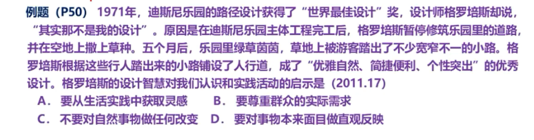
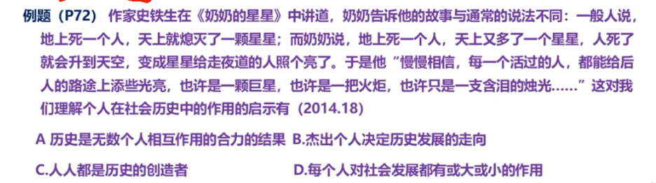
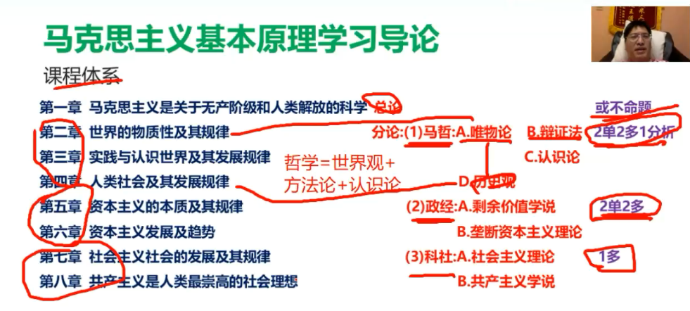
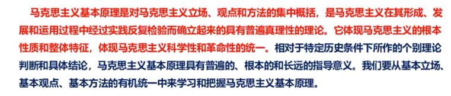
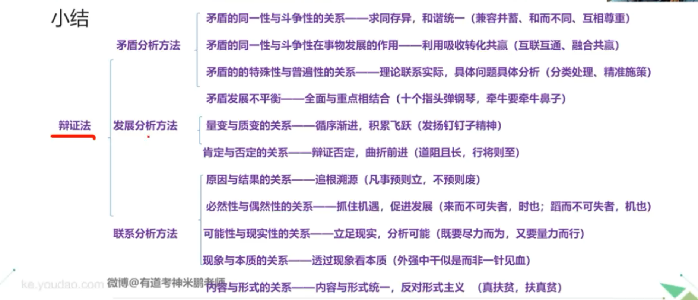

### 马克思基本原理

#### 导论

+ 1、解题方法
    + 选择题使用——排除法
      + 
      + 
        答案：AB
      + 
        答案：AD，C是错的，因为人人有好人和坏人等等的分别，人民群众是历史的创造者，但是人人不是。
    + 分析题(哲学分析题)
      + 第一步：阅读材料，总结中心思想
      + 第二步：审读问题，定位考察原理
      + 第三步：料理结合，复制组织答案
        + 先写原理
        + 接着过渡联承
        + 最后链接材料
    + 马原体系
      
      + 总论
      + 分论
        + 马哲：唯物论、辩证法、认识论、历史论
        + 政经：剩余价值学说、垄断资本主义理论
        + 科社：社会主义理论、共产主义学说
---
#### 第一章 马克思主义是关于无产阶级和人类解放的科学
+ 考点1	马克思主义和马克思主义的基本原理 
  
  + 角度1：马克思主义是什么 ——*10%*
    
    + 马克思主义是由**马克思和恩格斯创立的，并为后继者不断丰富和发展的**科学理论体系。
    + 马克思主义是关于**无产阶级和全人类解放**的科学。
    + 马克思主义分为：马哲、政经和社科 三个部分。
    
  + 角度2：马克思主义基本原理是什么 ——*10%*
  
    
  
+ 考点2	马克思主义产生的社会根源、阶级基础和思想渊源 ——*20%*
  + 资本主义固有矛盾的发展。（社会根源） 
  + 欧洲三大工人运动。（实践基础）
  + 马克思的思想渊源：**德国古典哲学**、**英国古典政治经济学**、**英法空想社会主义**
  + 马克思主义产生标志
    + 1845年，马克思、恩格斯和撰了《德意志意识形态》，阐述了**历史唯物主义基本原理**
    + 1848年，发表《共产党宣言》，**标志着马克思主义公开问世**。
    + 1867年，马克思发表《资本论》，被誉为“工人阶级的圣经”。
  
+ 考点3	马克思主义的鲜明特征和当代价值 ——*30%*
  + 马克思主义具有鲜明的**科学性、革命性、实践性、人民性和开放发展性**，其中**科学性**指马克思主义是**科学的理论**，**革命性**指**阶级性**，**实践性**是**最显著的特征** 。（鲜明特征）
  + 当代价值
    - 马克思主义是观察当代世界变化的认识工具
    - 马克思主义是指导当代中国反战的行动指南
    - 马克思主义是引导人类社会进步的科学真理

---

#### 第二章 世界的物质性机器发展规律

##### 第一节	世界的多样性与物质统一性

+ 考点1	世界观、方法论与哲学流派划分
  + 角度1：哲学的基本问题是什么？——*20%*
    + **恩格斯总结哲学发展的历史，明确提出思维和存在的关系问题是哲学的基本问题。**
    + 思维和存在是 **共存的、联系的、相互转化的**。
    + 思维和存在何者是第一性 ，即根据世界观 划分为 **唯物主义** 和 **唯心主义**。
    + 唯心主义 又分为 **主观唯心主义**和**客观唯心主义**。
    + 一切哲学都**不能超越或调和**唯物主义和唯心主义两大派别，这是哲学的**党性或是党派性**。
  + 角度3：从哲学上划分认识世界的方法论有哪些？——*50%*
    + 分为**辩证法**和**形而上学**
    + 辩证法坚持用**全面联系的、发展的观点看世界**，认为**发展的根本原因在于事物的内部矛盾**。
    + 形而上学则用**片面孤立的、静止的观点看世界，否认事物内部矛盾的存在和作用**。
  + 角度4：根据哲学基本问题第二方面的不同回答，哲学可划分为哪些派别？
    + 对哲学基本问题第二方面的不同回答，哲学可划分为**可知论**和**不可知论**。
    + 可知论：世界是可以被认识的，思维和存在具有同一性
    + 不可知论：世界是不能被人所认识或不能被完全认识的，否认思维和存在的同一性。

+ 考点2	物质与意识的辩证关系

  + 命题角度1：列宁对物质的科学定义是什么？ ——*选择题，60%*  

    + A、物质是标志 **客观实在** 的哲学范畴
    + B、**它不依赖于我们的感觉而存在**
    + C、**为我们的感觉所复写、摄影、反映**。
    + ABC 三个结论对于物质的定义是 **从物质与意识的辩证关系上** 界定的
    + **做某件事情（即实践）**是物质，**想做某件事情** 是意识

  + 命题角度2：马克思主义物质观提出的重大意义是什么？ ——*选择题，50%*  

    + 坚持了物质的客观实在性原则，**坚持了唯物主义一元性，同唯心主义一元论和二元论划清了界限**。
    + 坚持了能动的反映论和可知论，**有力的批判了不可知论，与不可知论划清了界限**。
    + 坚持了唯物论与辩证法的统一，**与形而上学划清了界限**。
    + 坚持了唯物主义自然观和唯物主义历史观的统一，**与唯心史观划清了界限，为彻底的唯物主义奠定了理论基础**。

  + 命题角度3：物质与运动的关系是什么？ ——*选择题，50%*

    + 运动是物质的存在方式和根本属性，物质是**一切运动变化和发展过程**的实在基础和承担者。
    + 物质和运动是不可分割的。
    + 设想不运动的物质，将导致形而上学；设想无物质的运动，将导致唯心主义。
    + 必须**运动地分析问题**。

  + 命题角度4：运动与静止的关系是什么？ ——*选择题，80%*

    + 静止是物质运动在**一定条件下的稳定状态**，包括**空间位置**和**根本性质暂时未变**两种运动的特殊状态。  

      静止 = 质 = 特殊性 = 物质存在

    + 动中有静，静中有动。  

      夸大绝对运动而否认相对静止，必然导致**相对主义诡辩论**，即**否认事物间的区别**。  

      夸大相对静止而否认运动的绝对性，必然导致**形而上学不变论**。  

  + 命题角度5：物质运动与时间空间的关系是什么？ ——*选择题，60%*

    + 时间和空间是物质运动存在形式，物质运动是时间空间的具体内容。
    + 空间是指物质运动的广延性、伸张性，特点是三维性
    + 时间是指物质运动的持续性、顺序性，特点是**一维性**
    + 物质运动总是在一定的时间和空间中进行，时间空间必须借助物质运动而存在。
    + 物质运动时间和空间的客观实在性是**绝对的**，物质运动时间和空间的具体特性是**相对的**。
    + 这一原理要求一切以时间、条件、地点为转移。
  + 物质、运动、时间、空间具有内在的统一性。
  
+ 命题角度6：怎样从实践出发理解社会生活的本质？ ——*选择题，60%*
  
    + 社会的物质性表现——实践
    + 实践是**社会关系形成的基础**。
    + 实践形成了**社会生活的基本领域**。
  + 实践构成了**社会发展的动力**。
  
+ 命题角度7：如何处理人与自然的关系？ ——*选择题，80%*
  
    + 实践是使物质世界分化为自然界与人类社会的历史前提，又是使自然界与人类社会统一起来的现实基础。
    + 自然界是人类社会的前提和基础，人类社会产生后，既不断地改变自然界，又制约自然界。
    +  人类社会实践改变自然界的两种结果：
      + **尊重自然规律**，既推动自然界的发展，又可以满足人类发展的需要。
      + **只考虑人类自己的利益需要，而不顾自然规律**，就会出现生态失衡、全球危机。
  + 坚持人与自然和谐共生。人与自然是生命共同体，人类必须尊重自然、顺应自然、保护自然。
  
+ 命题角度8：怎样认识物质与意识的辩证关系？ ——*选择题，80%*
  
  + 物质决定意识，意识是自然界长期发展的产物。
  
      + 一切物质所具有的反应特性，如 纸泛黄铁生锈。
      + 低等生物的刺激感应性，如 含羞草向日葵。
      + 动物的感觉和心理，如 狗灵敏的嗅觉。
    + 人类的意识。
  
  + 意识反映物质，意识在内容上是客观的，在形式上是主观的，是客观内容和主观形式的统一。
  
      + 差异多样性。
    + 对物质既有的近似真实的反映，也有歪曲虚幻的反映（例如艺术作品）。
  
  + 意识对物质具有反作用（**意识的能动作用**）
  
    + 意识活动具有**目的性和计划性**。
  
    + 意识活动具有**创造性**。  
  
      最突出表现  
  
      人的认识不仅反映客观世界，并且创造客观世界。
  
    + **意识具有指导、控制人的行为和生理活动的作用**。
  
+ 命题角度9：如何实现主观能动性和客观规律性的统一？ ——*选择题，60%*
  
    + 尊重客观规律是正确发挥主观能动性的前提。
    + 只有充分发挥主观能动性，才能正确认识和利用客观规律。
    + 实践是客观规律性和主观能动性统一的基础。

##### 第二节	事物的普遍联系与发展

+ 考点4～考点8 矛盾分析问题原理，考点9～考点11 发展分析问题原理，考点12～考点13 联系分析问题原理

+ 考点4	唯物辩证法的实质和核心——对立统一规律（矛盾学说,）

  + 命题角度：为什么说对立统一规律是辩证法的实质和核心？ ——*选择题，30%*
    1. 是事物普遍联系的**根本内容**和永恒发展的**内在动力**
    2. 是贯穿质量互变规律、否定之否定规律以及唯物辩证法基本范畴的**中心线索**，也是理解这些规律和范畴的“**钥匙**”
    3. **矛盾分析法**

+ 考点5	矛盾的同一性和矛盾的斗争性的辩证关系及其方法论意义

  + 命题角度：矛盾的同一性和斗争性的辩证关系及其方法论意义是什么？ ——*选择题或分析题，90%*

    1. 对立和统一分别体现了矛盾的两种**基本**属性：同一性和斗争性
       + **同一性**：相互依存、相互联系、相互转化
       + **斗争性**：相互排斥、相互分离

    2. 矛盾的同一性和斗争性是**相互联系**，没有斗争性就没有同一性（尊重差异），同一性**规定和制约**着斗争的形式、规模和范围（寻找双方的联系）
    3. **求同存异，和谐共处**

  +  示例考点材料：中美贸易战争，第二届“一带一路”国际合作高峰论坛

+ 考点6	矛盾的同一性和矛盾的斗争性在事物发展中的作用（矛盾动力作用）

  + 考点解释：解释矛盾是如何推动事物往前发展的。
  + 命题角度：矛盾的同一性和斗争性是怎样推动事物往前发展的？ ——*选择题或分析题，90%*
    1. 同一性
       + 矛盾双方可以**利用**对方的发展使自己获得发展；
       + 矛盾双方可以相互**吸取**有利于自身的因素而得到发展；
       + 矛盾双方可以向着自己对立面**转化**而得到发展。
    2. 斗争性
       + 斗争推动矛盾双方力量对比发生变化，造成**量变**；
       + 斗争促使矛盾双方地位或性质转化，实现事物**质变**。
    3. **利用** **借鉴**、彼此**转化**，实现*互利共赢*。
  + 示例考点材料：林丹和李宗伟；一带一路，互利共赢

+ 考点7	矛盾的普遍性和特殊性及其相互关系原理和方法论意义

  + 命题角度：矛盾的普遍性和特殊性的辩证关系及其方法论意义是什么？——*选择题或分析题，90%*

    1. 矛盾无处不在，无时不有（普遍性）。矛盾普遍存在，但是不同事物的矛盾又是具体的、特殊的（特殊性）。矛盾特殊性的三种情形：①**不同事物和过程**的矛盾；②同一事物或过程的矛盾在**不同的发展阶段**；③诸多矛盾以及每一矛盾的**不同方面**。

    2. 任何现实存在的事物都是普遍性和特殊性的有机统一

       + 普遍性存在于特征性之中，只能通过特殊性而存在。

         【个人理解：普遍性只是一个抽象概念，有一个个有特殊性的矛盾表现出来】

       + 任何特殊性都是普遍性，都包含普遍性。

         【个人理解：一个矛盾是特殊的，但是每个矛盾的特殊性体现了矛盾的普遍性】

       + 普通和特殊的区分是相对的，在一定条件下可以相互转化。

    3. 矛盾的普遍性和特殊性辩证关系原理是**马克思主义的普遍真结合的哲学基础**，也是**建设中国特色社会主义的哲学基础**。

  + 总结：**理论联系实际，具体问题具体分析**。

  + 示例考点材料：如何建设中国特色社会主义；精准扶贫；上海垃圾分类

  + 一些政治常识观点：

    + 普遍性 = 共性 = 一般
    + 特殊性 = 个性 = 个体

+ 考点8	矛盾的发展不平衡原理

  + 命题角度：矛盾的发展不平衡原理及其方法论意义是什么？ ——*选择题或分析题，90%*

    1. **主要矛盾**是一个矛盾体系中居于支配地位、对于事物发展过程起决定作用的矛盾；非主要矛盾是一个矛盾体系中居于从属地位、对于事物发展过程不起决定作用的矛盾。

       + 主要矛盾规定和影响非主要矛盾，解决好主要矛盾，非主要矛盾也就比较容易解决；
       + 非主要矛盾对主要矛盾也有影响，非主要矛盾处理得当，有利于主要矛盾的解决；
       + 主要矛盾和非主要矛盾在一定条件下，其地位可以相互转化。

       【用于**分析多个矛盾之间关系**】

    2. 矛盾双方中**总有**一方处于**支配地位**，起主导作用，成为矛盾**主要方面**。

       + 矛盾的主要方面决定了事物的性质；
       + 非主要方面对矛盾总体的变化、发展也有不可忽略的影响作用；
       + 矛盾的主要方面和非主要方面也会互相转化。

       【用于**分析一个矛盾两个方面之间的关系**】

    3. 矛盾力量的不平衡性，要求我们把唯物辩证法的**两点论和重点论**结合起来。

+ 考点9	事物的永恒发展

  + 命题角度：如何理解”世界不是既成事物的集合体，而是过程的集合体“？ ——*选择题，30%*

    + 联系构成运动，运动引起变化，变化的基本趋势是发展。

    + 发展是前进的上升的运动，发展的实质是新事物的产生和旧事物的灭亡。

    + 世界不是既成事物的集合体，而是过程的集合体。

      【个人理解：即世界是不断发展的，所以是过程集合体】

+ 考点10	事物发展过程中的量变和质变及其相互转化

  + 命题角度1：什么是质、量、度，把握度的意义是什么？ ——*选择题或分析题，90%*
    + 质：质是一事物**区别于**其他事物的内在规定性。
    + 量：量是事物的规模、程度、速度等可以**用数量关系表示**的规定性。
    + 度：度是保持事物质的（质的）稳定性的数量**界限、即事物的限度、幅度和范围**，度的两端叫**关节点**和**临界点**。
    + 认识和处理问题时要掌握**适度的原则**。
  + 命题角度2：量变和质变的关系及其方法论意义是什么？ ——*选择题或分析题，90%*
    + 量变是事物数量的增减和次序的变动，质变是事物性质的根本变化。
    + 量变和质变两者的辩证关系：
      + 量变和质变是相互**依存**的。量变是质变的必要准备，质变是量变的必然结果。
      + 量变和质变相互**渗透**的。一方面，在总的量变过程中有阶段性和局部性的部分质变；另一方面，在质变的过程中也有旧质在量上的收缩和新质在量上的扩张。
      + 量变和质变是相互**贯通**的，交替循环。
      + 依存 &rArr; 渗透 &rArr; 转化
    + 质量互变规律体现了事物发展的**渐进性和飞跃性**的统一。在实际工作和生活中，要把远大的革命目标和科学的求实精神结合起来。
  
+ 考点11	事物发展过程中的肯定和否定机器相互转化

  + 命题角度：肯定与否定的辩证关系及其方法论一是什么？ ——*选择题或分析题，70%*

  + 内容：
    + 任何事物都包含肯定和否定两个方面。肯定是事物中**保持其存在**的方面，否定是事物中**促使其灭亡**的方面。
    + 肯定与否定是对立统一的。
      + 统一
        + **相互依赖**。没有离开否定的肯定，一个事物肯定自己是这个事物，也就是否定自己是别的事物；没有离开肯定的否定，否定不是将事物化为乌有二是改变其存在形态，否定事物的这个形态，也是肯定其对立形态。
        + **相互渗透**，肯定中包含否定，否定中包含肯定。			
      + 对立：事物内部的肯定方面和否定方面又相互斗争
    + 1. 这一原理要求我们对一切事物都要采取**辩证否定**的态度，辩证否定对的实质是**对新旧事物的“扬弃”**。反对肯定一切和否定一切是形而上学的否定观。  
      2. 这一原理还揭示了事物发展的前进性与曲折性的统一，即在**内容**表现上是**事物的自我发展和自我完善**，在**形式**表现上呈现**波浪式前进或螺旋式上升的总趋势**。

+ 考点12	事物的普遍联系

  + 命题角度：联系的特点是什么？ ——*选择题或分析题，60%*
  + 内容
    + 联系是指事物内部各要素之间和事物之间 **相互影响、相互制约和相互作用** 的关系
    + 联系的特点
      + 客观性，不以人的意志为转移；坚持联系的客观性。要求我们从事物的固有联系中去把握事物，切记主观随意性。
      
      + 普遍性（无处不在，无时不有）
      
        1. 任何事物内部的不同部分和要素是相互联系的，即任何事物都具有内在的结构性；
        2. 任何事物都不能孤立存在，都同其他事物处于一定的相互联系之中；
        3. 整个世界是相互联系的统一整体，每一事物都是世界普遍联系中的一个成分或环节，并通过它表现出联系的普遍性。
      
        + 世界的普遍联系是通过“中介”实现的。
        + 马克思主义要求人们**要善于分析事物的具体联系**，确立整体性、开放性的观念，**从动态中考察事物的普遍联系**。
      
      + 多样性，联系多种多样，如内外联系、直接间接联系、必然偶然联系、本质非本质联系等等……；
      
      + 条件性
        1. 对事物的发展和人的活动**具有支持或制约作用**；
        
        2. 条件可以创造，人们经过努力可以创造出事物发展所需要的条件。
        
           如：**有条件要上，没有条件创造条件也要上**；
        
        3. 条件的改变和创造**不是任意的**，必须**尊重事物发展的客观规律**。

+ 考点13	联系看问题的方法

  + 命题角度1：原因与结果的关系是什么？ ——*选择题或分析题，60%*

    + 原因与结果是 **引起与被引起** 的关系；
    + 辩证关系
      + 原因和结果的区分既是确定的，又是不确定的；
    + 原因与结果 **相互依存，相互作用，相互转化**；
    + 正确把握事物的因果联系是**自觉实践活动的必要前提**。正确认识因果联系，**追根溯源**找到问题的成因，有利于实践活动达到较好的效果。（方法论意义）

  + 命题角度2：必然性与偶然性的关系是什么？ ——*选择题或分析题，70%*

    + 必然性是事物发展的过程中的**确定不移**的趋势，体现事物发展的**本质联系和发展前途**；
  
    + 偶然性则是**不确定**的趋势，对事物发展起**加速或延缓作用**。

    + 1. 必然性与偶然性相连结而存在（依存）
      2. 必然性寓于偶然性之中，偶然性背后隐藏着必然性，偶然性为必然性开辟道路（渗透）
      3. 必然和偶然在一定条件下会相互转化（转化）

    + 重视必然性，不忽视偶然性，善于从偶然中发现必然，把握有利于事物发展的机遇。

      【抓住机遇（偶然）的方法】

  + 命题角度3：现实性与可能性的关系是什么？ ——*选择题或分析题，60%*
  
      + 现实性与可能性
  
        + 现实性：指代已经产生出来的有内在根据的、合乎必然性的存在
        
        + 可能性：指代事物发展过程中潜在的东西，包含在事物中并预示事物发展前途的种种趋势
        
      + 现实性与可能性 **相互依存，相互作用，相互转化**。  
  
        发展就是现实与可能相互转化的过程
  
      + 这一联系要求我们一方面立足现实，对可能性作出全面的分析和预判；另一方面要高瞻远瞩，防止坏的可能变成现实，促进好的可能变成现实。
  
          【分析可能性】
  
  + 命题角度4：现象与本质的关系是什么？ ——*选择题或分析题，50%*
    
      + 现象是事物的**外部联系和表面特征**，本质是事物的**内在联系**。
      
    + 本质和现象对立统一，两者 **相互依存，相互作用，相互转化**。任何本质都是通过现象表现出来，没有不表现现象的本质；任何现象都从一方面体现着本质，现象是本质的外部表现。  
      
      而且**假像**也是本质的表现，但是会使我们产生错觉，因此假象能够到达本质，但是错觉不能到达本质。
      
    + 本质和现象的辩证关系表明：**透过现象发现本质是科学研究的任务**。
    
  + 命题角度5：内容与形式的关系是什么？ ——*选择题或分析题，60%*
    
    + 内容与形式统一。
    + 内容决定形式，形式反作用于内容，两者既有相互区别又相互依存。（决定与反作用）
    + 对于内容与形式，**既要重视内容，反对形式主义，又要善于运用形式，发挥其积极作用**。

##### 第三节	唯物辩证法是认识世界和改造世界的根本方法

+ 考点14	客观辩证法与主观辩证法

  + **唯物辩证法既包括客观辩证法也包括主观辩证法**，体现了唯物主义、辩证法、认识论的统一。
  + 命题角度1：客观辩证法和主观辩证有什么区别？ ——*选择题，30%*
    + 客观辩证法是指客观事物或客观存在的辩证法。
    + 主观辩证法是指人类认识和思维运动的辩证法。
  + 命题角度2：客观辩证法与主观辩证法的关系是什么？ ——*选择题，40%*
    + 主观辩证法是客观辩证法的反映。
    + 客观辩证法与主观辩证法在本质上是统一的，但在表现形式上则是不同的。

+ 考点15	辩证思维方法

  + 命题角度1：归纳与演绎 ——*选择题，30%*

    + 归纳：从个别事实概括出一般性结论，是一种有个别性前提过渡到一般性结论的推理形式。(作总结)
    + 演绎：从一般原理走向个别结论的思维方法，是由一般性原则推到个别结论的推理形式。(举例子)
    + 归纳与演绎是人类思维从个别到一般，又有一般到个别的最常见的推理形式。

  + 命题角度2：分析与综合 ——*选择题，30%*

    + 分析：把认识对象分解为不同的组成部分、方面，并从中找出构成这一认识对象的基础的部分、本质的方面。（分析的是“部分”）
    + 综合：把对象的各个本质的方面按其内在联系有机地结合成一个统一的整体。（综合的是“整体”）
    + 分析与综合的关系也是**辩证**的，**分析是综合的基础，综合是分析的完成**，只有把两者结合在一起，才能构成一个完整的、科学的认识。

  + 命题角度3：抽象与具体 ——*选择题，40%*

    + 抽象：对客观事物某一方面本质的概括或规定

    + 感性具体：感官直接感觉到的具体。

      【**知其然不知其所以然**】

    + 理性具体：在感性具体基础上经过思维的分析与综合，达到对事物多方面属性或本质的把握。

      【**知其然亦知其所以然**】

    + 人对事物的认识经历着从（感性）具体到抽象和从抽象到（理性）具体的过程

    + 抽象与具体是辩证思维的高级形式。

  + 命题角度4：逻辑与历史 ——*选择题，40%*

    + 该辩证思维方法只用于分析**社会历史现象**！

    + 历史的东西是逻辑的东西的基础，逻辑的东西则是历史的东西在思维中的再现。

      【个人理解：逻辑是从历史中总结出来的，逻辑在一定程度上表现了历史】

    + 逻辑的东西则是“修正过”的历史东西。

      【个人理解：逻辑虽然源与历史，但是是对历史的一种“扬弃”，发扬精华除去糟粕，所以是“修正过的”】

+ 考点16	习近平新时代中国特色社会主义思想对唯物辩证法的创造性运用和发展

  + 命题角度：为什么唯物辩证法的方法同认识方法和工作方法是一致的？ ——*选择题或分析题，40%*
  + 在唯物辩证法的方法论体系中，矛盾分析法居于核心的地位，是根本的认识方法。矛盾分析法包含着广泛而深刻的内容。
  
  **习新思想与其他辩证法的结合**
  
  

---

#### 第三章 实践与认识及其发展规律

##### 第一节 认识与实践

+ 考点1	实践与认识活动中的主体、客体与中介；主体与客体的关系及相互作用的过程

  + 命题角度1：实践的本质、特征是什么？ ——*选择题，40%*

    + 实践活动是马克思主义认识论 **首要的** 和 **基本的** 观点

    1. 实践活动是人类能动地改造世界的客观物质性活动，是以改造客观世界为目的、**主体**与**客体**之间通过一定的**中介**发生相互作用的过程。  
       + 主体：指具有思维能力、从事社会实践和认识活动的人
       + 客体：指**进入主体的认识和实践范围**的客观事物，是实践和认识活动所指向的对象
       + 中介：指各种形式的**工具、手段**，以及**运用、操作这些工具的程序和方法**
    2. 实践的主体和客体相互作用的关系，包括**实践关系、认识关系、价值关系**，**实践关系是最根本的关系**
    3. 实践具有**直接现实性**、**自觉能动性**和**社会历史性**等基本特征
       + 直接现实性：实践高于认识 &rArr; 大道至简，实干为先
       + 自觉能动性：实践是**人**独有的活动
       + 社会历史性：随着历史的发展而发展

  + 命题角度2：实践的形式是什么？ ——*选择题，30%*

    + **物质生产实践**，是人类**最基本的**实践活动。物质生产实践在实践各种形式中处于基础的地位，对其他实践形式起着主导的作用。
    + 社会政治实践
    + 科学文化实践
    + 虚拟实践

+ 考点2	实践在认识活动中的决定作用 

  + 命题角度：为什么说实践是认识的基础，它对认识的决定作用有哪些表现？ ——*选择题，80%*

  + 实践是认识的**来源**（所有认识都来源于实践）

    + 认识来源于实践并不否认人的大脑和器官在胜利素质上的差异对认识的影响

      【并不否认人的天赋的作用，但实践决定认识，天赋影响认识】

    + 认识来源于实践并不否认学习间接经验的重要性

    + 主体可以也应该通过读书或传授等方法来获取间接经验，这是发展人类认识的必要途径

    + 一个人的知识，不外乎直接经验和间接经验两部分。

      【告诉我们：既要读万卷书，又要行万里路】

  + 实践是认识发展的**动力**（实践能推动、丰富、发展、完善认识）

    + 实践的发展不断的提出认识的新课题，推动着认识向前发展；
    + 实践为认识发展提供必要的条件
    + 实践锻炼和提高了主体的认识能力

  + 实践是检验认识是否具有真理性的唯一标准（用于判断认识的对错）

  + 实践是认识的目的（学以致用；纸上得来终觉浅，绝知此事要躬行）

+ 考点3	认识的本质

  + 命题角度1：唯心主义在认识的本质上犯了什么错误？ ——*选择题，60%*

    + **主观唯心主义**认为人的认识是主观自生的，是心灵的自由创造物；

    + **客观唯心主义**认为人的认识是上帝的启示或绝对精神的产物；

    + 两者都否认认识是人脑对客观物质世界的反映，反对唯物主义的反映论，  

      坚持**唯心主义先验论**（唯心主义认识论）；

    + 唯心主义认识论 &rArr; **坚持精神的第一性，否认认识来源于实践**。

  + 命题角度2：旧唯物主义在认识本质问题上犯了什么错误？ ——*选择题，40%*

    + 旧唯物主义认识论即形而上学唯物主义认识论
    + 旧唯物主义认识论**又被称为直观、消极被动的反映论**，有两个的严重**缺陷**
      + 否认了认识主体的能动创造。
      + 不把认识看作是一个不断发展的过程，而是认为认识是**一次性**完成的。

  + 命题角度3：辩证唯物主义对认识的本质观点是什么？ ——*选择题，40%*

    + 辩证唯物主义认识论认为，认识是主体对客体的**能动反映**

    + 这种能动反映具有两方面特点

      + 反映具有摹写性
      + 反映具有创造性

      【艺术既源于生活（摹写性），又高于生活（创造性）。】

      【艺术是意识的范畴；艺术作品是意识，其承载物才是物质】

**考点4 ～ 考点7 &rArr; 两次飞跃，不断发展**

+ 考点4	认识过程中感性认识和理性认识及其相互关系；从感性认识向理性认识的飞跃（**第一次飞跃**）

  + 命题角度1：什么是感性认识，什么是理性认识？ ——*选择题，50%*

    + 认识的过程首先是实践到认识的过程，这个过程中主要表现为**在实践基础上**认识活动由**感性认识**能动地飞跃到**理性意识**，这是认识运动的**第一次飞跃**

    + 感性认识

      + 是人们在实践的基础上，由感官直接感受到的关于事物的现象、事物的外部连系、事物的各个方面的认识。
      + 感性认识包括感觉、知觉和表象三种形式
        + 感觉：对事物个别属性的反映
        + 知觉：对事物各个属性的综合反映
        + 表象：一种对现象的认识，是对知觉的回忆

      【感性认识本质就是 **对现象的认识**】

    + 理性认识

      + 指认识借助抽象思维，在概括整理大量感性材料的基础上，达到关于事物的本质、全体、内部关联和事物自身规律性的认识。
      + 理性认识包括概念、判断、推理三种形式
        + 概念：把个性总结成共性
        + 判断：把概念加以展开并运用
        + 推理：从已知判断过渡到新的判断

      【理性认识的本质就是 **对本质规律的认识**】

  + 命题角度2：感性认识与理性认识的辩证关系是什么？它对实践有什么要求？ ——*选择题或分析题，50%*

    + 主要讲述了 如何得到**正确的认识 *结果***，侧重结果

    1. 感性认识和理性认识相互依存

       + 理性认识依赖于感性认识，只是认识论的唯物论；( 理性认识来源于经过实践的感性认识 )
       + 感性认识有待于发展到理性认识，这是认识论的辩证法。( 理性认识是感性认识发展的必然结果 )

    2. 感性认识和理性认识是相互交织、相互渗透的

       + 感性中渗透着理性的因素（人总是**在已有的理性认识基础**的参与和指导下去获得新的感性认识）
       + 理性中渗透着感性的因素（**通过长期的感性认识**，能够加深理性认识；如”日久见人心“等格言）

    3. 感性认识和理性认识是辩证统一的，统一的基础是**实践**。如果割裂二者的辩证统一关系，就会走向  

       **唯理论**和**经验论**。实际工作中就会犯教条主义和经验主义的错误。

+ 考点5	认识过程中的非理性因素

  + 命题角度：非理性因素在认识活动中的作用是什么？ ——*选择题，40%*

    + 理性因素：**指人的理性直观、理性思维等能力**。
      + 作用：在认识活动中的作用主要有指导作用、解释作用和遇见作用
    + 非理性因素：**主要指认识主体的情感和意志**。联想、想象、猜测、顿悟、灵感等，也包括在人的非理						性因素中。
      + 作用：	对于人的认识能力和认识活动具有**激活、驱动和控制**作用
    + 非理性因素要受理性因素的制约

    【理性因素即<u>具有严格的逻辑秩序性的精神因素</u>，非理性因素是<u>带有突发性的精神因素</u>】

+ 考点6	从理性到认识的飞跃（**第二次飞跃**）

  + 命题角度1：认识为什么要进行第二次飞跃？ ——*选择题，50%*
    + 认识世界的**目的**是改造世界；
    + 只有将已经获得的理论回到实践中去，**通过实践的检验**，正确的理论才能得到**证实和发展**。
  + 命题角度2：认识进行第二次飞跃需要哪些条件？ ——*选择题，50%*
    + 必须从实际出发，坚持一般理论和具体实践相结合的原则；
    + 需要经过一定中介的环节；
    + 坚持理论和实际相结合，让理论为群众所掌握，转化为改造社会、改造自然的物质力量；
    + 要有正确的实践的方法即工作方法
  
+ 考点7	认识运动的不断反复和无限发展

  + 命题角度：认识运动的不断反复与无限发展原理及其对实际工作的指导意义是什么? 

    ——*选择题或分析题，80%*

    + 分析认识的**过程**
    
    + 认识过程的**反复性**（曲折失误）
      
      + 是指人们对于一个复杂事物的认识往往要经过由感性认识到理性认识、再由理性认识到实践的多次反复才能完成
      + 从客观方面看，事物的各个侧面及其本质的暴露有一个过程；
      + 从主观方面看，人的认识能力有一个提高的过程。
      + 人的认识受实践范围、立场、观点、方法、思维能力、工作经验和知识水平等因素的制约。
      
    + 认识发展的**无限性**，是指对于事物发展过程的推移来说，人类的认识是永无止境、无限发展的，它表现为“实践、认识、再实践、再认识“的无限循环
    
    + 认识运动的反复性和无限性决定了主观和客观、认识和实践的统一是具体的历史的。  
    
      **这启示了我们人们认识世界的过程是充满曲折失误但又永无止境的。**
    
    + 历尽艰辛，永无止境