## 马克思主义基本哲学笔记

#### 第一节、哲学家在想些什么

##### 1. 哲学？ 

philosophy -- 爱和智慧

哲学家：苏格拉底、柏拉图、笛卡尔等……

苏格拉底：智者就是知道自己不知道，爱智慧。

##### 2. 哲学定义

+ 理论化-系统化；

+ 世界观和方法论统一；

+ 意识形态

  哲学一定是理论化和系统化的，例如：“社会太黑暗了”是一种观点不是哲学。

  世界观：怎么看？ ——方法论：怎么做？

  意识形态：一群人身份相同或类似拥有共同的意识 即 “意识形态”。

  例子：马克思主义是全人类公认的真理（应该是工人阶级的）

##### 3. 研究哲学的条件

+ 好奇心（爱琢磨事情）

+ 自由（掉脑袋）
+ 闲暇（吃饱没事干）

##### 4. 思考世界本源（本体论）

唯物主义：

猜测东西由几种基本物演化来：

- 泰勒斯：世界由水组成
- 毕达哥拉斯：数（整数和整数的比）
- 恩培多克勒：水、火、土、气
- 中国人L：气、道、阴阳、五行

 猜测世界的本源（物、几种物）：**朴素** 唯物主义

近代科学：

​	道尔顿——发现原子

​	汤姆生——发现电子

​	…质子、中微子、夸克…

​	最后总结：世界的物质是由某种微粒组成，即 **形而上学** 唯物主义

马克思列对于物质的定义：客观实在性，即<u>辩证唯物主义</u>

唯物主义发展： 古代 **朴素** 唯物主义——>近代 **形而上学** 唯物主义——>现代辩证唯物主义

例子：古希腊哲学家德谟克里特认为世界本源是原子——>古代 朴素 唯物主义

唯心主义：

+ 主观唯心主义：笛卡尔——我思故我在
+ 客观唯心主义：上帝创造世界
+ 例子1：人的理性为自然立法——> 主观唯心主义
+ 例子2：在万事万物存在前，就有绝对理念，并产生世界。——> 客观唯心主义
+ 例子3：世界上除了运动着的物质以外，什么也没有——> 唯物主义

##### 5. 认识论

+ **可知论**：

  + <u>唯物主义反映论（唯物主义可知论）</u>：

    <u>能动反映论</u> 和 直观反映论

  + 唯心主义先验论（唯心主义可知论）

+ **不可知论**：

##### 6. 恩格斯的总结

+ 全部哲学、近代哲学的基本问题是：思维和存在的关系问题。
+ 思维（意识）和存在（物质）
  + **第一性**（本源）：<u>物质（唯物主义）</u>；意识（唯心主义）
  + **同一性**（关系）：<u>意识和物质有关系（可知论）</u>；无关系（不可知论）

---

#### 第一节课的复习

+ 哲学的基本问题：（恩格斯）思维和存在
+ 第一性：唯物和唯心
+ 统一性：可知论和不可知论
+ 支持的观点：马克思辩证唯物主义 + 可知论

---

#### 第二节、辩证唯物主义-物质与运动

##### 1. 唯物主义

+ 古代朴素唯物主义——近代形而上学唯物主义——现代辩证唯物主义

+ 猜测--物——科学依据--微粒——客观实在性

##### 2. 物质是东西？性质？

+ 物质：客观实在性。
+ 物质——物体
+ 例子：
  + 手机信号——>物质；
  + 语言——>非物质，因为传递的是意识，语言是意识的物质外壳

##### 3. 世界是物质的，物质是运动的

+ 运动：物质的一切变化
+ 运动——静止
+ 运动和静止的观点：
  + 运动是绝对的，静止是相对的
  + 静止是运动的衡量尺度：只有选择号参考系才能知道运动尺度
  + 静者静动，非不动也：物体静止只是相对的静止，其实物体也在运动
+ 错误的观点：
  - 只有运动，没有静止。诡辩论，道理是对的，对解决问题没有任何新的帮助。
  - 只有静止，没有运动。芝诺，形而上学。
+ 时间和空间是物质运动的存在形式
  + 时间：一维性、顺序性
  + 空间：三维性、广延性
  + 时间和空间：既有限（对个体）又无限（对整体）；绝对又相对。
    + 相对：相对论
      + 狭义相对论：物体运动速度越快、时间越慢、质量越大。
      + 广义相对论 ：引力是空间的变形和扭曲。

##### 4. 马克思辩证唯物论总结

+ **物质**：客观实在性（唯一属性）。语言：意识的物质外壳

+ **运动**：不可分。运动是物质的根本属性和存在方式，物质是运动的承担者和载体。

  “运动是物质的存在方式和根本属性”也是对的

+ **运动和静止**：运动是绝对的，静止是相对的；静止是运动的衡量尺度；静者静动，非不动也。只运动：诡辩论。只静止：形而上学。

+ **时空**：时间和空间是物质运动的存在形式。

  + 时间：一维性、顺序性
  + 空间：三维性、广延性
  + 时间和空间：既有限（对个体）又无限（对整体）；绝对又相对。

##### 5. 意识观

+ 意识的含义：意识是客观世界的**主观映像** == 内容是客观的，形式是主观的。

  即世界的内容是客观实在的，但是不同的人有不同的想法。

+ 意识的产生：低级反射；高等动物的感觉和心理；人类的意识。

  所以马克思的思想认为：除了人类以外，其他动物没有意识。

+ 意识和人脑：人脑是意识的器官，而非意识的源泉。因为有人脑不一定有意识，但有意识一定有人脑。

+ 意识的能动作用

---

#### 第二节课复习

+ 意识的本质是：A

  + A. 人脑的技能、物质的反映
  + B. 人脑产生的特殊物质
  + C. 感觉的总和
  + D. 逻辑的集合

+ 不同的人对统一事物所见所思往往各不相同，这说明：C

  + A 意识是主题的自由创造
  + B 意识部不认识客体的制约
  + C 意识受主体状态的影响
  + D 意识的内容和形式是主观的

+ “观念的东西不外是移入人的头脑并在人的头脑中改造过的物质的东西而已”。这一命题表明了了：A

  + A. 意识是客观存在的主观映像
  + B. 人脑是意识的源泉
  + C. 观念的东西和物质的东西没有本质上的区别
  + D. 意识是人脑中特有的物质

+ （多选）“观念的东西不外是移入人的头脑并在人的头脑中改造过的物质的东西而已”。这一命题揭示了：ACD

  + A. 观念的东西和物质的东西是**对立统一**的

  + B. 人脑是意识的源泉

  + C. 观念的东西是物质的东西的能动反映

  + D. 没有被反映者，就没有反映。

    解释：*被反映者是物质，反映是意识*

---

#### 第三节、辩证唯物主义-意识和实践

##### 1. 意识观（想）（接第二节末尾）

+ 意识的能动作用与规律

  意识能改变客观世界和自身，但是改变客观世界一定要经过实践，意识可以直接作用在自身

+ 根据客观规律发挥主观能动性

+ 主观能动性的两个限制：客观规律，实践水平

##### 2. 实践观（做）

+ 含义：**人类** <u>**能动**</u>（自己意识主动）地改造世界的**客观物质性活动**（不是精神活动）。
+ 基本特征：
  + 直接现实性：实践做了事情就会得到了结果。
  + 自觉能动性：人区别于物的根本特点，指人既能动地反映世界，又能动地改造世界的能力。
  + 社会历史性：每个时代都有每个时代的脉络，每个时代都每个时代的该做的事情。
+ 基本形式：
  + 物质生产实践（根本）：经济	人和自然
  + 社会政治实践：政治	人和人
  + 科学文化实践：文化	人和思维
+ **实践都是人的存在方式，连社会也是实践出来的。**

##### 3. 物质意识的辩证关系原理（总结）

+ 区分：根源（物质）与派生（意识），客观存在（物质）与主观存在（意识），物质与意识不可相互取代（替代）
+ 联系：
  + 作用反作用：物质与意识可以相互作用
  + 改变：物质与意识可以相互改变（转化）
  + 同一性

##### 4. 世界物质统一性原理

+ 统一性和多样性

##### 5. 唯物论总结

+ 记忆：**三观两原理**
+ 物质观：物质——运动——静止——时空
+ 意识观：含义——产生——人脑——能动作用
+ 实践观：定义——特征——形式
+ 物质意识的辩证关系原理：三点区别，三点联系
+ 世界物质统一性原理：统一性和多样性

---

#### 第三节课复习总结

+ 预测未来最好的方式就是把它创造出来

+ 实践（打架）才有可能解决问题 == 马克思：批判的武器代替不了武器的批判

+ 意识能发挥主观能动性：猫会蔑视，狗会祈求；蔑视和祈求都是人类的意识在发挥作用

+ 唯物主义就要坚持一切从实际出发，唯物主义也不代表意识不存在，只是物质是根源意识是派生

+ （多选）人的意识的主观性方面表现为：ABCD

  + A. 反映形式的主观性

  + B. 不同主体的意识之间的差别性

  + C. 对客观对象放映的近似性

    例如：我画了一个近似圆的椭圆，别人会近似想象成篮球

  + D. 对事物反映的虚化性

+ 人的意识不仅反映客观世界，并且创造客观世界，但是意识不能创造物质，因为世界&ne;物质

---

#### 第四节、一叶落而治天下秋：辩证法-联系和发展

**总结口号：1、1、2、3、4、6**

##### 1. 一个结论

坚持**辩证法**，反对**形而上学**

+ 认为世界是 **联系的、发展的、全面的、矛盾的、运动的、变化的**，就是辩证法

+ 认为世界是 **孤立的、静止的、片面的、不动的、不变的**，就是形而上学

形而上学（metaphysics） 源于 亚里士多德

辩证法（dialectics）

+ 道之大原出于天，天**不变**道亦不变：形而上学
+ 世界上除了**运动**着的物质以外，什么也没有：辩证唯物主义 —— 列宁

##### 2. 一个关系

+ 客观规律性：规律是客观性，<u>人不能创造、改变、补充或完善规律</u>。
  + 规律：事物的本质的、必然的、稳定的联系。
  + **自然规律**：简单；盲目、无意识的力量；
  + **社会规律**：难；有意识的人的活动；
+ 主观能动性
+ 根据**客观规律**发挥**主观能动性**

##### 3. 两大特征
+ 联系：四个性质：
  + 客观性（联系不以人的意志转移）
  + 普遍性（联系普遍存在）
  + 多样性（联系的方式多种多样）
  + 条件性（联系是有条件的，根据条件变化改变联系的方式）
+ 发展：本质、过程
  + 运动的趋势 即 发展
  + **发展**是一个**过程**
  + 事物是不断的运动的，所以事物是不断的发展的。
  + **发展的实质：新事物产生，旧事物灭亡。**
  + 新旧事物的区别不是产生的**早或是晚**，而是指事物的**生命力**与及是否**顺应规律**

---
#### 第四节课复习

+ **复习——辩证法**

  + 1 &rArr; 一个结论：坚持辩证法，反对形而上学
  + 1 &rArr; 一个关系：根据**客观规律**发挥**主观能动性**
  + 2 &rArr; 两大规征：联系、发展
  + 3、4、6
  
+ **练习题目**

  + 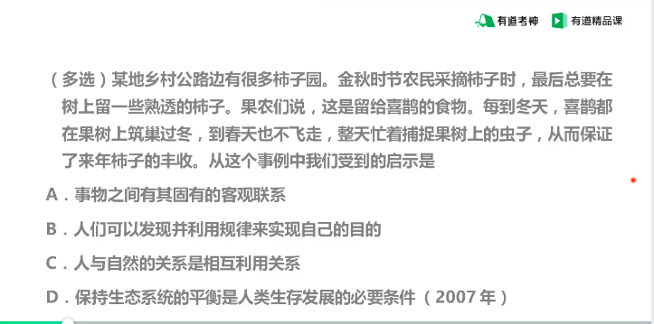

    答案：**ABD**

  + 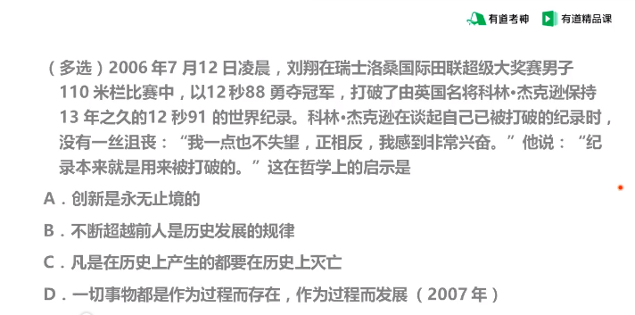

    答案：**ABCD**

---
#### 第五节、日月阴阳，孟章凌光：辩证法-意识与实践

##### 4. 三大规律(序号接上节)
+ **辩证法三大规律和发展的关系**

  | **辩证法三大规律和发展的关系** |                            |
  | ------------------------------ | -------------------------- |
  | 对立统一规律                   | 揭示了事物发展的源泉和动力 |
  | 量变与质变                     | 揭示了事物发展的形式和状态 |
  | 否定之否定                     | 揭示了事物发展的方向和道路 |

  

+ 质量互变规律

  + 质：一个东西是什么

    - 量：东西的多少

      都是描述事物的两个方面

    - ***认识质是认识的起点，认识量是认识的深化。***

    **例如**：看到一个胖子我们会想到胖子的**胖**，具体**多少斤**可能不知道

  + 量变——质变

    - 量变：数量的变化

    - 质变：根本性的变化

    - **量变的积累才能达到质变**

  + 度——关节点

    - 度：表示**范围**

    - 关节点：也称临界值，是度与度之间的边界**点**

  + **所以做事要把握好一个度，否则过犹不及**

+ 肯定与否定

  + 肯定与否定
  
    - 对于传统文化要：取其精华去其糟粕
  
    - 对于所有事物都要**既肯定又否定**
    - 否定不是不好，否定也是一种发展h。
  
  + 否定之否定
  
    - 发展是一个过程，因此否定也不只有一次，只能通过不断的否定才能向前发展。
    - 发展的过程通常都不是直线的，而经常是**波浪式前进**或是**螺旋式上升**，即道路是曲折的，前途式光明的。
  
+ 对立统一 （矛盾，是一种关系，不仅仅只代表冲突）

  + 地位
    - 对立统一规律是**联系的本质**和**发展的动力**
    - 辩证法的**实质和核心**,与形而上学的根本区别
    
  + 矛盾的同一性和斗争性
    - 同一性：对立（矛盾）双方的相互依存、相互转化
    - 斗争性：对立（矛盾）双方的相互斗争、相互分离
    - 斗争性和同一性促进了矛盾事物的向前发展与矛盾事物的相互转换
    - 古代的***阴阳鱼***图像
    
  + 矛盾的普遍性和特殊性 
  
    + **普遍性**：矛盾是普遍存在的，万事万物之间联系普遍存在，所以万事万物之间都有矛盾。
  
    + **特殊性**：万事万物之间联系是多样性的（即联系是各种各样的的，每种联系都是特殊的），因此万事万物之间的矛盾有特殊性。
  
      因为矛盾具有**特殊性**，所以遇到不同的矛盾要用不同的解决方法
  
      即 **具体问题具体分析，抓住事物的主要矛盾。**
  
      主要矛盾——最重要的事
  
      主要方面——事从哪方面解决
  
      **中国的主要矛盾：人民日益增长的美好生活需要——不平衡不充分的发展**
  
  + 矛盾分析法
  
    + 分析问题的根本方法
    + 两点论与重点论统一：即全面看问题，把握问题要抓住重点。
  
  + 和谐：是矛盾的特殊表现形式，相互统一，相互促进，共同发展。
  
    现在国家不和谐，所以要建设社会主义和谐社会。
  

##### 5. 辩证思维的四个方法（20年没考）

+ 归纳与演绎（低级）
  + 归纳法：通过穷举的方法得出结论
  + 演绎法：根据一个基本的逻辑前提去推导出结论。如欧几里得通过五条定理推演出“欧几里得的几何”
  + 归纳很难做到完全的归纳，演绎的前提是归纳出来的，所以归纳法和演绎都是容易出问题的。
  + 归纳法由培根提出，演绎法有笛卡尔提出。
+ 分析与综合（稍高）
  + 分析：整体拆成部分
  + 综合：部分组合成整体
+ 抽象到具体（高）
+ 历史与逻辑统一(特高）

##### 6. 六个环节

+ 必然和偶然
  + 必然是偶然的
  + 偶然是必然的
  + 例子：一个人死是必然的，但一个人死的时间、地点是偶然的。
  
+ 现象和本质
  + 透过现象看本质：现象是丰富的，本质是抽象的。
  
  + 现象和本质是有区别的
  
  + 现象和本质是有联系的

  + 现象和本质的区别构成了认识的必要性，现象和本质的联系构成了认识的可能性
  
  + 真相和假象：对于事物的本质的表现比较直接的就是真相，对于事物的本质的表现比较歪曲的就						是假象
  
    例如：海市蜃楼看到一个城市却是假的，这就是假象，可是假象背后也蕴含事物的本质是对的，			只不过假象容易造成人的错觉。
  
  + **假象** 不等于 **错觉**
  
+ 原因和结果

  + 引起、被引起：原因引起结果，原因被结果引起
  + 前后相继-彼此制约
  + 复杂
    + 一个原因导致多个结果
    + 多个原因导致同一个结果
    + 一个原因导致一个结果
    + 多个原因导致多个结果

+ 可能和现实

  + 可能包含现实

    例如：考研的可能只有：可能考上和可能不考上，现实的结果就是考上和考不上。

  + 可能——不可能：有的事情是有可能的，但有的事情是一点可能性都没有。

  + 现实可能——抽象可能：现实可能就是可能性比较大，抽象可能就是可能性比较。小

  + 好的可能——坏的可能：对我们有利的就是好的可能，对我们没有利的就是坏的可能。

+ 内容和形式

  + 内容决定形式——形式反作用与内容

  + 与 **现象和本质** 的区别

    内容和形式：面粉——馒头

    现象和本质：苹果落地——万有引力

+ 整体和部分

  + 整体包含部分
  + 部分反映整体
  + 整体由部分组成
  + 可以相互转化：即某个整体可以是别的整体的一部分
  + 类比 分析与综合：**整体和部分** 是 **物质的层面**，**分析与综合** 是 **思维层面**。

---

#### 第五节课复习

- 

  答案：**C**

- 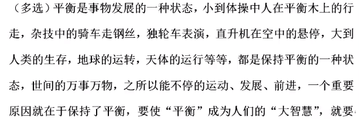

  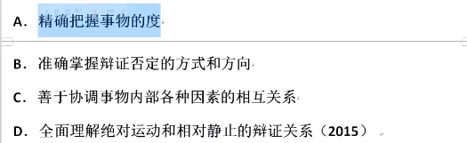

  答案：**ACD，B是对的但与题干无关。**

- 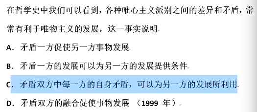

  答案：**C**

- 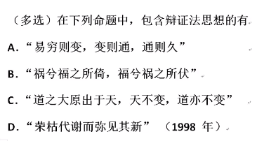

  答案：**ABD，D选项是树木的生长过程体现波浪式前进、量变到质变的哲理。**

- 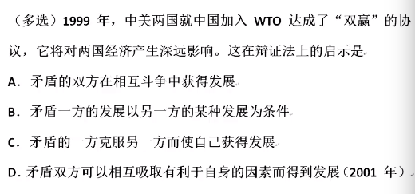

  答案：**ABD，A加入“世贸”组织后中美一定会存在斗争和摩擦，因为“世贸”组织就是调停贸易纠纷的地方**

- 上节课程总结

  - 质量互变
    + 什么是质，什么是量？
    + 质变和量变如何转变？
    + 度和关节点是什么？
  - 肯定与否定、否定之否定
    + 内容：自我发展，自我完善
    + 形式：螺旋式上升，波浪式前进
  - 对立统一（矛盾）
    + 地位
    + 矛盾同一性和斗争性

---

#### 第六七节、认识论

##### 1、**认识**：意识通过实践改变物质，物质通过认识进入到意识。
##### 2、划分
  + 可知论——不可知论
  + 可知论：唯物主义反映论——唯心主义先验论
  + 唯物主义反映论：能动反映论——直观反映论
##### 3、认识：以	*实践为基础*	的	*主体对客体*	的	*能动反应*。
##### 4、认识与实践
  + 实践是认识的**基础**、**来源**、**目的**、**发展动力**和**检验标准**
  + 认识可以指导实践
##### 5、认识发展
  + 感性认识——理性认识——实践
  + 感性：经验主义
  + 理性：教条主义，书呆子
  + 实践：实践->感性认识->理性认识->实践，如此循环往复
    + 理性因素
    + 非理性因素
##### 6、真理
  + 真理：正确的认识
  + 真理
    + 客观性，一元性，不以人的意志而转移，不容推翻的。
    + 决定性：真理可以通过实践的检验。
    + 相对性：真理可以进一步发展，进一步深化。
    + 条件性：任何真理都是有条件的。
              例如水在１００摄氏度时会沸腾，必须在１个标准大气压下。
              条件变了，真理也会变化，原来的真理可能变成谬误。
              **真理和谬误在同一条件下绝对对立，超出固定条件就可以相互转化。**
##### 7、价值
  + 真理是客观的，而价值就是客体有功能与及主体有需要。
    因此价值有客观性、主体性。
  + 多维性：对于不同的人有不同的价值。
  + 社会历史性：对于不同的历史时期相同的物质有不同的价值。
  + 客观——主观，是非——得失，真理——价值
---
#### 第六节课复习

##### 唯物论：三观两原理

##### 辩证法：1 1 2 3 4 6

  + 一个结论：坚持唯物辩证法，反对形而上学
  + 一个关系：根据客观规律，发挥主观能动性
  + 两大特征：联系和发展
  + 三大规律：质量互变、肯定与否定、对立统一
  + 四个方法：
  + 六个环节：
    + 必然和偶然
    + 原因和结果
    + 现象和本质
      + 现象本后是本质。
        + 真相
        + 假象
      + 假象不是错觉：假象能够到达本质，但是错觉不能到达本质，假象及现象不会错，错的是人。
    + 可能和现实
      + 可能和不可能
      - 现实可能和抽象可能
      - 好的可能和坏的可能
    + 形式和内容

##### 认识论

- 实践、认识、真理、价值
- 认识论的划分：能动反映论
- 认识：
- 实践是认识的基础、来源、目的、动力、检验标准
- 认识指导实践

##### 练习题

- 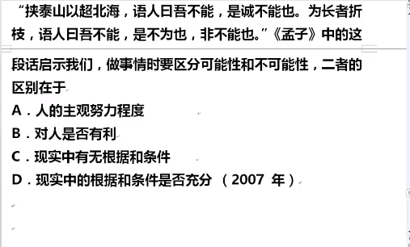
  答案：**C，Ｄ选项表示的是现实可能和理论可能**
- 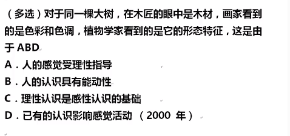
  答案：**ABD**

---
#### 第七节课复习 

**第七节的笔记记到第六节课中了**

+ 认识论：认识、实践、真理、价值

  + 认识论的划分
  + 实践和认识的关系、认识的含义
  + 认识的发展过程
  + 真理与谬误
  + 真理与价值

+ 从 **必然** 走向 **自由**，即利用 **客观规律** 发挥 **主观能动性**。

+ 练习题

  + 习题1

    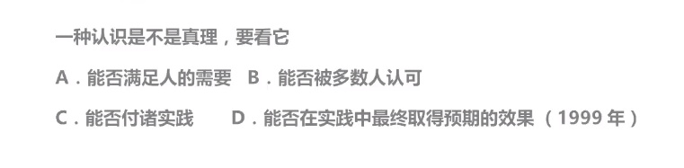

    答案：**D，C错在无论是不是真理都能付诸实践**。

  + 习题2

    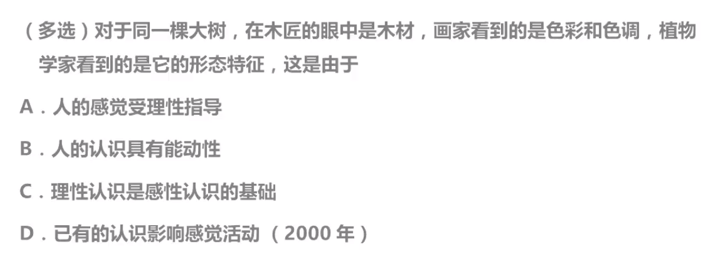

    答案：**ABD，C顺序反了，感性认识是理性认识的基础。**

  + 习题3

    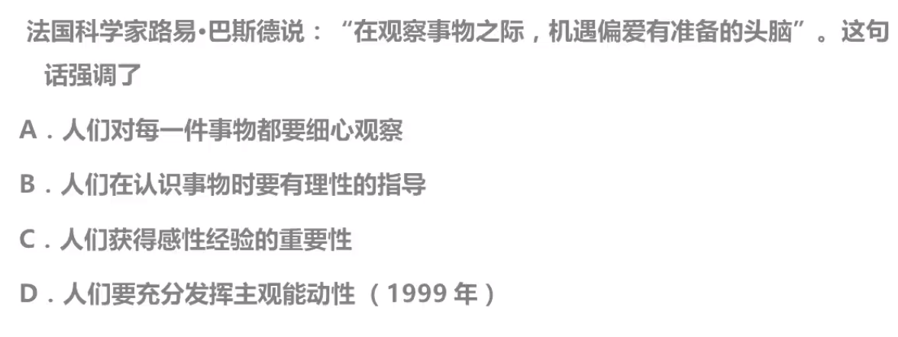

    答案：**B，D选项没有错，但是B选项最优，所以选B**。

  + 习题4

    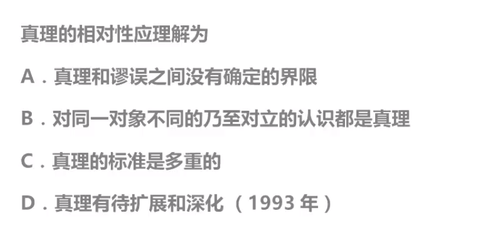

    答案：**D，了解真区别理的四个特性，A是错的，因为真理和谬误是有明确界限的，B错在真理具有一元性，C错在真理的标准只有一个实践**。

  + 习题5

    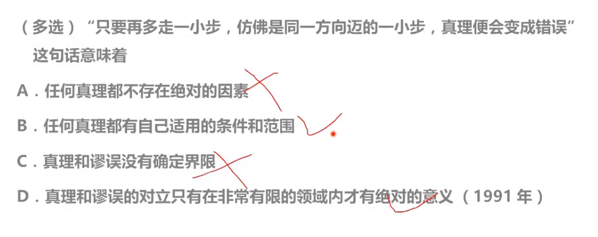

    答案解析：**选BD，A错在真理是既绝对有相对的**。

---

#### 第八节、克娄巴特拉与阿特拉斯：历史观1-彻底的唯物史观

##### 1、马哲的四大领域

+ 哲学及其基本问题
+ 唯物论 + 辩证法：物质世界的发展规律
+ 认识论：意识的发展规律
+ 历史观：**人类社会**的发展规律

##### 2、千奇百怪的历史观

+ 克娄巴特拉的鼻子：比喻 **历史发展的偶然性**
+ 阿特拉斯耸耸肩：**英雄史观**
+ 唯物史观：
  + 群众史观
  + 社会存在决定社会意识：仓廪实而知礼节，衣食足而知荣辱。
+ 唯心史观：
  + 英雄史观
  + 英雄、宗教存在决定社会意识

+ 唯物史观和之前唯物主义的关系：半截子唯物主义、庸俗唯物主义

+ 唯物史观之前的历史观全是唯心史观  

  **唯物史观** 是 **马克思独创性** 的成果  

  所以 **唯物主义** 可以分为 **唯心史观** 和 **唯物史观**，**唯心主义** 只有 **唯心史观**  

##### 3、社会的发展：

+ 发展动力：
  + 基本动力：基本矛盾
  + 重要动力：革命、改革、阶级斗争、科学技术（是把双刃剑）
+ 发展形态：
  + 前进性和曲折性
  + 统一性和多样性
  + 必然性和历史选择性

---

#### 第八节课复习

+ 习题1

  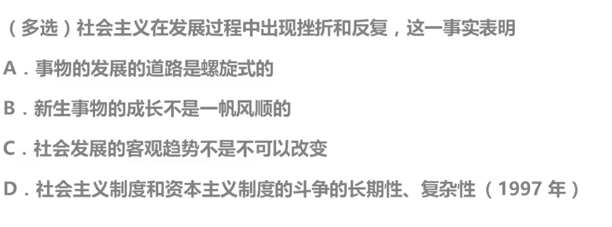

  答案：**ABD，C错在社会发展的客观趋势是不可改变的**。

+ 哲学的划分

  + 唯物主义——唯心主义      本源
  + 辩证法——形而上学          状态
  + 可知论——不可知论          认识
  + 唯物史观——唯心史观

+ 社会的发展

  + 统一性和多样性
  + 前进性和曲折性
  + 必然性和历史选择性

---

#### 第九节、人类社会是什么：历史观2-社会的组成要素与人民群众

##### 1、社会的组成要素

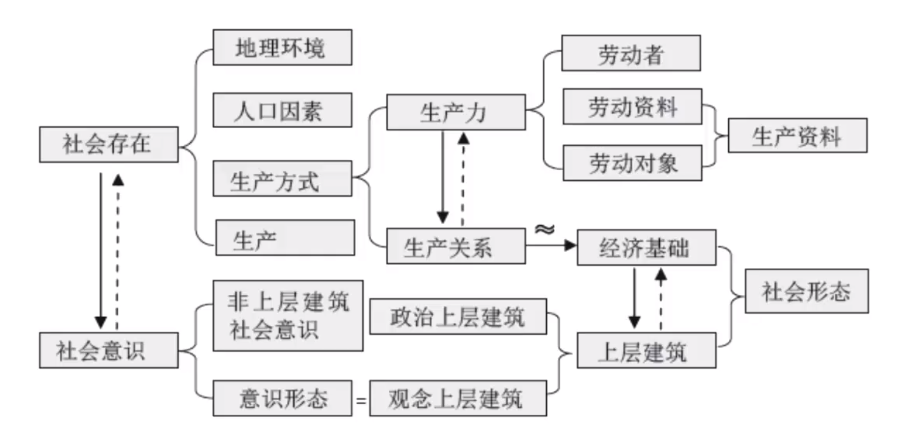  

+ **社会存在** 决定 **社会意识**，**社会意识** 反作用于 **社会存在**。
+ **地理环境**：一方水土养一方人
+ **人口因素**：人口密集程度
+ **生产方式**：最重要的因素之一
  + 生产力：**生产力** 决定 **生产关系**，**生产关系** 反作用于 **生产力**。
    + 劳动者（实践的主体）：类比 农民 或 **程序猿**
    + 劳动资料（实践的中介）：类比 农民的锄头、牛等等 或 **程序猿的电脑**
    + 劳动对象（实践的客体）：类比 农民的地 或 **程序猿公司里需要新上的项目**
    + 即 **劳动者** 用 **劳动资料** 去改造 **劳动对象**
    + **劳动资料和劳动对象** 合成 **生产资料**
    + 工人没有生产资料，农民拥有劳动资料
  + 生产关系：在生产过程中结成的人与人之间的关系，是**社会关系的基础**。
  + 一个社会有多种多样的生产关系，其中 **最主要的生产关系** 叫做 **经济基础**。
+ **经济基础** 决定 **上层建筑**，**上层建筑** 反作用于 **经济基础**。
+ **上层建筑**：
  + 政治上层建筑
    + 国家政权是政治上层建筑中最核心的
  + 观念上层建筑
+ **经济基础和上层建筑** 决定 社会形态，例如：原始社会，奴隶制，资本主义，封建主义，社会主义
+ **社会意识**
  + **意识形态**：上层建筑和社会意识的交集，也称为**观念上层建筑**
  + **非上层建筑社会意识**：风俗习惯、社会心理

##### 2、人与人民群众

+ 人是什么

  + （恩格斯）人的自然属性：劳动，即 **物质生产实践**。
  + （马克思）人的社会属性：一切社会关系的总和，即 **物以类聚人以群分**。

+ 个体的作用

  + 作用大小：普通个体 &rArr; 历史人物

  + 作用正负：人民群众 &rArr; 希特勒

  + 历史人物（正负）：杰出人物（英雄人物） &rArr; 蒋某石

  + 杰出人物（阶级，正面）：无产阶级领袖 &rArr; XXX

    无产阶级领袖也可能犯错误  

  + 个体作用分类图：

    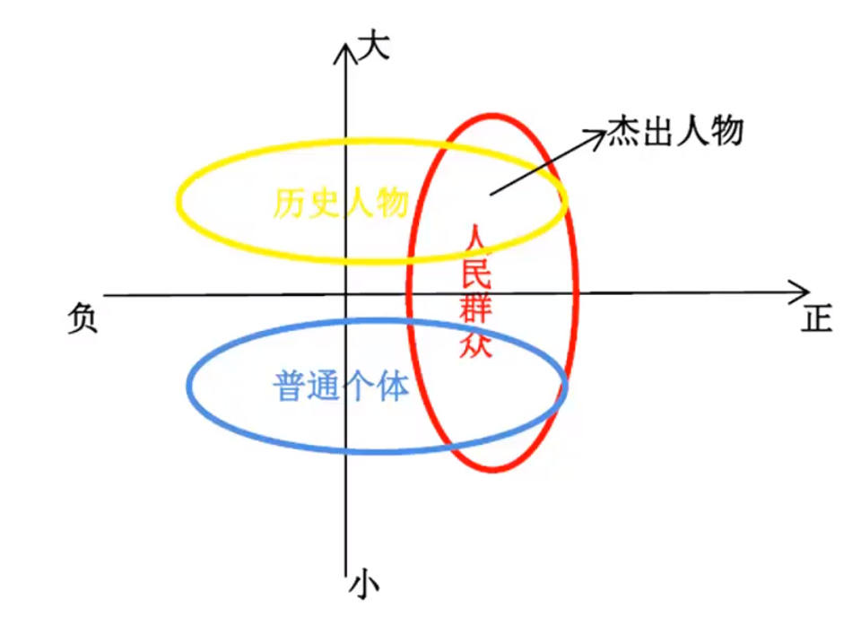  

---

#### 第十节、马克思主义政治经济学

##### 主要内容

+ 研究对象：资本主义社会
+ 结论：资本主义必将灭亡，社会主义必然胜利
+ 内容：劳动价值论、剩余价值论、资本主义历程

##### 劳动价值论

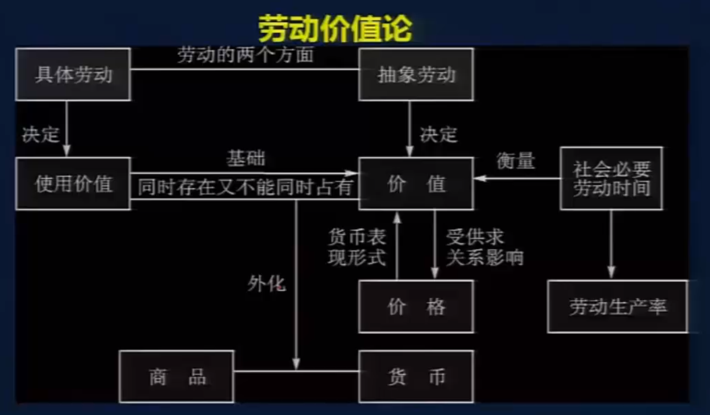

+ 自然经济的状态与商品经济的矛盾

  + 自然经济：自给自足，不需要商品交换
  + 商品经济
    + 交换商品
    + 必要前提：分工、私有
    + 商品：是劳动产品，且用于交换。
  + 商品经济的矛盾：**私人劳动（自然经济）和社会劳动（商品经济）之间的矛盾**

+ 劳动二重性与商品二因素（源自《国富论》）

  + 劳动的二重性

    + 抽象劳动，劳动的社会属性
    + 具体劳动，劳动的自然属性

  + 商品二因素

    + 价值：**抽象劳动决定价值**，商品的社会属性

    + 使用价值：**具体劳动决定决定使用价值**，商品的自然属性

    + 一切商品都具有价值和使用价值。

    + 商品的使用价值和价值**同时存在又不能同时拥有**  

      例如：某人持有一件商品没有使用，则这人便只能拥有这件商品的价值  

      ​			当这人在使用这件商品时，则只能拥有这件商品的使用价值

    + **社会必要劳动时间** 衡量 **商品价值**

    + 商品根据 **价值** 交换，而不是 **使用价值**。

+ 货币理论

  + 随着货币的出现，商品的价值和使用价值的矛盾**外化**，此时商品代表使用价值，货币代表价值。
  + 货币的职能
    + **价值尺度**：衡量和表现商品价值
    + **贮藏**：退出流通领域充当独立的价值形式和社会财富的一般代表而储存起来
    + **流通**：现钱现货
    + **支付**：先给钱再给货，或是先给货再给钱
    + **世界货币**：充当世界市场上的一般等价物
  + 价格：**用货币衡量商品价值**，即价值决定价格（**并受供求关系影响**），价格是价值的货币表现形式。

+ 价值理论

+ 总结

  + 商品经济出现的两大必要前提：社会**分工**、生产资料和劳动产品**私有**

  + 商品是用于**交换**的劳动产品，有**价值**和**使用价值**两个因素。

  + **使用价值**满足人们的**某种需要**，是**商品的自然属性**；**价值**用于实现**人人之间的商品交换**，  

    是商品的**社会属性**。

  + 具体劳动决定商品的使用价值，抽象劳动决定商品的价值。

  + 价值决定价格（**并受供求关系影响**），价格是价值的货币表现形式。

  + 货币的产生是整个商品世界分化成两级：一是各种物品，二是货币

  + 货币有五种职能。

  + 私人劳动（自然经济）和社会劳动（商品经济）之间的矛盾构成了商品经济的基本矛盾。

##### 剩余价值论

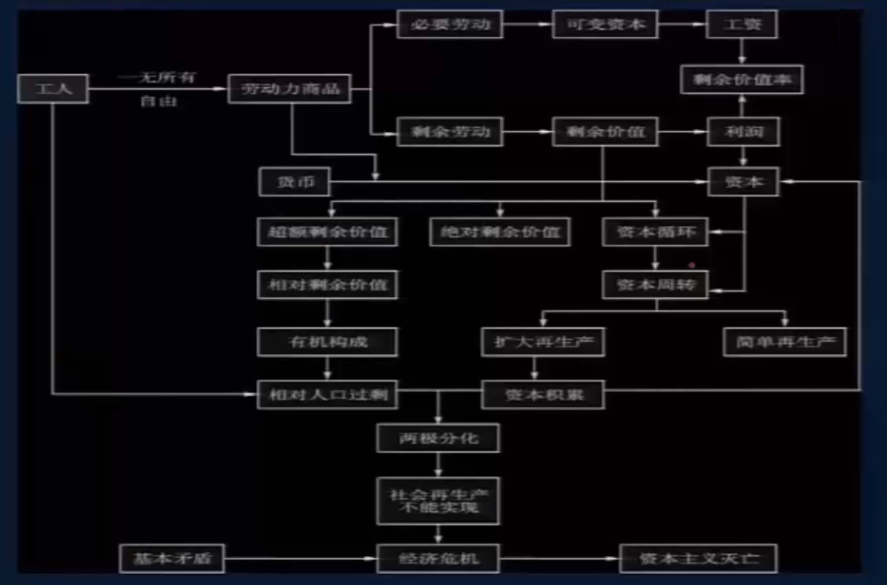

+ 资本主义社会——资本
+ 资本要运动，要发展，要增长，要变大
+ 资本家是**人格化**的资本
+ 总结：
  + 劳动力是指人的劳动力，是人的体力和脑力的总和。劳动力的使用即劳动。
  + 劳动力商品的价值，是有生产、发展、维持和延续劳动力所必须的生活必需品的价值决定的。
  + 在资本主义条件下，资本家购买的是雇佣工人劳动力而不是劳动。
  + 资本家凭借对生产资料的占有，在等价交换原则的掩盖下雇佣工人从事劳动。占有工人的剩余价值，**这就是资本主义所有制的实质**。
  + 资本是可以带来剩余价值的价值。但资本的本质不是物，而是一定的历史社会形态下的生产关系。
  + 全社会劳动生产率的提高是资本家追逐超额剩余价值的结果。
  + **资本积累**会导致资本家进一步扩大资本规模和加强对工人的剥削，最终导致两极分化。
  + 由资本技术构成决定并反映技术构成变化的资本价值构成，叫做资本的有机构成。
  + 在资本主义制度下，工人工资是**劳动力**的价值或价格，这是资本主义工资的本质。
  + 剩余价值是利润的本质。
  + 生产资料资本主义私人占有和生产社会化之间的矛盾，是资本主义的**基本矛盾**。

##### 资本主义发展历程

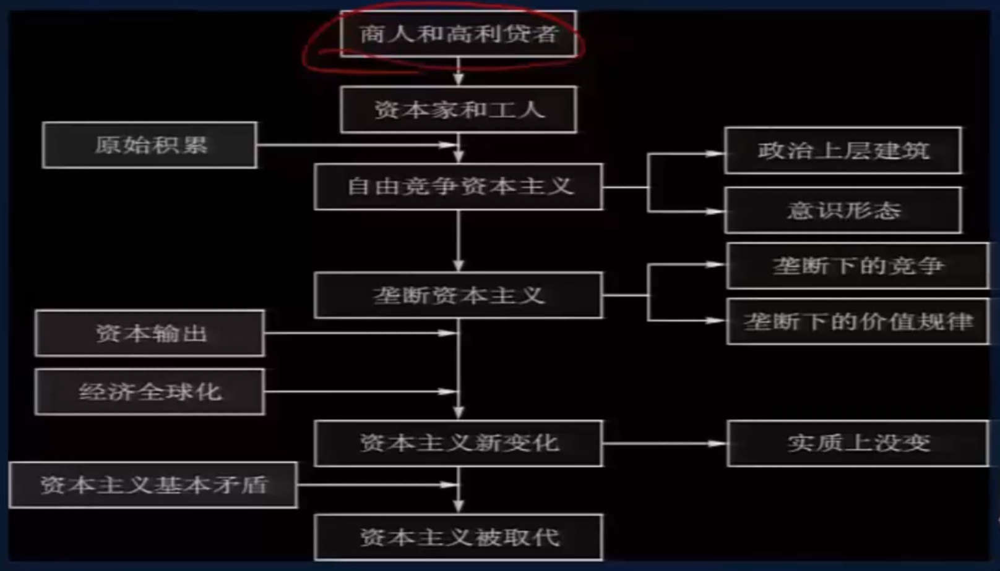

+ 萌芽 &rArr; 原始积累 &rArr; 自由竞争 &rArr; 垄断 &rArr; 垄断规模扩大
+ 资本主义新变化
+ 资本主义社会的未来

---

#### 第十一节、红色—社会主义的理论与实践

##### 回顾

+ 对资本主义社会的判断
  + 资本主义较封建社会是进步的：**天赋人权、民主、权力制衡、法制**
  + 资本主义是有问题的：**不可避免的经济危机，贫富差距的拉大，社会福利公共安全和自由税收的对立**
+ 马克思主义哲学
+ 马克思主义政治经济学

##### 社会主义的发展

###### 从空想到科学

+ 空想社会主义：批判资本主义，憧憬新的社会，但是不知道**如何推翻社会的力量，如何通往型社会的道路，旧社会为何会灭亡**。
+ 科学社会主义：《共产党宣言》、唯物史观和剩余价值说

###### 从理论到实践

+ 尝试：第一国际和巴黎公社
+ 列宁的贡献：社会主义可以在一国或数国首先取得胜利，经济落后国家可以率先进入社会主义
+ 马克思主义有多个派别，我们国家搞的是马克思列宁主义

###### 从一国到多国

+ 苏联模式的失败
  + 经济：重视重工业、军事工业，排斥市场经济
  + 政治：自上而下的委任制，疲软的监督
+ 社会主义向多国发展

###### 从毛泽东思想到中国特色社会主义理论体系

+ 毛泽东思想
+ 中国特色社会主义理论特体系

###### 共产主义

+ 物质财富极大丰富、消费资料按需分配
+ 精神境界极大提高、社会高度和谐
+ 每人自由全面的发展，从必然王国向自由王国飞跃：
  + **人依赖型社会**：自然经济
  + **物依赖性社会**：商品经济
  + **人自由全面发展**

##### 练习

+ 习题1

  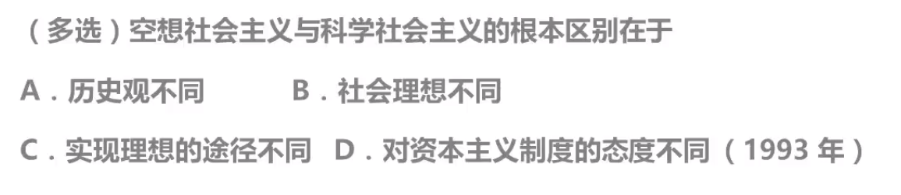

  答案：AC

+ 习题2

  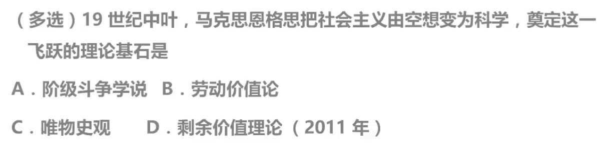

  答案：CD，A阶级斗争学说由17、18世纪历史学家和经济学家提出，B源自英国哲学家、经济学家——**亚当·斯密**的《国富论》

---

#### 最终总结——马克思主义重介绍

+ 创建者：**马克思** 和 **恩格斯**
+ 继承者：毛泽东、邓小平、列宁、习近平等等……
+ 阶级属性：无产阶级——工人阶级
+ 来源
  + 马克思主义哲学  源自于  德国古典哲学，并创造出  唯物史观
  + 马克思主义政治经济学  源自于  英国古典政治经济学，并创造出  剩余价值论
  + 科学社会主义  源自于  英法空想社会主义
+ 特征
  + 科学性——真理性——客观性
  + 革命性
  + 实践性：最显著的特征
  + 发展性：时代性、开放性
  + 人民性
+ 马克思主义基本原理概论
