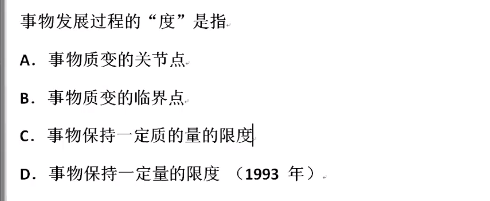

## 马克思主义基本哲学笔记

#### 第一节、哲学家在想些什么

##### 1. 哲学？ 

philosophy -- 爱和智慧

哲学家：苏格拉底、柏拉图、笛卡尔等……

苏格拉底：智者就是知道自己不知道，爱智慧。

##### 2. 哲学定义

+ 理论化-系统化；

+ 世界观和方法论统一；

+ 意识形态

  哲学一定是理论化和系统化的，例如：“社会太黑暗了”是一种观点不是哲学。

  世界观：怎么看？ ——方法论：怎么做？

  意识形态：一群人身份相同或类似拥有共同的意识 即 “意识形态”。

  例子：马克思主义是全人类公认的真理（应该是工人阶级的）

##### 3. 研究哲学的条件

+ 好奇心（爱琢磨事情）

+ 自由（掉脑袋）
+ 闲暇（吃饱没事干）

##### 4. 思考世界本源（本体论）

唯物主义：

猜测东西由几种基本物演化来：

- 泰勒斯：世界由水组成
- 毕达哥拉斯：数（整数和整数的比）
- 恩培多克勒：水、火、土、气
- 中国人L：气、道、阴阳、五行

 猜测世界的本源（物、几种物）：**朴素** 唯物主义

近代科学：

​	道尔顿——发现原子

​	汤姆生——发现电子

​	…质子、中微子、夸克…

​	最后总结：世界的物质是由某种微粒组成，即 **形而上学** 唯物主义

马克思列对于物质的定义：客观实在性，即<u>辩证唯物主义</u>

唯物主义发展： 古代 **朴素** 唯物主义——>近代 **形而上学** 唯物主义——>现代辩证唯物主义

例子：古希腊哲学家德谟克里特认为世界本源是原子——>古代 朴素 唯物主义

唯心主义：

+ 主观唯心主义：笛卡尔——我思故我在
+ 客观唯心主义：上帝创造世界
+ 例子1：人的理性为自然立法——> 主观唯心主义
+ 例子2：在万事万物存在前，就有绝对理念，并产生世界。——> 客观唯心主义
+ 例子3：世界上除了运动着的物质以外，什么也没有——> 唯物主义

##### 5. 认识论

+ **可知论**：

  + <u>唯物主义反映论（唯物主义可知论）</u>：

    <u>能动反映论</u> 和 直观反映论

  + 唯心主义先验论（唯心主义可知论）

+ **不可知论**：

##### 6. 恩格斯的总结

+ 全部哲学、近代哲学的基本问题是：思维和存在的关系问题。
+ 思维（意识）和存在（物质）
  + **第一性**（本源）：<u>物质（唯物主义）</u>；意识（唯心主义）
  + **同一性**（关系）：<u>意识和物质有关系（可知论）</u>；无关系（不可知论）

---

#### 第一节课的复习

+ 哲学的基本问题：（恩格斯）思维和存在
+ 第一性：唯物和唯心
+ 统一性：可知论和不可知论
+ 支持的观点：马克思辩证唯物主义 + 可知论

---

#### 第二节、辩证唯物主义-物质与运动

##### 1. 唯物主义

+ 古代朴素唯物主义——近代形而上学唯物主义——现代辩证唯物主义

+ 猜测--物——科学依据--微粒——客观实在性

##### 2. 物质是东西？性质？

+ 物质：客观实在性。
+ 物质——物体
+ 例子：
  + 手机信号——>物质；
  + 语言——>非物质，因为传递的是意识，语言是意识的物质外壳

##### 3. 世界是物质的，物质是运动的

+ 运动：物质的一切变化
+ 运动——静止
+ 运动和静止的观点：
  + 运动是绝对的，静止是相对的
  + 静止是运动的衡量尺度：只有选择号参考系才能知道运动尺度
  + 静者静动，非不动也：物体静止只是相对的静止，其实物体也在运动
+ 错误的观点：
  - 只有运动，没有静止。诡辩论，道理是对的，对解决问题没有任何新的帮助。
  - 只有静止，没有运动。芝诺，形而上学。
+ 时间和空间是物质运动的存在形式
  + 时间：一维性、顺序性
  + 空间：三维性、广延性
  + 时间和空间：既有限（对个体）又无限（对整体）；绝对又相对。
    + 相对：相对论
      + 狭义相对论：物体运动速度越快、时间越慢、质量越大。
      + 广义相对论 ：引力是空间的变形和扭曲。

##### 4. 马克思辩证唯物论总结

+ **物质**：客观实在性（唯一属性）。语言：意识的物质外壳

+ **运动**：不可分。运动是物质的根本属性和存在方式，物质是运动的承担者和载体。

  “运动是物质的存在方式和根本属性”也是对的

+ **运动和静止**：运动是绝对的，静止是相对的；静止是运动的衡量尺度；静者静动，非不动也。只运动：诡辩论。只静止：形而上学。

+ **时空**：时间和空间是物质运动的存在形式。

  + 时间：一维性、顺序性
  + 空间：三维性、广延性
  + 时间和空间：既有限（对个体）又无限（对整体）；绝对又相对。

##### 5. 意识观

+ 意识的含义：意识是客观世界的**主观映像** == 内容是客观的，形式是主观的。

  即世界的内容是客观实在的，但是不同的人有不同的想法。

+ 意识的产生：低级反射；高等动物的感觉和心理；人类的意识。

  所以马克思的思想认为：除了人类以外，其他动物没有意识。

+ 意识和人脑：人脑是意识的器官，而非意识的源泉。因为有人脑不一定有意识，但有意识一定有人脑。

+ 意识的能动作用

---

#### 第二节课复习

+ 意识的本质是：A

  + A. 人脑的技能、物质的反映
  + B. 人脑产生的特殊物质
  + C. 感觉的总和
  + D. 逻辑的集合

+ 不同的人对统一事物所见所思往往各不相同，这说明：C

  + A 意识是主题的自由创造
  + B 意识部不认识客体的制约
  + C 意识受主体状态的影响
  + D 意识的内容和形式是主观的

+ “观念的东西不外是移入人的头脑并在人的头脑中改造过的物质的东西而已”。这一命题表明了了：A

  + A. 意识是客观存在的主观映像
  + B. 人脑是意识的源泉
  + C. 观念的东西和物质的东西没有本质上的区别
  + D. 意识是人脑中特有的物质

+ （多选）“观念的东西不外是移入人的头脑并在人的头脑中改造过的物质的东西而已”。这一命题揭示了：ACD

  + A. 观念的东西和物质的东西是**对立统一**的

  + B. 人脑是意识的源泉

  + C. 观念的东西是物质的东西的能动反映

  + D. 没有被反映者，就没有反映。

    解释：*被反映者是物质，反映是意识*

---

#### 第三节、辩证唯物主义-意识和实践

##### 1. 意识观（想）（接第二节末尾）

+ 意识的能动作用与规律

  意识能改变客观世界和自身，但是改变客观世界一定要经过实践，意识可以直接作用在自身

+ 根据客观规律发挥主观能动性

+ 主观能动性的两个限制：客观规律，实践水平

##### 2. 实践观（做）

+ 含义：**人类** <u>**能动**</u>（自己意识主动）地改造世界的**客观物质性活动**（不是精神活动）。
+ 基本特征：
  + 直接现实性：实践做了事情就会得到了结果。
  + 自觉能动性：人区别于物的根本特点，指人既能动地反映世界，又能动地改造世界的能力。
  + 社会历史性：每个时代都有每个时代的脉络，每个时代都每个时代的该做的事情。
+ 基本形式：
  + 物质生产实践（根本）：经济	人和自然
  + 社会政治实践：政治	人和人
  + 科学文化实践：文化	人和思维
+ **实践都是人的存在方式，连社会也是实践出来的。**

##### 3. 物质意识的辩证关系原理（总结）

+ 区分：根源（物质）与派生（意识），客观存在（物质）与主观存在（意识），物质与意识不可相互取代（替代）
+ 联系：
  + 作用反作用：物质与意识可以相互作用
  + 改变：物质与意识可以相互改变（转化）
  + 同一性

##### 4. 世界物质统一性原理

+ 统一性和多样性

##### 5. 唯物论总结

+ 记忆：**三观两原理**
+ 物质观：物质——运动——静止——时空
+ 意识观：含义——产生——人脑——能动作用
+ 实践观：定义——特征——形式
+ 物质意识的辩证关系原理：三点区别，三点联系
+ 世界物质统一性原理：统一性和多样性

---

#### 第三届课复习总结

+ 预测未来最好的方式就是把它创造出来

+ 实践（打架）才有可能解决问题 == 马克思：批判的武器代替不了武器的批判

+ 意识能发挥主观能动性：猫会蔑视，狗会祈求；蔑视和祈求都是人类的意识在发挥作用

+ 唯物主义就要坚持一切从实际出发，唯物主义也不代表意识不存在，只是物质是根源意识是派生

+ （多选）人的意识的主观性方面表现为：ABCD

  + A. 反映形式的主观性

  + B. 不同主体的意识之间的差别性

  + C. 对客观对象放映的近似性

    例如：我画了一个近似圆的椭圆，别人会近似想象成篮球

  + D. 对事物反映的虚化性

+ 人的意识不仅反映客观世界，并且创造客观世界，但是意识不能创造物质，因为世界&ne;物质

---

#### 第四节、一叶落而治天下秋：辩证法-联系和发展

**总结口号：1、1、2、3、4、6**

##### 1. 一个结论

坚持**辩证法**，反对**形而上学**

+ 认为世界是 **联系的、发展的、全面的、矛盾的、运动的、变化的**，就是辩证法

+ 认为世界是 **孤立的、静止的、片面的、不动的、不变的**，就是形而上学

形而上学（metaphysics） 源于 亚里士多德

辩证法（dialectics）

+ 道之大原出于天，天**不变**道亦不变：形而上学
+ 世界上除了**运动**着的物质以外，什么也没有：辩证唯物主义 —— 列宁

##### 2. 一个关系

+ 客观规律性：规律是客观性，<u>人不能创造、改变、补充或完善规律</u>。
  + 规律：事物的本质的、必然的、稳定的联系。
  + **自然规律**：简单；盲目、无意识的力量；
  + **社会规律**：难；有意识的人的活动；
+ 主观能动性
+ 根据**客观规律**发挥**主观能动性**

##### 3. 两大特征
+ 联系：四个性质：
  + 客观性（联系不以人的意志转移）
  + 普遍性（联系普遍存在）
  + 多样性（联系的方式多种多样）
  + 条件性（联系是有条件的，根据条件变化改变联系的方式）
+ 发展：本质、过程
  + 运动的趋势 即 发展
  + **发展**是一个**过程**
  + 事物是不断的运动的，所以事物是不断的发展的。
  + **发展的实质：新事物产生，旧事物灭亡。**
  + 新旧事物的区别不是产生的**早或是晚**，而是指事物的**生命力**与及是否**顺应规律**

---
#### 第四节课复习

+ **复习——辩证法**

  + 1 &rArr; 一个结论：坚持辩证法，反对形而上学
  + 1 &rArr; 一个关系：根据**客观规律**发挥**主观能动性**
  + 2 &rArr; 两大规征：联系、发展
  + 3、4、6
  
+ **练习题目**

  + 

    答案：**ABD**

  + 

    答案：**ABCD**

---
#### 第五节 日月阴阳，孟章凌光：辩证法-意识与实践

##### 4. 三大规律(序号接上节)

+ 质量互变规律

  + 质：一个东西是什么

    - 量：东西的多少

      都是描述事物的两个方面

    - ***认识质是认识的起点，认识量是认识的深化。***

    **例如**：看到一个胖子我们会想到胖子的**胖**，具体**多少斤**可能不知道

  + 量变——质变

    - 量变：数量的变化

    - 质变：根本性的变化

    - **量变的积累才能达到质变**

  + 度——关节点

    - 度：表示**范围**

    - 关节点：也称临界值，是度与度之间的边界**点**

  + **所以做事要把握好一个度，否则过犹不及**

+ 肯定与否定

  + 肯定与否定
  
    - 对于传统文化要：取其精华去其糟粕
  
    - 对于所有事物都要**既肯定又否定**
    - 否定不是不好，否定也是一种发展。
  
  + 否定之否定
  
    - 发展是一个过程，因此否定也不只有一次，只能通过不断的否定才能向前发展。
    - 发展的过程通常都不是直线的，而经常是**波浪式前进**或是**螺旋式上升**，即道路是曲折的，前途式光明的。
  
+ 对立统一 （矛盾，是一种关系，不仅仅只代表冲突）

  + 地位
    - 对立统一规律是**联系的本质**和**发展的动力**
    - 辩证法的**实质和核心**,与形而上学的根本区别
    
  + 矛盾的同一性和斗争性
    - 同一性：对立（矛盾）双方的相互依存、相互转化
    - 斗争性：对立（矛盾）双方的相互斗争、相互分离
    - 古代的***阴阳鱼***图像
    
  + 矛盾的普遍性和特殊性 
  
    + **普遍性**：矛盾是普遍存在的，万事万物之间联系普遍存在，所以万事万物之间都有矛盾。
  
    + **特殊性**：万事万物之间联系是多样性的（即联系是各种各样的的，每种联系都是特殊的），因此万事万物之间的矛盾有特殊性。
  
      因为矛盾具有**特殊性**，所以遇到不同的矛盾要用不同的解决方法
  
      即 **具体问题具体分析，抓住事物的主要矛盾。**
  
      主要矛盾——最重要的事
  
      主要方面——事从哪方面解决
  
      **中国的主要矛盾：人民日益增长的美好生活需要——不平衡不充分的发展**
  
  + 矛盾分析法
  
    + 分析问题的根本方法
    + 两点论与重点论统一：即全面看问题，把握问题要抓住重点。
  
  + 和谐：是矛盾的特殊表现形式，相互统一，相互促进，共同发展。
  
    现在国家不和谐，所以要建设社会主义和谐社会。
  

##### 5. 辩证思维的四个方法（20年没考）

+ 归纳与演绎（低级）
  + 归纳法：通过穷举的方法得出结论
  + 演绎法：根据一个基本的逻辑前提去推导出结论。如欧几里得通过五条定理推演出“欧几里得的几何”
  + 归纳很难做到完全的归纳，演绎的前提是归纳出来的，所以归纳法和演绎都是容易出问题的。
  + 归纳法由培根提出，演绎法有笛卡尔提出。
+ 分析与综合（稍高）
  + 分析：整体拆成部分
  + 综合：部分组合成整体
+ 抽象到具体（高）
+ 历史与逻辑统一（高）

##### 6. 

---

#### 第五节课复习

- 

  答案：**C**

- 

  

  答案：**ACD，B是对的但与题干无关。**

- 

  答案：**C**

- 

  答案：**ABD，D选项是树木的生长过程体现波浪式前进、量变到质变的哲理。**

- 

  答案：**ABD，A加入“世贸”组织后中美一定会存在斗争和摩擦，因为“世贸”组织就是调停贸易纠纷的地方**

- 上节课程总结

  - 质量互变
    + 什么是质，什么是量？
    + 质变和量变如何转变？
    + 度和关节点是什么？
  - 肯定与否定、否定之否定
    + 内容：自我发展，自我完善
    + 形式：螺旋式上升，波浪式前进
  - 对立统一（矛盾）
    + 地位
    + 矛盾同一性和斗争性

---

