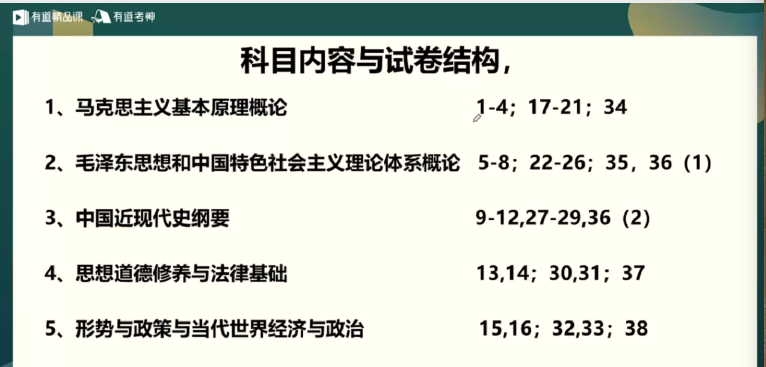
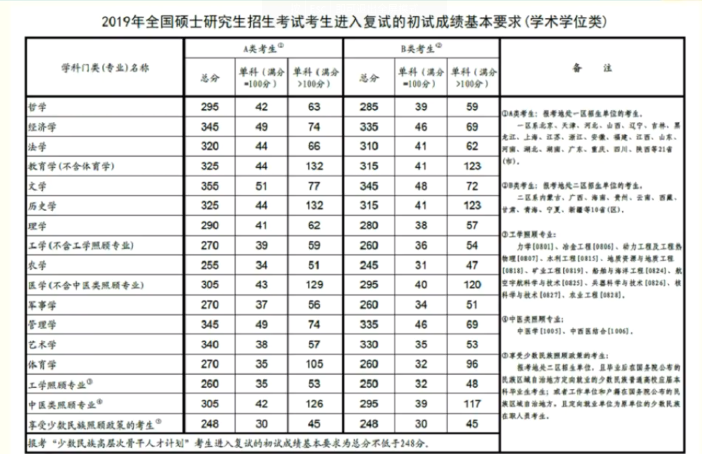
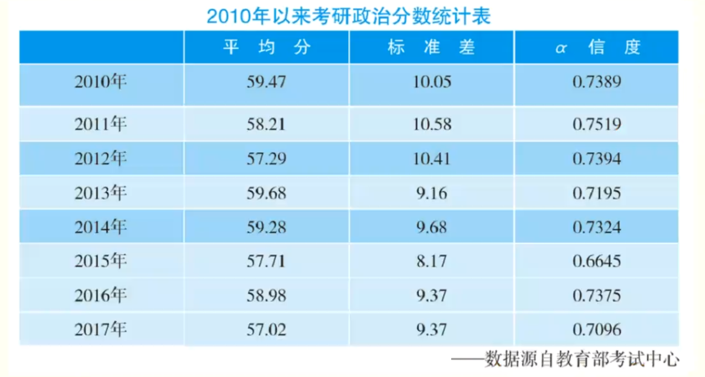
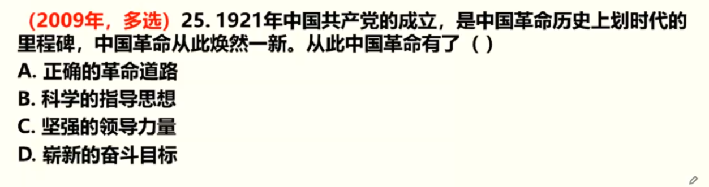
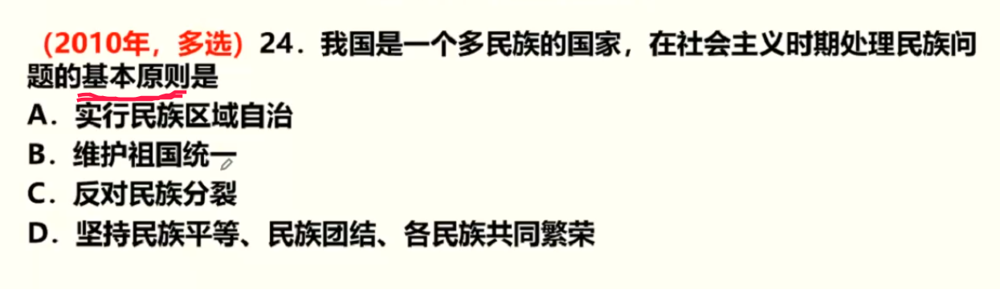
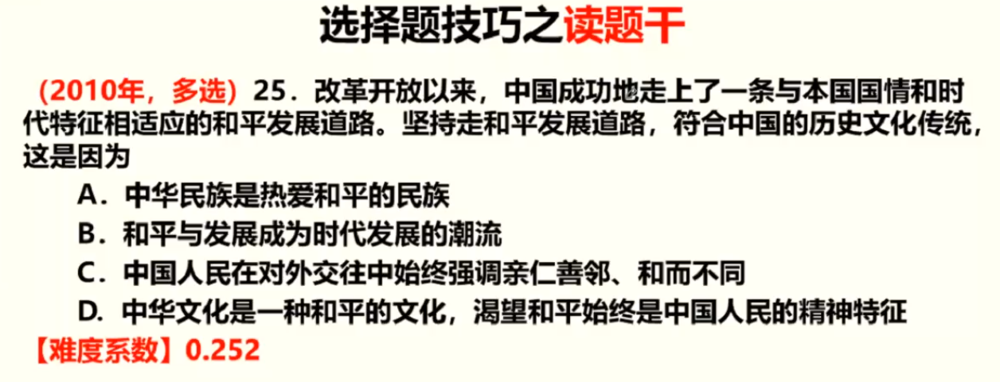

## 考研政治复习方略

#### 备考规划

##### 考研政治介绍
+ 1、考试时间：**2019年12月21日 上午  8:30--11:30**
+ 2、科目内容
    + **马克思主义基本原理概论**                    约24%
    + **毛泽东思想和中国特色社会主义理论体系概论**  约30%
    + **中国近代史纲要**                            约14%
    + **思想道德修养与法律基础**                    约16%
    + **形势与政策与当代世界经济与政治**            约16%
    + **马原** 是最重要的
+ 3、考察方式
    + 单选题：16个，16分
    + 多选题：17个，34分
    + 分析题： 5个，50分
    + **全国统考+闭卷笔试**
    + 其中**多选题**最难
+ 4、科目内容与试卷结构
    + **试卷的考试内容与题目的题号有关**
    
    + 分数基本要求
    
    + 近年来政治分数统计
    
+ 5、小结
    + 了解考研政治的考试实践和内容比重
    + 明确考研政治的试卷结构
    + 知晓考研政治的重要性和目标要求

##### 政治复习策略

+ 1、理解
    + 考试的目的：培养出优秀的社会主义接班人
    + 记忆规律：不能靠单纯的记忆
    + 题目实际
    + 真题举例
      + 
      答案：BCD，A错了是因为一开始犯了左倾的思想导致革命道路错误
      + 
      答案：BCD，A是对的，但是题干问的是基本原则
+ 2、记忆
    + 记忆内容
    + 记忆方法
    + 小结
      + 考研政治内容太多
      + 考研政治有其侧重点
      + 抓住重点复习做到事半功倍
      + 不要看教材
      + 对选择题要做到认识
      + 对分析体要做到背诵，到11月初左右开始
      + 对易混淆知识点去记表格
      + 对知识和体系去记框架
+ 3、练习
    + 练习做题的意义：复习考点、查漏补缺、提升能力
    + 做什么题：真题 + 模拟题
    + 做题的心态：做题不怕做错，做题就是为了看清自己的短处。
    + 做题的方式：有记录，有反思，有进步。
+ 4、冲刺(还有一份模拟试卷，11月份寄出)
    + 时政与当代
    + 重点串讲
    + 选择题技巧
    + 分析题方法
    + 模拟考试
    + 预测点睛
+ 5、做题的一些小技巧
    + 读题干
      
      答案：ACD，因为题干问的是**符合中国的历史文化传统的**，B虽然结论是对的但不是题干问的。
    + 看选项
+ 听课
    + 精讲阶段
      + 授课，授课前无需预习，做好拖堂准备
      + 伴学系统：知识总结 + 题目练习
    + 冲刺阶段
      + 时政串讲
      + 模拟考试
      + 预测点睛
      + 答题方法与技巧
+ 总结
  + 全程理解识记，半程做题练习，考前集中背诵。
  + 如果需要其他图书：肖秀荣老师的书 + 肖老师的最后四套卷
  + **建议尽量看直播**
